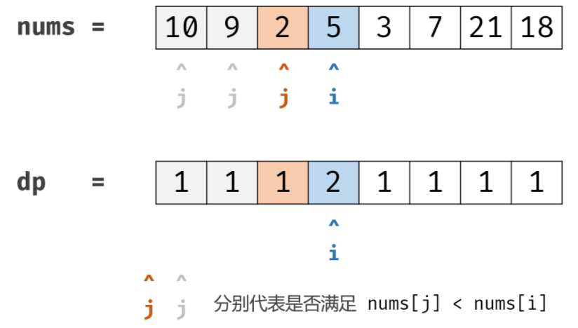

## Leetcode 题解 - 动态规划

* [最长递增子序列](#最长递增子序列)
  * [1. 最长递增子序列](#1-最长递增子序列)
  * [2. 一组整数对能够构成的最长链](#2-一组整数对能够构成的最长链)
  * [3. 最长摆动子序列](#3-最长摆动子序列)
* [最长公共子序列](#最长公共子序列)
  * [1. 最长公共子序列](#1-最长公共子序列)
* [0-1 背包](#0-1-背包)
  * [1. 划分数组为和相等的两部分](#1-划分数组为和相等的两部分)
  * [2. 改变一组数的正负号使得它们的和为一给定数](#2-改变一组数的正负号使得它们的和为一给定数)
  * [3. 01 字符构成最多的字符串](#3-01-字符构成最多的字符串)
  * [4. 找零钱的最少硬币数](#4-找零钱的最少硬币数)
  * [5. 找零钱的硬币数组合](#5-找零钱的硬币数组合)
  * [6. 字符串按单词列表分割](#6-字符串按单词列表分割)
  * [7. 组合总和](#7-组合总和)
* [股票交易](#股票交易)
  * [1. 需要冷却期的股票交易](#1-需要冷却期的股票交易)
  * [2. 需要交易费用的股票交易](#2-需要交易费用的股票交易)
  * [3. 只能进行两次的股票交易](#3-只能进行两次的股票交易)
  * [4. 只能进行 k 次的股票交易](#4-只能进行-k-次的股票交易)
* [字符串编辑](#字符串编辑)
  * [1. 删除两个字符串的字符使它们相等](#1-删除两个字符串的字符使它们相等)
  * [2. 编辑距离](#2-编辑距离)
  * [3. 复制粘贴字符](#3-复制粘贴字符)
    <!-- GFM-TOC -->

## 最长递增子序列

已知一个序列 {S<sub>1</sub>, S<sub>2</sub>,...,S<sub>n</sub>}，取出若干数组成新的序列 {S<sub>i1</sub>, S<sub>i2</sub>,..., S<sub>im</sub>}，其中 i1、i2 ... im 保持递增，即新序列中各个数仍然保持原数列中的先后顺序，称新序列为原序列的一个  **子序列**  。

如果在子序列中，当下标 ix > iy 时，S<sub>ix</sub> > S<sub>iy</sub>，称子序列为原序列的一个  **递增子序列**  。

定义一个数组 dp 存储最长递增子序列的长度，dp[n] 表示以 S<sub>n</sub> 结尾的序列的最长递增子序列长度。对于一个递增子序列 {S<sub>i1</sub>, S<sub>i2</sub>,...,S<sub>im</sub>}，如果 im < n 并且 S<sub>im</sub> < S<sub>n</sub>，此时 {S<sub>i1</sub>, S<sub>i2</sub>,..., S<sub>im</sub>, S<sub>n</sub>} 为一个递增子序列，递增子序列的长度增加 1。满足上述条件的递增子序列中，长度最长的那个递增子序列就是要找的，在长度最长的递增子序列上加上 S<sub>n</sub> 就构成了以 S<sub>n</sub> 为结尾的最长递增子序列。因此 dp[n] = max{ dp[i]+1 | S<sub>i</sub> < S<sub>n</sub> && i < n} 。

因为在求 dp[n] 时可能无法找到一个满足条件的递增子序列，此时 {S<sub>n</sub>} 就构成了递增子序列，需要对前面的求解方程做修改，令 dp[n] 最小为 1，即：

<!--<div align="center"></div> <br>-->

<div align="center">  </div><br>
对于一个长度为 N 的序列，最长递增子序列并不一定会以 S<sub>N</sub> 为结尾，因此 dp[N] 不是序列的最长递增子序列的长度，需要遍历 dp 数组找出最大值才是所要的结果，max{ dp[i] | 1 <= i <= N} 即为所求。

### 1. 最长递增子序列

300\. Longest Increasing Subsequence (Medium)

[Leetcode](https://leetcode.com/problems/longest-increasing-subsequence/description/) / [300. 最长递增子序列](https://leetcode-cn.com/problems/longest-increasing-subsequence/)

```js
给你一个整数数组 nums ，找到其中最长严格递增子序列的长度。
子序列是由数组派生而来的序列，删除（或不删除）数组中的元素而不改变其余元素的顺序。
例如，[3,6,2,7] 是数组 [0,3,1,6,2,2,7] 的子序列。

示例 1：

输入：nums = [10,9,2,5,3,7,101,18]
输出：4
解释：最长递增子序列是 [2,3,7,101]，因此长度为 4 。
示例 2：

输入：nums = [0,1,0,3,2,3]
输出：4
示例 3：

输入：nums = [7,7,7,7,7,7,7]
输出：1

示例 4：
[4,10,4,3,8,9]
3
示例 5：
[3,5,6,2,5,4,19,5,6,7,12]  
6 

提示：
1 <= nums.length <= 2500
-104 <= nums[i] <= 104

进阶：
你可以设计时间复杂度为 O(n2) 的解决方案吗？
你能将算法的时间复杂度降低到 #O(nlog(n)) 吗?
```

1



2


3


4


5


- **转移方程：** `dp[i] = max(dp[i], dp[j] + 1) for j in [0, i)`。

```java
// 时间O(N*N) 空间O(N)
// 73ms,62%
class Solution {
    public int lengthOfLIS(int[] nums) {
        if(nums.length == 0) return 0;
        int[] dp = new int[nums.length];
        int res = 0;
        Arrays.fill(dp, 1);//含义是每个元素都至少可以单独成为子序列，此时长度都为 1。
        for(int i = 0; i < nums.length; i++) {//当前数字
            for(int j = 0; j < i; j++) {//遍历当前数前面的，比当前数字小的有几个
                if(nums[j] < nums[i]) dp[i] = Math.max(dp[i], dp[j] + 1);
            }						    //dp[j] + 1是在比自己小的那位的比自己小的个数+1
            res = Math.max(res, dp[i]);
        }
        return res;//
    }
}
```

```
res = Math.max(res, dp[i]); 处理如下

输入：[1,3,6,7,9,4,10,5,6]

输出：[1, 2, 3, 4, 5, 3, 6, 4, 5]
```

其他题解

```java
public int lengthOfLIS(int[] nums) {
    int n = nums.length;
    int[] dp = new int[n];
    for (int i = 0; i < n; i++) {
        int max = 1;
        for (int j = 0; j < i; j++) {
            if (nums[i] > nums[j]) {
                max = Math.max(max, dp[j] + 1);
            }
        }
        dp[i] = max;
    }
    return Arrays.stream(dp).max().orElse(0);
}

```

使用 Stream 求最大值会导致运行时间过长，可以改成以下形式：

```java
int ret = 0;
for (int i = 0; i < n; i++) {
    ret = Math.max(ret, dp[i]);
}
return ret;

```

以上解法的时间复杂度为 O(N<sup>2</sup>)，可以使用二分查找将时间复杂度降低为 O(NlogN)。

定义一个 tails 数组，其中 tails[i] 存储长度为 i + 1 的最长递增子序列的最后一个元素。对于一个元素 x，

- 如果它大于 tails 数组所有的值，那么把它添加到 tails 后面，表示最长递增子序列长度加 1；
- 如果 tails[i-1] \< x \<= tails[i]，那么更新 tails[i] = x。

例如对于数组 [4,3,6,5]，有：

```html
tails      len      num
[]         0        4
[4]        1        3
[3]        1        6
[3,6]      2        5
[3,5]      2        null

```

可以看出 tails 数组保持有序，因此在查找 S<sub>i</sub> 位于 tails 数组的位置时就可以使用二分查找。

```java
public int lengthOfLIS(int[] nums) {
    int n = nums.length;
    int[] tails = new int[n];
    int len = 0;
    for (int num : nums) {
        int index = binarySearch(tails, len, num);
        tails[index] = num;
        if (index == len) {
            len++;
        }
    }
    return len;
}

private int binarySearch(int[] tails, int len, int key) {
    int l = 0, h = len;
    while (l < h) {
        int mid = l + (h - l) / 2;
        if (key == tails[mid]) {
            return mid;
        } else if (key < tails[mid]) {
            h = mid;			//
        } else {
            l = mid + 1;
        }
    }
    return l;
}

```

### 2. 一组整数对能够构成的最长链

类似题目参考：

https://leetcode-cn.com/problems/maximum-length-of-pair-chain/solution/chuan-shang-yi-fu-wo-jiu-bu-ren-shi-ni-liao-lai--2/

作者力扣题解仓库：https://github.com/azl397985856/leetcode

646\. Maximum Length of Pair Chain (Medium)

[Leetcode](https://leetcode.com/problems/maximum-length-of-pair-chain/description/) / [646. 最长数对链](https://leetcode-cn.com/problems/maximum-length-of-pair-chain/)

```js
给出 n 个数对。 在每一个数对中，第一个数字总是比第二个数字小。
现在，我们定义一种跟随关系，当且仅当 b < c 时，数对(c, d) 才可以跟在 (a, b) 后面。我们用这种形式来构造一个数对链。
给定一个数对集合，找出能够形成的最长数对链的长度。
你不需要用到所有的数对，你可以以任何顺序选择其中的一些数对来构造。

示例：
输入：[[1,2], [2,3], [3,4]]
输出：2
解释：最长的数对链是 [1,2] -> [3,4]

提示：给出数对的个数在 [1, 1000] 范围内。#注意：b < c

```

题目描述：对于 (a, b) 和 (c, d) ，如果 b \< c，则它们可以构成一条链。

排序思路：按照第二维数组的第二位数字升序排列

```java
//10ms，99%
class Solution {
    public int findLongestChain(int[][] pairs) {
        if (pairs.length == 1) return 1;
        // Arrays.sort(pairs, new Comparator<int[]>() {
        //     @Override
        //     public int compare(int[] o1, int[] o2) {
        //         return o1[1] - o2[1];
        //     }
        // });
        Arrays.sort(pairs, (o1, o2) -> o1[1] - o2[1]);
        int chainTail = pairs[0][1];					//记录数对的第2位
        int res = 1;
        for (int i = 1; i < pairs.length; i++) {		
            if (pairs[i][0] > chainTail) {				//后续数对的第1位 > 前面数对的第2位
                chainTail = pairs[i][1];				//更新chainTail，也是pre
                res++;
            }
        }
        return res;
    }
}

```


```java
//其他49ms、50%
class Solution {
    public int findLongestChain(int[][] pairs) {
        if (pairs == null || pairs.length == 0) {
            return 0;
        }
        Arrays.sort(pairs, (a, b) -> (a[0] - b[0]));
        int n = pairs.length;
        int[] dp = new int[n];
        Arrays.fill(dp, 1);
        for (int i = 1; i < n; i++) {
            for (int j = 0; j < i; j++) {
                if (pairs[j][1] < pairs[i][0]) {
                    dp[i] = Math.max(dp[i], dp[j] + 1);
                }
            }
        }
        return Arrays.stream(dp).max().orElse(0);
        //orElse(0)需要加，否则 OptionalInt cannot be converted to int
    }

    //二维数组排序Demo：Arrays.sort(pairs, (a, b) -> (a[0] - b[0]));
    public static void main(String[] args) {
        int[][] nums = new int[][]{{1, 3}, {1, 2}, {4, 5}, {3, 7}};
        Arrays.sort(nums, new Comparator<int[]>() {
            public int compare(int[] a, int[] b) {
                if (a[0] == b[0]) {
                    return a[1] - b[1];
                } else {
                    return a[0] - b[0];
                }
            }
        });
        for (int i = 0; i < nums.length; i++) {
            System.out.println(Arrays.toString(nums[i]));
        }
        /*输出：
            [1, 2]
            [1, 3]
            [3, 7]
            [4, 5]
        */
    }

}

```

### 3. 最长摆动子序列

376\. Wiggle Subsequence (Medium)

[Leetcode](https://leetcode.com/problems/wiggle-subsequence/description/) / [376. 摆动序列](https://leetcode-cn.com/problems/wiggle-subsequence/)

```js
如果连续数字之间的差严格地在正数和负数之间交替，则数字序列称为摆动序列。
第一个差（如果存在的话）可能是正数或负数。少于两个元素的序列也是摆动序列。

例如， [1,7,4,9,2,5] 是一个摆动序列，因为差值 (6,-3,5,-7,3) 是正负交替出现的。
相反, [1,4,7,2,5] 和 [1,7,4,5,5] 不是摆动序列，第一个序列是因为它的前两个差值都是正数，第二个序列是因为它的最后一个差值为零。

给定一个整数序列，返回作为摆动序列的最长子序列的长度。 通过从原始序列中删除一些（也可以不删除）元素来获得子序列，剩下的元素保持其原始顺序。

示例 1:
输入: [1,7,4,9,2,5]
输出: 6 
解释: 整个序列均为摆动序列。

示例 2:
输入: [1,17,5,10,13,15,10,5,16,8]
输出: 7
解释: 这个序列包含几个长度为 7 摆动序列，其中一个可为[1,17,10,13,10,16,8]。负正交替出现的。

示例 3:
输入: [1,2,3,4,5,6,7,8,9]
输出: 2

示例 4:
[0,0]
1

[0,1]、[1,2]
2

进阶：你能否用 O(n) 时间复杂度完成此题?

```

贪心： [376. 摆动序列:【贪心经典题目】详解 - 摆动序列 - 力扣（LeetCode） (leetcode-cn.com)](https://leetcode-cn.com/problems/wiggle-subsequence/solution/376-bai-dong-xu-lie-tan-xin-jing-dian-ti-vyxt/) 


```java
//0ms，100%
class Solution {
    public int wiggleMaxLength (int[] nums) {
        if (nums.length <= 1) return nums.length;
        int curDiff = 0; 			// 当前一对差值
        int preDiff = 0; 			// 前一对差值
        int ret = 1;  				// 记录峰值个数，序列默认序列最右边有一个峰值
        for (int i = 1; i < nums.length; i++) {
            curDiff = nums[i] - nums[i - 1];
            // 出现峰值，preDiff <= 0为了处理 [0,1]、[1,2]
            if ((curDiff > 0 && preDiff <= 0) || (curDiff < 0 && preDiff >= 0)) {
                ret++;
                preDiff = curDiff;
            }
        }
        return ret;
    }
}
```

dp参考：

https://leetcode-cn.com/problems/wiggle-subsequence/solution/tan-xin-si-lu-qing-xi-er-zheng-que-de-ti-jie-by-lg/

方程：


案例：


```java
//双O(N)
class Solution {
    public int wiggleMaxLength(int[] nums) {
        int n = nums.length;
        if (n < 2) return n;
        int[] up = new int[n];
        int[] down = new int[n];
        up[0] = down[0] = 1;
        for (int i = 1; i < n; i++) {
            if (nums[i] > nums[i - 1]) {
                up[i] = Math.max(up[i - 1], down[i - 1] + 1);
                down[i] = down[i - 1];
            } else if (nums[i] < nums[i - 1]) {
                up[i] = up[i - 1];
                down[i] = Math.max(up[i - 1] + 1, down[i - 1]);
            } else {
                up[i] = up[i - 1];
                down[i] = down[i - 1];
            }
        }
        return Math.max(up[n - 1], down[n - 1]);
    }
}

```

```java
//其他
//优化空间到O(1)
public int wiggleMaxLength(int[] nums) {
    if (nums == null || nums.length == 0) {
        return 0;
    }
    int up = 1, down = 1;
    for (int i = 1; i < nums.length; i++) {
        if (nums[i] > nums[i - 1]) {
            up = down + 1;
        } else if (nums[i] < nums[i - 1]) {
            down = up + 1;
        }
    }
    return Math.max(up, down);
}

```

## 最长公共子序列

对于两个子序列 S1 和 S2，找出它们最长的公共子序列。

定义一个二维数组 dp 用来存储最长公共子序列的长度，其中 **dp\[i][j] 表示 S1 的前 i 个字符与 S2 的前 j 个字符最长公共子序列的长度**。考虑 S1<sub>i</sub> 与 S2<sub>j</sub> 值是否相等，分为两种情况：

- 当 S1<sub>i</sub>==S2<sub>j</sub> 时，那么就能在 S1 的前 i-1 个字符与 S2 的前 j-1 个字符最长公共子序列的基础上再加上 S1<sub>i</sub> 这个值，最长公共子序列长度加 1，即 dp\[i][j] = dp\[i-1][j-1] + 1。
- 当 S1<sub>i</sub> != S2<sub>j</sub> 时，此时最长公共子序列为 S1 的前 i-1 个字符和 S2 的前 j 个字符最长公共子序列，或者 S1 的前 i 个字符和 S2 的前 j-1 个字符最长公共子序列，取它们的最大者，即 dp\[i][j] = max{ dp\[i-1][j], dp\[i][j-1] }。

综上，最长公共子序列的状态转移方程为：

<!--<div align="center">S2_j}\end{array}\right." class="mathjax-pic"/></div> <br>-->

<div align="center">  </div><br>
对于长度为 N 的序列 S<sub>1</sub> 和长度为 M 的序列 S<sub>2</sub>，dp\[N][M] 就是序列 S<sub>1</sub> 和序列 S<sub>2</sub> 的最长公共子序列长度。

与最长递增子序列相比，最长公共子序列有以下不同点：

- 针对的是两个序列，求它们的最长公共子序列。
- 在最长递增子序列中，dp[i] 表示以 S<sub>i</sub> 为结尾的最长递增子序列长度，子序列必须包含 S<sub>i</sub> ；在最长公共子序列中，dp[i][j] 表示 S1 中前 i 个字符与 S2 中前 j 个字符的最长公共子序列长度，不一定包含 S1<sub>i</sub> 和 S2<sub>j</sub>。
- 在求最终解时，最长公共子序列中 dp[N][M] 就是最终解，而最长递增子序列中 dp[N] 不是最终解，因为以 S<sub>N</sub> 为结尾的最长递增子序列不一定是整个序列最长递增子序列，需要遍历一遍 dp 数组找到最大者。

### 1. 最长公共子序列

1143\. Longest Common Subsequence

[Leetcode](https://leetcode.com/problems/longest-common-subsequence/) / [1143. 最长公共子序列](https://leetcode-cn.com/problems/longest-common-subsequence/)

最长公共子序列（LCS）问题是典型的二维动态规划问题。 

```js
给定两个字符串 text1 和 text2，返回这两个字符串的最长 公共子序列 的长度。如果不存在公共子序列，返回 0 。

一个字符串的 子序列 是指这样一个新的字符串：它是由原字符串在不改变字符的相对顺序的情况下删除某些字符（也可以不删除任何字符）后组成的新字符串。

例如，"ace" 是 "abcde" 的子序列，但 "aec" 不是 "abcde" 的子序列。
两个字符串的 公共子序列 是这两个字符串所共同拥有的子序列。


示例 1：

输入：text1 = "abcde", text2 = "ace" 
输出：3  
解释：最长公共子序列是 "ace" ，它的长度为 3 。
示例 2：

输入：text1 = "abc", text2 = "abc"
输出：3
解释：最长公共子序列是 "abc" ，它的长度为 3 。
示例 3：

输入：text1 = "abc", text2 = "def"
输出：0
解释：两个字符串没有公共子序列，返回 0 。
 
提示：
1 <= text1.length, text2.length <= 1000
text1 和 text2 仅由小写英文字符组成。
```

方程：


图解：


```java
class Solution {
    public int longestCommonSubsequence(String str1, String str2) {
        int n1 = str1.length(), n2 = str2.length();
        int[][] dp = new int[n1 + 1][n2 + 1];
        for (int i = 1; i <= n1; i++) {
            for (int j = 1; j <= n2; j++) {
                if (str1.charAt(i - 1) == str2.charAt(j - 1)) {//相等了延续左上角加1
                    dp[i][j] = dp[i - 1][j - 1] + 1;
                } else {									   //不相等延续左和上的最值
                    dp[i][j] = Math.max(dp[i - 1][j], dp[i][j - 1]);
                }
            }
        }
        return dp[n1][n2];
    }
}
```

## 0-1 背包

[1085 背包问题（0-1背包模板题） - 0一叶0知秋0 - 博客园 (cnblogs.com)](https://www.cnblogs.com/yi-ye-zhi-qiu/p/7554736.html) 

有一个容量为 N 的背包，要用这个背包装下物品的价值最大，这些物品有两个属性：体积 w 和价值 v。

定义一个二维数组 dp 存储最大价值，其中 **dp\[i][j] 表示前 i 件物品体积不超过 j 的情况下能达到的最大价值**。

设第 i 件物品体积为 w，价值为 v，根据第 i 件物品是否添加到背包中，可以分两种情况讨论：

- 第 i 件物品没添加到背包，总体积不超过 j 的前 i 件物品的最大价值就是总体积不超过 j 的前 i-1 件物品的最大价值，dp\[i][j] = dp\[i-1][j]。
- 第 i 件物品添加到背包中，dp\[i][j] = dp\[i-1][j-w] + v。

第 i 件物品可添加也可以不添加，取决于哪种情况下最大价值更大。因此，0-1 背包的状态转移方程为：

<!--<div align="center"></div> <br>-->

<div align="center">  </div><br>
**0-1背包问题总结**：


执行图：


```java
public class Solution {
    public static void main(String[] args) {
        int[][] arr = knapsack(5, 4, new int[]{2, 1, 3, 2}, new int[]{3, 2, 4, 2});
        print(arr);
    }
    // W 为背包总体积
    // N 为物品数量
    // weights 数组存储 N 个物品的重量
    // values 数组存储 N 个物品的价值
    public static int[][] knapsack(int W, int N, int[] weights, int[] values) {
        int[][] dp = new int[N + 1][W + 1];
        for (int i = 1; i <= N; i++) {				//允许的物品个数
            int w = weights[i - 1], v = values[i - 1];
            for (int j = 1; j <= W; j++) {			//允许的空间个数
                if (j >= w) { 
                    dp[i][j] = Math.max(dp[i - 1][j], dp[i - 1][j - w] + v);
                } else {
                    dp[i][j] = dp[i - 1][j];		//空间不够，放不进去，状态延续。
                }
            }
        }	 // dp[i-1][j-w]，前一个状态，移出去w空间后（状态价值）+价值后，和前一个状态取最值。
        return dp;
    }

    public static void print(int[][] arr) {
        for (int i = 0; i < arr.length; i++) {
            for (int j = 0; j < arr[0].length; j++) {
                System.out.print(arr[i][j] + " ");
            }
            System.out.println();
        }
    }
}
```

**空间优化**  

在程序实现时可以对 0-1 背包做优化。观察状态转移方程可以知道，前 i 件物品的状态仅与前 i-1 件物品的状态有关，因此可以将 dp 定义为一维数组，其中 dp[j] 既可以表示 dp\[i-1][j] 也可以表示 dp\[i][j]。此时，

<!--<div align="center"></div> <br>-->

<div align="center">  </div><br>
因为 dp[j-w] 表示 dp\[i-1][j-w]，因此不能先求 dp\[i][j-w]，防止将 dp\[i-1][j-w] 覆盖。

也就是说要先计算 dp\[i][j] 再计算 dp\[i][j-w]，在程序实现时需要按倒序来循环求解。

```java
public int knapsack(int W, int N, int[] weights, int[] values) {
    int[] dp = new int[W + 1];
    for (int i = 1; i <= N; i++) {
        int w = weights[i - 1], v = values[i - 1];
        for (int j = W; j >= 1; j--) {
            if (j >= w) {
                dp[j] = Math.max(dp[j], dp[j - w] + v);
            }
        }
    }
    return dp[W];
}
```

**无法使用贪心算法的解释**  

0-1 背包问题无法使用贪心算法来求解，**也就是说不能按照先添加性价比最高的物品来达到最优**，这是因为这种方式可能造成**背包空间的浪费**，从而无法达到最优。考虑下面的物品和一个**容量为 5 的背包**，如果先添加物品 0 再添加物品 1，那么只能存放的价值为 16，浪费了大小为 2 的空间。最优的方式是存放物品 1 和物品 2，价值为 22.

| id   | w    | v    | v/w  |
| ---- | ---- | ---- | ---- |
| 0    | 1    | 6    | 6    |
| 1    | 2    | 10   | 5    |
| 2    | 3    | 12   | 4    |

**变种**  

- 完全背包：物品数量为无限个

- 多重背包：物品数量有限制

- 多维费用背包：物品不仅有重量，还有体积，同时考虑这两种限制

- 其它：物品之间相互约束或者依赖

### 1. 划分数组为和相等的两部分

416\. Partition Equal Subset Sum (Medium)

[Leetcode](https://leetcode.com/problems/partition-equal-subset-sum/description/) / [416. 分割等和子集](https://leetcode-cn.com/problems/partition-equal-subset-sum/)

```js
给定一个只包含正整数的非空数组。是否可以将这个数组分割成两个子集，使得两个子集的元素和相等。
#注意:每个数组中的元素不会超过 100、数组的大小不会超过 200


示例 1:
输入: [1, 5, 11, 5]
输出: true
解释: 数组可以分割成 [1, 5, 5] 和 [11].
 
示例 2:
输入: [1, 2, 3, 5]
输出: false
解释: 数组不能分割成两个元素和相等的子集.

```


可以看成一个背包大小为 sum/2 的 0-1 背包问题。


图解官方图解：

[动态规划（转换为 0-1 背包问题） - 分割等和子集 - 力扣（LeetCode） (leetcode-cn.com)](https://leetcode-cn.com/problems/partition-equal-subset-sum/solution/fen-ge-deng-he-zi-ji-by-leetcode-solution/) 

分析：


Demo过程：

1


2


3、


优化前

```java
//42ms,50%
class Solution {
    public boolean canPartition(int[] nums) {
        int n = nums.length;
        if (n < 2) return false;
        int sum = 0, maxNum = 0;
        for (int num : nums) {
            sum += num;
            maxNum = Math.max(maxNum, num);
        }
        if (sum % 2 != 0) return false;
        int w = sum / 2;							//w也可以理解为tar
        if (maxNum > w) return false;

        boolean[][] dp = new boolean[n][w + 1];
        //一、
        //for (int i = 0; i < n; i++) {				//第一列，边界处理
        //    dp[i][0] = true;
        //}
        //二、
        dp[0][nums[0]] = true;						//初始化第一行，其他的值都为默认false
        for (int i = 1; i < n; i++) {
            int num = nums[i];
            for (int j = 0; j <= w; j++) {			//三、
                if (j >= num) {
                    dp[i][j] = dp[i - 1][j] | dp[i - 1][j - num];
                } else {
                    dp[i][j] = dp[i - 1][j];
                }
            }
        }
        return dp[n - 1][w];
    }
}
//细节：初始化，用二、其实就可以了，
//三、的话，j可以从0开始，代表算出目标值是0的。 但是，j=1提交了没错。
```

优化后

```java
//22ms,88%
class Solution {
    public boolean canPartition(int[] nums) {
        int sum = computeArraySum(nums);
        if (sum % 2 != 0) {					   // nums元素总和必须为偶数才可以分
            return false;
        }
        int W = sum / 2;
        boolean[] dp = new boolean[W + 1];
        dp[0] = true;
        for (int num : nums) {                 // 0-1 背包一个物品只能用一次
            for (int i = W; i >= num; i--) {   // 从后往前，先计算 dp[i] 再计算 dp[i-num]
                dp[i] = dp[i] || dp[i - num];
            }
        }
        return dp[W];
    }

    private int computeArraySum(int[] nums) {
        int sum = 0;
        for (int num : nums) {
            sum += num;
        }
        return sum;
    }
}
```

### 2. 改变一组数的正负号使得它们的和为一给定数

494\. Target Sum (Medium)

[Leetcode](https://leetcode.com/problems/target-sum/description/) / [494. 目标和](https://leetcode-cn.com/problems/target-sum/)

```js
给定一个非负整数数组，a1, a2, ..., an, 和一个目标数，S。现在你有两个符号 + 和 -。
对于数组中的任意一个整数，你都可以从 + 或 -中选择一个符号添加在前面。
返回可以使最终数组和为目标数 S 的所有添加符号的方法数。

示例：
输入：nums: [1, 1, 1, 1, 1], S: 3
输出：5
解释：
-1+1+1+1+1 = 3
+1-1+1+1+1 = 3
+1+1-1+1+1 = 3
+1+1+1-1+1 = 3
+1+1+1+1-1 = 3
一共有5种方法让最终目标和为3。

提示：
数组非空，且长度不会超过 20 。
初始的数组的和不会超过 1000 。
保证返回的最终结果能被 32 位整数存下。

```

该问题可以转换为 Subset Sum 问题，从而使用 0-1 背包的方法来求解。

[换一下角度，可以转换为典型的01背包问题 - 目标和 - 力扣（LeetCode） (leetcode-cn.com)](https://leetcode-cn.com/problems/target-sum/solution/huan-yi-xia-jiao-du-ke-yi-zhuan-huan-wei-dian-xing/) 

可以将这组数看成两部分，P 和 N，其中 P 使用正号，N 使用负号，有以下推导：

```html
                  sum(P) - sum(N) = target
sum(P) + sum(N) + sum(P) - sum(N) = target + sum(P) + sum(N)
                       2 * sum(P) = target + sum(nums)

```

因此只要找到一个子集，令它们都取正号，并且和等于 (target + sum(nums))/2，就证明存在解。

```java
//2ms,100%
class Solution {
    public int findTargetSumWays(int[] nums, int S) {
        int sum = computeArraySum(nums);
        if (sum < S || (sum + S) % 2 == 1) {
            return 0;
        }
        int W = (sum + S) / 2;
        int[] dp = new int[W + 1];
        dp[0] = 1;
        for (int num : nums) {
            for (int i = W; i >= num; i--) {
                dp[i] = dp[i] + dp[i - num];
            }
        }
        return dp[W];
    }

    private int computeArraySum(int[] nums) {
        int sum = 0;
        for (int num : nums) {
            sum += num;
        }
        return sum;
    }
}
```

DFS 解法（枚举）：

```java
//652ms,18%
class Solution {
    public int findTargetSumWays(int[] nums, int S) {
        return findTargetSumWays(nums, 0, S);
    }

    private int findTargetSumWays(int[] nums, int start, int S) {
        if (start == nums.length) {
            return S == 0 ? 1 : 0;
        }
        return findTargetSumWays(nums, start + 1, S + nums[start])
         + findTargetSumWays(nums, start + 1, S - nums[start]);
    }
}
```

### 3. 01 字符构成最多的字符串

474\. Ones and Zeroes (Medium)

[Leetcode](https://leetcode.com/problems/ones-and-zeroes/description/) / [474. 一和零](https://leetcode-cn.com/problems/ones-and-zeroes/)

```js
给你一个二进制字符串数组 strs 和两个整数 m 和 n 。
请你找出并返回 strs 的最大子集的大小，该子集中 #最多 有 m 个 0 和 n 个 1 。
如果 x 的所有元素也是 y 的元素，集合 x 是集合 y 的 子集 。
#题目转述：求最大子集

示例 1：
输入：strs = ["10", "0001", "111001", "1", "0"], m = 5, n = 3
输出：4
解释：最多有 5 个 0 和 3 个 1 的最大子集是 {"10","0001","1","0"} ，因此答案是 4 。
其他满足题意但较小的子集包括 {"0001","1"} 和 {"10","1","0"} 。{"111001"} 不满足题意，因为它含 4 个 1 ，大于 n 的值 3 。

示例 2：
输入：strs = ["10", "0", "1"], m = 1, n = 1
输出：2
解释：最大的子集是 {"0", "1"} ，所以答案是 2 。

提示：
1 <= strs.length <= 600
1 <= strs[i].length <= 100
strs[i] 仅由 '0' 和 '1' 组成
1 <= m, n <= 100

```

这是一个多维费用的 0-1 背包问题，有两个背包大小，0 的数量和 1 的数量。

```java
public int findMaxForm(String[] strs, int m, int n) {
    if (strs == null || strs.length == 0) {
        return 0;
    }
    int[][] dp = new int[m + 1][n + 1];
    for (String s : strs) {    // 每个字符串只能用一次
        int ones = 0, zeros = 0;
        for (char c : s.toCharArray()) {
            if (c == '0') {
                zeros++;
            } else {
                ones++;
            }
        }
        for (int i = m; i >= zeros; i--) {
            for (int j = n; j >= ones; j--) {
                dp[i][j] = Math.max(dp[i][j], dp[i - zeros][j - ones] + 1);
            }
        }
    }
    return dp[m][n];
}

```

### 4. 找零钱的最少硬币数

322\. Coin Change (Medium)

[Leetcode](https://leetcode.com/problems/coin-change/description/) / [322. 零钱兑换](https://leetcode-cn.com/problems/coin-change/)

```js
给定不同面额的硬币 coins 和一个总金额 amount。编写一个函数来计算可以凑成总金额所需的最少的硬币个数。
如果没有任何一种硬币组合能组成总金额，返回 -1。你可以认为每种硬币的数量是无限的。

示例 1：

输入：coins = [1, 2, 5], amount = 11
输出：3 
解释：11 = 5 + 5 + 1
示例 2：

输入：coins = [2], amount = 3
输出：-1
示例 3：

输入：coins = [1], amount = 0
输出：0

提示：
1 <= coins.length <= 12
1 <= coins[i] <= 231 - 1
0 <= amount <= 104
```

题目描述：给一些面额的硬币，要求用这些硬币来组成给定面额的钱数，并且使得硬币数量最少。

物品：硬币，**硬币可以重复使用。**

- 物品大小：面额
- 物品价值：数量

因为硬币可以重复使用，因此这是一个完全背包问题。完全背包只需要将 0-1 背包的逆序遍历 dp 数组改为正序遍历即可。

```java
public int coinChange(int[] coins, int amount) {
    if (amount == 0 || coins == null) return 0;
    int[] dp = new int[amount + 1];
    for (int coin : coins) {
        for (int i = coin; i <= amount; i++) { //将逆序遍历改为正序遍历
            if (i == coin) {
                dp[i] = 1;
            } else if (dp[i] == 0 && dp[i - coin] != 0) {
                dp[i] = dp[i - coin] + 1;
            } else if (dp[i - coin] != 0) {
                dp[i] = Math.min(dp[i], dp[i - coin] + 1);
            }
        }
    }
    return dp[amount] == 0 ? -1 : dp[amount];
}
```

### 5. 找零钱的硬币数组合

518\. Coin Change 2 (Medium)

[Leetcode](https://leetcode.com/problems/coin-change-2/description/) / [518. 零钱兑换 II](https://leetcode-cn.com/problems/coin-change-2/)

```js
给定不同面额的硬币和一个总金额。写出函数来计算可以凑成总金额的#硬币组合数。
假设每一种面额的#硬币有无限个。 

示例 1:
输入: amount = 5, coins = [1, 2, 5]
输出: 4
解释: 有四种方式可以凑成总金额:
5=5
5=2+2+1
5=2+1+1+1
5=1+1+1+1+1

示例 2:
输入: amount = 3, coins = [2]
输出: 0
解释: 只用面额2的硬币不能凑成总金额3。
示例 3:
输入: amount = 10, coins = [10] 
输出: 1

注意:
你可以假设：
0 <= amount (总金额) <= 5000、硬币种类不超过 500 种
1 <= coin (硬币面额) <= 5000、结果符合 32 位符号整数
```

完全背包问题，使用 dp 记录可达成目标的组合数目。

```java
class Solution {
    public int change(int amount, int[] coins) {
        if (coins == null) return 0;
        int[] dp = new int[amount + 1];
        dp[0] = 1;
        for (int coin : coins) {
            for (int i = coin; i <= amount; i++) {
                dp[i] += dp[i - coin];
            }
        }
        return dp[amount];
    }
}
```

### 6. 字符串按单词列表分割

139\. Word Break (Medium)

[Leetcode](https://leetcode.com/problems/word-break/description/) / [139. 单词拆分](https://leetcode-cn.com/problems/word-break/)

```js
给定一个非空字符串 s 和一个包含非空单词的列表 wordDict，判定 s 是否可以被空格拆分为一个或多个在字典中出现的单词。
说明：#字典中没有重复的单词
拆分时#可以重复使用字典中的单词。

示例 1：

输入: s = "leetcode", wordDict = ["leet", "code"]
输出: true
解释: 返回 true 因为 "leetcode" 可以被拆分成 "leet code"。
示例 2：

输入: s = "applepenapple", wordDict = ["apple", "pen"]
输出: true
解释: 返回 true 因为 "applepenapple" 可以被拆分成 "apple pen apple"。
     注意你可以重复使用字典中的单词。
示例 3：

输入: s = "catsandog", wordDict = ["cats", "dog", "sand", "and", "cat"]
输出: false
```

dict 中的单词没有使用次数的限制，因此这是一个完全背包问题。

该问题涉及到字典中单词的使用顺序，也就是说物品必须按一定顺序放入背包中，例如下面的 dict 就不够组成字符串 "leetcode"：

```html
["lee", "tc", "cod"]
```

求解顺序的完全背包问题时，对物品的迭代应该放在最里层，对背包的迭代放在外层，只有这样才能让物品按一定顺序放入背包中。

```java
public boolean wordBreak(String s, List<String> wordDict) {
    int n = s.length();
    boolean[] dp = new boolean[n + 1];
    dp[0] = true;
    for (int i = 1; i <= n; i++) {
        for (String word : wordDict) {   // 对物品的迭代应该放在最里层
            int len = word.length();
            if (len <= i && word.equals(s.substring(i - len, i))) {
                dp[i] = dp[i] || dp[i - len];
            }
        }
    }
    return dp[n];
}
```

### 7. 组合总和

377\. Combination Sum IV (Medium)

[Leetcode](https://leetcode.com/problems/combination-sum-iv/description/) / [377. 组合总和 Ⅳ](https://leetcode-cn.com/problems/combination-sum-iv/)

```js
给你一个由 不同 整数组成的数组 nums ，和一个目标整数 target 。
请你从 nums 中找出并返回总和为 target 的元素组合的个数。
题目数据保证答案符合 32 位整数范围。

示例 1：
输入：nums = [1,2,3], target = 4
输出：7
解释：
所有可能的组合为：
(1, 1, 1, 1)
#(1, 1, 2)
(1, 2, 1)
(1, 3)
#(2, 1, 1)
(2, 2)
(3, 1)
请注意，顺序不同的序列被视作不同的组合。

示例 2：
输入：nums = [9], target = 3
输出：0
 
提示：
1 <= nums.length <= 200
1 <= nums[i] <= 1000
nums 中的所有元素 互不相同
1 <= target <= 1000
 
进阶：如果给定的数组允许负数出现，需要向题目中添加哪些限制条件？
```

涉及顺序的完全背包。

```java
public int combinationSum4(int[] nums, int target) {
    if (nums == null || nums.length == 0) return 0;
    int[] maximum = new int[target + 1];
    maximum[0] = 1;
    Arrays.sort(nums);
    for (int i = 1; i <= target; i++) {
        for (int j = 0; j < nums.length && nums[j] <= i; j++) {
            maximum[i] += maximum[i - nums[j]];
        }
    }
    return maximum[target];
}
```

## 股票交易

### 1. 需要冷却期的股票交易

309\. Best Time to Buy and Sell Stock with Cooldown(Medium)

[Leetcode](https://leetcode.com/problems/best-time-to-buy-and-sell-stock-with-cooldown/description/) / [力扣](https://leetcode-cn.com/problems/best-time-to-buy-and-sell-stock-with-cooldown/description/)

题目描述：交易之后需要有一天的冷却时间。

<div align="center">  </div><br>
```java
public int maxProfit(int[] prices) {
    if (prices == null || prices.length == 0) {
        return 0;
    }
    int N = prices.length;
    int[] buy = new int[N];
    int[] s1 = new int[N];
    int[] sell = new int[N];
    int[] s2 = new int[N];
    s1[0] = buy[0] = -prices[0];
    sell[0] = s2[0] = 0;
    for (int i = 1; i < N; i++) {
        buy[i] = s2[i - 1] - prices[i];
        s1[i] = Math.max(buy[i - 1], s1[i - 1]);
        sell[i] = Math.max(buy[i - 1], s1[i - 1]) + prices[i];
        s2[i] = Math.max(s2[i - 1], sell[i - 1]);
    }
    return Math.max(sell[N - 1], s2[N - 1]);
}
```

### 2. 需要交易费用的股票交易

714\. Best Time to Buy and Sell Stock with Transaction Fee (Medium)

[Leetcode](https://leetcode.com/problems/best-time-to-buy-and-sell-stock-with-transaction-fee/description/) / [力扣](https://leetcode-cn.com/problems/best-time-to-buy-and-sell-stock-with-transaction-fee/description/)

```html
Input: prices = [1, 3, 2, 8, 4, 9], fee = 2
Output: 8
Explanation: The maximum profit can be achieved by:
Buying at prices[0] = 1
Selling at prices[3] = 8
Buying at prices[4] = 4
Selling at prices[5] = 9
The total profit is ((8 - 1) - 2) + ((9 - 4) - 2) = 8.
```

题目描述：每交易一次，都要支付一定的费用。

<div align="center">  </div><br>
```java
public int maxProfit(int[] prices, int fee) {
    int N = prices.length;
    int[] buy = new int[N];
    int[] s1 = new int[N];
    int[] sell = new int[N];
    int[] s2 = new int[N];
    s1[0] = buy[0] = -prices[0];
    sell[0] = s2[0] = 0;
    for (int i = 1; i < N; i++) {
        buy[i] = Math.max(sell[i - 1], s2[i - 1]) - prices[i];
        s1[i] = Math.max(buy[i - 1], s1[i - 1]);
        sell[i] = Math.max(buy[i - 1], s1[i - 1]) - fee + prices[i];
        s2[i] = Math.max(s2[i - 1], sell[i - 1]);
    }
    return Math.max(sell[N - 1], s2[N - 1]);
}
```


### 3. 只能进行两次的股票交易

123\. Best Time to Buy and Sell Stock III (Hard)

[Leetcode](https://leetcode.com/problems/best-time-to-buy-and-sell-stock-iii/description/) / [力扣](https://leetcode-cn.com/problems/best-time-to-buy-and-sell-stock-iii/description/)

```java
public int maxProfit(int[] prices) {
    int firstBuy = Integer.MIN_VALUE, firstSell = 0;
    int secondBuy = Integer.MIN_VALUE, secondSell = 0;
    for (int curPrice : prices) {
        if (firstBuy < -curPrice) {
            firstBuy = -curPrice;
        }
        if (firstSell < firstBuy + curPrice) {
            firstSell = firstBuy + curPrice;
        }
        if (secondBuy < firstSell - curPrice) {
            secondBuy = firstSell - curPrice;
        }
        if (secondSell < secondBuy + curPrice) {
            secondSell = secondBuy + curPrice;
        }
    }
    return secondSell;
}
```

### 4. 只能进行 k 次的股票交易

188\. Best Time to Buy and Sell Stock IV (Hard)

[Leetcode](https://leetcode.com/problems/best-time-to-buy-and-sell-stock-iv/description/) / [力扣](https://leetcode-cn.com/problems/best-time-to-buy-and-sell-stock-iv/description/)

```java
public int maxProfit(int k, int[] prices) {
    int n = prices.length;
    if (k >= n / 2) {   // 这种情况下该问题退化为普通的股票交易问题
        int maxProfit = 0;
        for (int i = 1; i < n; i++) {
            if (prices[i] > prices[i - 1]) {
                maxProfit += prices[i] - prices[i - 1];
            }
        }
        return maxProfit;
    }
    int[][] maxProfit = new int[k + 1][n];
    for (int i = 1; i <= k; i++) {
        int localMax = maxProfit[i - 1][0] - prices[0];
        for (int j = 1; j < n; j++) {
            maxProfit[i][j] = Math.max(maxProfit[i][j - 1], prices[j] + localMax);
            localMax = Math.max(localMax, maxProfit[i - 1][j] - prices[j]);
        }
    }
    return maxProfit[k][n - 1];
}
```

## 字符串编辑

### 1. 删除两个字符串的字符使它们相等

583\. Delete Operation for Two Strings (Medium)

[Leetcode](https://leetcode.com/problems/delete-operation-for-two-strings/description/) / [力扣](https://leetcode-cn.com/problems/delete-operation-for-two-strings/description/)

```html
Input: "sea", "eat"
Output: 2
Explanation: You need one step to make "sea" to "ea" and another step to make "eat" to "ea".
```

可以转换为求两个字符串的最长公共子序列问题。

```java
public int minDistance(String word1, String word2) {
    int m = word1.length(), n = word2.length();
    int[][] dp = new int[m + 1][n + 1];
    for (int i = 1; i <= m; i++) {
        for (int j = 1; j <= n; j++) {
            if (word1.charAt(i - 1) == word2.charAt(j - 1)) {
                dp[i][j] = dp[i - 1][j - 1] + 1;
            } else {
                dp[i][j] = Math.max(dp[i][j - 1], dp[i - 1][j]);
            }
        }
    }
    return m + n - 2 * dp[m][n];
}
```

### 2. 编辑距离

72\. Edit Distance (Hard)

[Leetcode](https://leetcode.com/problems/edit-distance/description/) / [72. 编辑距离](https://leetcode-cn.com/problems/edit-distance/)

```js
给你两个单词 word1 和 word2，请你计算出将 word1 转换成 word2 所使用的最少操作数 。
你可以对一个单词进行如下三种操作：#插入一个字符、删除一个字符、替换一个字符

示例 1：
输入：word1 = "horse", word2 = "ros"
输出：3
解释：
horse -> rorse (将 'h' 替换为 'r')
rorse -> rose (删除 'r')
rose -> ros (删除 'e')

示例 2：
输入：word1 = "intention", word2 = "execution"
输出：5
解释：
intention -> inention (删除 't')
inention -> enention (将 'i' 替换为 'e')
enention -> exention (将 'n' 替换为 'x')
exention -> exection (将 'n' 替换为 'c')
exection -> execution (插入 'u')

提示：
0 <= word1.length, word2.length <= 500
word1 和 word2 由小写英文字母组成
```

题目描述：修改一个字符串成为另一个字符串，使得修改次数最少。一次修改操作包括：插入一个字符、删除一个字符、替换一个字符。

 [动态规划（Java，最后有同类问题列表） - 编辑距离 - 力扣（LeetCode） (leetcode-cn.com)](https://leetcode-cn.com/problems/edit-distance/solution/dong-tai-gui-hua-java-by-liweiwei1419/) 

```java
public int minDistance(String word1, String word2) {
    if (word1 == null || word2 == null) {
        return 0;
    }
    int m = word1.length(), n = word2.length();
    int[][] dp = new int[m + 1][n + 1];
    for (int i = 1; i <= m; i++) {
        dp[i][0] = i;
    }
    for (int i = 1; i <= n; i++) {
        dp[0][i] = i;
    }
    for (int i = 1; i <= m; i++) {
        for (int j = 1; j <= n; j++) {
            if (word1.charAt(i - 1) == word2.charAt(j - 1)) {
                dp[i][j] = dp[i - 1][j - 1];
            } else {
                dp[i][j] = Math.min(dp[i - 1][j - 1], 
                                    Math.min(dp[i][j - 1], dp[i - 1][j])) + 1;
            }
        }
    }
    return dp[m][n];
}
```

### 3. 复制粘贴字符

650\. 2 Keys Keyboard (Medium)

[Leetcode](https://leetcode.com/problems/2-keys-keyboard/description/) / [力扣](https://leetcode-cn.com/problems/2-keys-keyboard/description/)

题目描述：最开始只有一个字符 A，问需要多少次操作能够得到 n 个字符 A，每次操作可以复制当前所有的字符，或者粘贴。

```
Input: 3
Output: 3
Explanation:
Intitally, we have one character 'A'.
In step 1, we use Copy All operation.
In step 2, we use Paste operation to get 'AA'.
In step 3, we use Paste operation to get 'AAA'.
```

```java
public int minSteps(int n) {
    if (n == 1) return 0;
    for (int i = 2; i <= Math.sqrt(n); i++) {
        if (n % i == 0) return i + minSteps(n / i);
    }
    return n;
}
```

```java
public int minSteps(int n) {
    int[] dp = new int[n + 1];
    int h = (int) Math.sqrt(n);
    for (int i = 2; i <= n; i++) {
        dp[i] = i;
        for (int j = 2; j <= h; j++) {
            if (i % j == 0) {
                dp[i] = dp[j] + dp[i / j];
                break;
            }
        }
    }
    return dp[n];
}
```

