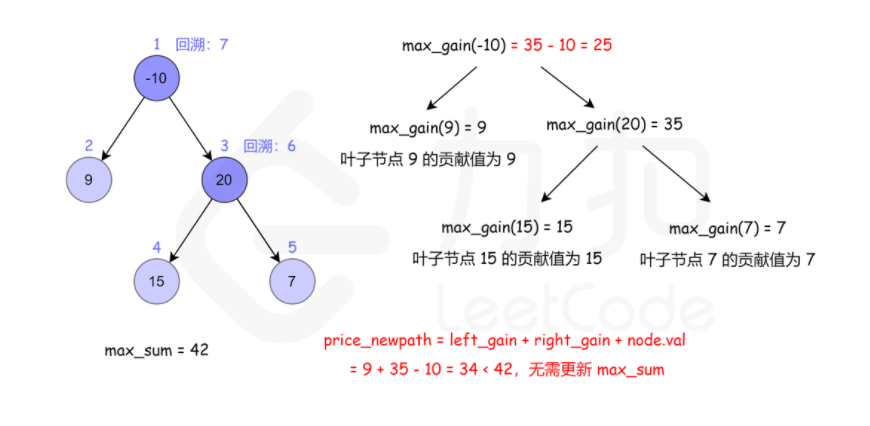
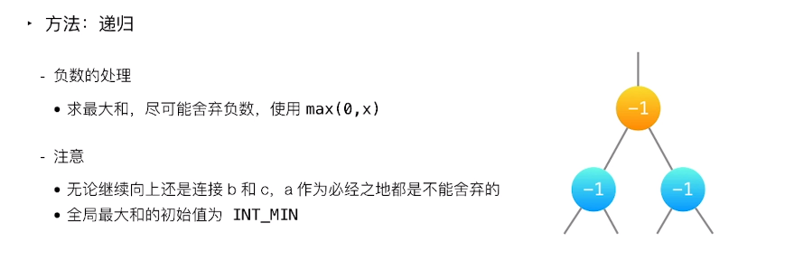
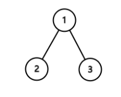

## 力扣

力扣困难

题目一样

[124. 二叉树中的最大路径和](https://leetcode-cn.com/problems/binary-tree-maximum-path-sum/)


**路径** 被定义为一条**从树中任意节点出发**，沿父节点-子节点连接，**达到任意节点的序列**。

同一个节点在一条路径序列中 **至多出现一次** 。

该路径 **至少包含一个 节点**，且不一定经过根节点。

**路径和** 是路径中各节点值的总和。

给你一个二叉树的根节点 root ，返回其 **最大路径和** 。

 

示例 1：

输入：root = [1,2,3]
输出：6
解释：最优路径是 2 -> 1 -> 3 ，路径和为 2 + 1 + 3 = 6


示例 2：

输入：root = [-10,9,20,null,null,15,7]
输出：42
解释：最优路径是 15 -> 20 -> 7 ，路径和为 15 + 20 + 7 = 42


提示：

树中节点数目范围是 [1, 3 * 104]
-1000 <= Node.val <= 1000


##### 路径的意思

图解，路径可以是：

从d出发，dbac

从f出发，fcg

或从b出发，就b一个节点。


##### 路径和二叉树特点

所以是，从二叉树节点进行三选择二。 只能是，左加上，左加右，右加上。


右加上的情况


解题思路细化


### 官解






小范围的子节点为负数，用0比较舍弃，而小范围的跟节点必须累加，用全局最大变量来舍弃。


时间复杂度：O(N)，其中 N是二叉树中的节点个数。对每个节点访问不超过 2 次。

空间复杂度：O(N)，其中 N是二叉树中的节点个数。空间复杂度主要取决于递归调用层数，最大层数等于二叉树的高度，最坏情况下，二叉树的高度等于二叉树中的节点个数。

```java
class Solution {
    int maxSum = Integer.MIN_VALUE;

    public int maxPathSum(TreeNode root) {
        maxGain(root);
        return maxSum;
    }

    public int maxGain(TreeNode node) {
        if (node == null) {
            return 0;
        }
        
        // 递归计算左右子节点的最大贡献值
        // 只有在最大贡献值大于 0 时，才会选取对应子节点
        int leftGain = Math.max(maxGain(node.left), 0);
        int rightGain = Math.max(maxGain(node.right), 0);

        // 节点的最大路径和取决于该节点的值与该节点的左右子节点的最大贡献值
        int priceNewpath = node.val + leftGain + rightGain;

        // 更新答案
        maxSum = Math.max(maxSum, priceNewpath);

        // 返回节点的最大贡献值
        return node.val + Math.max(leftGain, rightGain);
    }
}

//配有动图

作者：LeetCode-Solution
链接：https://leetcode-cn.com/problems/binary-tree-maximum-path-sum/solution/er-cha-shu-zhong-de-zui-da-lu-jing-he-by-leetcode-/
来源：力扣（LeetCode）
著作权归作者所有。商业转载请联系作者获得授权，非商业转载请注明出处。
```


## 牛客

https://www.nowcoder.com/practice/da785ea0f64b442488c125b441a4ba4a?tpId=190&tqId=35180&rp=1&ru=%2Factivity%2Foj&qru=%2Fta%2Fjob-code-high-rd%2Fquestion-ranking&tab=answerKey


题目描述

给定一个二叉树，请计算节点值之和最大的路径的节点值之和是多少。

这个路径的开始节点和结束节点可以是二叉树中的任意节点

例如：
给出以下的二叉树，
 
返回的结果为6		累加1、3、2 所有正值。


示例1

输入

```
{-2,1}
```

返回值

```
1
```

示例2

输入

```
{-2,#,-3}
```

返回值

```
-2
```


想法的基础就是dfs，深度遍历，根据题意我们要想清楚两件事情
    1.节点可能是非负的，因词开始dfs的节点不一定是根节点，结束的节点也不一定是叶子结点
    2.题目没有说一定要按照自顶向下的顺序遍历，也就是说还有一种情况是这样 root.left->root->root.right。这就需要我们找到左子树最大值，右子树最大值加上根。这样一个值。
最后就是比较这两种情况哪个更大，也就是代码中标记的**1这一行。
2这一行如果大家没有深入理解的话可能也会有一些疑惑，为什么返回的是Math.max(leftMax,rightMax) + root.val，而不是root.val+leftMax+rightMax。这个其实也需要大家好好的思考一下，我们这个函数getMax()的作用，只是找到root节点下的最大节点和！这点一定要搞清楚。不要被这一行代码**1迷惑住，这只是我们更新res的代码。*2是dfs找最大值的方式，*1适用于这道题。
如果大家还有疑惑，可以尝试自底向上的想法递推一下。应该问题就会想的更明白了。 

```java
class Solution {
    public int res = Integer.MIN_VALUE;
    public int maxPathSum(TreeNode root) {
        getMax(root);
        return res;
    }

    public int getMax(TreeNode root){
        if(root == null) return 0;
        int leftMax = Math.max(0,getMax(root.left));
        int rightMax = Math.max(0,getMax(root.right));
        //*1.--下面一行划重点--//
        res = Math.max(res,Math.max(root.val+Math.max(leftMax,rightMax),root.val+leftMax+rightMax));
        //*2--这一行也很重要--//
        return Math.max(leftMax,rightMax) + root.val;
    }
}
```

