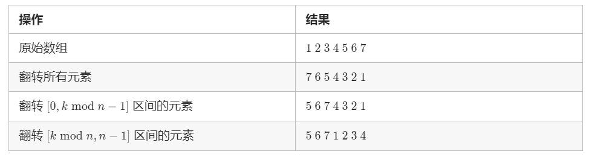

力扣中等

[189. 旋转数组](https://leetcode-cn.com/problems/rotate-array/)


给定一个数组，将数组中的元素向右移动 k 个位置，**其中 k 是非负数**。

 

进阶：

尽可能想出更多的解决方案，至少有三种不同的方法可以解决这个问题。
你可以使用**空间复杂度为 O(1) 的 原地 算法**解决这个问题吗？


示例 1:

输入: nums = [1,2,3,4,5,6,7], k = 3
输出: [5,6,7,1,2,3,4]


解释:
向右旋转 1 步: [7,1,2,3,4,5,6]
向右旋转 2 步: [6,7,1,2,3,4,5]
向右旋转 3 步: [5,6,7,1,2,3,4]


提示：

1 <= nums.length <= 2 * 104
-231 <= nums[i] <= 231 - 1
0 <= k <= 105


## 方法一：翻两次

思路：

 以 n=7，k=3 为例进行如下展示： 




时间复杂度：O(n)，其中 n 为数组的长度。每个元素被翻转两次，一共 n 个元素，因此总时间复杂度为 O(2n)=O(n)。

空间复杂度：O(1)。

````java
class Solution {
    public void rotate(int[] nums, int k) {
        // 处理k大于数组的情况
        k %= nums.length;
        reverse(nums, 0, nums.length - 1);
        reverse(nums, 0, k - 1);
        reverse(nums, k, nums.length - 1);
    }

    public void reverse(int[] nums, int start, int end) {
        while (start < end) {
            int temp = nums[start];
            nums[start] = nums[end];
            nums[end] = temp;
            start += 1;
            end -= 1;
        }
    }
}
作者：LeetCode-Solution
链接：https://leetcode-cn.com/problems/rotate-array/solution/xuan-zhuan-shu-zu-by-leetcode-solution-nipk/
来源：力扣（LeetCode）
著作权归作者所有。商业转载请联系作者获得授权，非商业转载请注明出处。
````


## 方法二：用额外数组

使用额外的数组来将每个元素放至正确的位置。用 n 表示数组的长度，我们遍历原数组，将原数组下标为 i 的元素放至新数组下标为 (i + k)%n 的位置，最后将新数组拷贝至原数组即可。


例子：

数组：1、2、3、4、5 而 k=2

过程是从  0、0、1、2、3 变为 4、5、1、2、3


复杂度：双On

````java
class Solution {
    public void rotate(int[] nums, int k) {
        int n = nums.length;
        int[] newArr = new int[n];
        for (int i = 0; i < n; ++i) {
            newArr[(i + k) % n] = nums[i];
        }
        System.arraycopy(newArr,0,  nums, 0, n);//用newArr的0到全部，覆盖nums的全部
    }
}

作者：LeetCode-Solution
链接：https://leetcode-cn.com/problems/rotate-array/solution/xuan-zhuan-shu-zu-by-leetcode-solution-nipk/
来源：力扣（LeetCode）
著作权归作者所有。商业转载请联系作者获得授权，非商业转载请注明出处。
````


## 相似题目

- [字符串：力扣541.反转字符串II](https://mp.weixin.qq.com/s/XGSk1GyPWhfqj2g7Cb1Vgw)
- [字符串：力扣151.翻转字符串里的单词](https://mp.weixin.qq.com/s/X3qpi2v5RSp08mO-W5Vicw)
- [字符串：剑指Offer58-II.左旋转字符串](https://mp.weixin.qq.com/s/PmcdiWSmmccHAONzU0ScgQ)