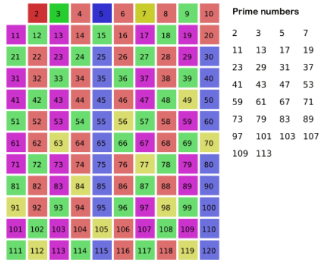

[204. 计数质数](https://leetcode-cn.com/problems/count-primes/)

力扣简单

统计所有小于非负整数 n 的质数的数量。

 

示例 1：

输入：n = 10
输出：4
解释：小于 10 的质数一共有 4 个, 它们是 2, 3, 5, 7 。


示例 2：

输入：n = 0
输出：0


示例 3：

输入：n = 1
输出：0


提示：

0 <= n <= 5 * 106


## 一、会超时！

时间复杂度：O( n*sqrt{n} )，因为判断单个素数时间复杂度是 sqrt(n)
空间复杂度：O(1)

结果：超时。

一般来说题目里 n 的规模达到 10^5 及以上时，您需要实现的程序的时间复杂度 最高 只能 O(nlogn) 的（只是一般来说，有时候可能是 O(nloglogn) 什么的，比如本题）。

````java
class Solution {
    public int countPrimes(int n) {
        int cnt = 0;
        for (int i = 2; i < n; i++) {
            if (isPrime(i)) {
                cnt++;
            }
        }
        return cnt;
    }

    //System.out.println(Math.sqrt(7));			//2.6457513110645907 double
    //System.out.println((int)Math.sqrt(7));	//2
    private boolean isPrime(int num) {
        int max = (int)Math.sqrt(num);
        for (int i = 2; i <= max; i++) {
            if (num % i == 0) {
                return false;
            }
        }
        return true;
    }
}
````

## 二：埃氏筛

初始化长度 O(n) 的标记数组，表示这个数组是否为质数。数组初始化所有的数都是质数，从 2 开始将当前数字的倍数全都标记为合数。标记到 根号n 时停止即可。

注意每次找当前素数 x 的倍数时，是从 x^2 开始的。因为如果 x > 2，那么 2*x 肯定被素数 2 给过滤了，最小未被过滤的肯定是 x^2




具体可以看来自维基百科的动画：

https://leetcode-cn.com/problems/count-primes/solution/kuai-lai-miao-dong-shai-zhi-shu-by-sweetie


时间复杂度：O(nloglogn)。就是n成对数的对数，证明不需要掌握，知道结论即可。
空间复杂度：O(n)，用来标记是否为质数。 

````java
class Solution {
    
    public int countPrimes(int n) {
        boolean[] isPrim = new boolean[n];
        Arrays.fill(isPrim, true);
        // 从 2 开始枚举到 sqrt(n)。
        for (int i = 2; i * i < n; i++) {
            // 如果当前是素数
            if (isPrim[i]) {
                // 就把从 i*i 开始，i 的所有倍数都设置为 false。
                for (int j = i * i; j < n; j+=i) {
                    isPrim[j] = false;
                }
            }
        }

        // 计数
        int cnt = 0;
        for (int i = 2; i < n; i++) {
            if (isPrim[i]) {
                cnt++;
            }
        }
        return cnt;
    }
}
````

