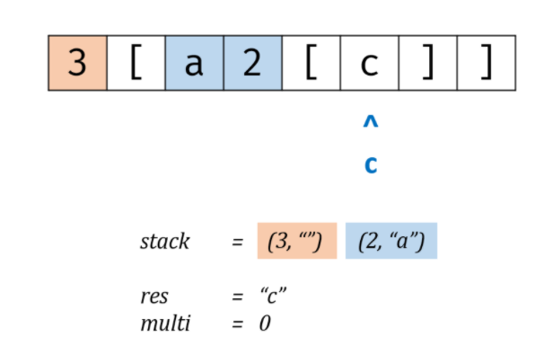
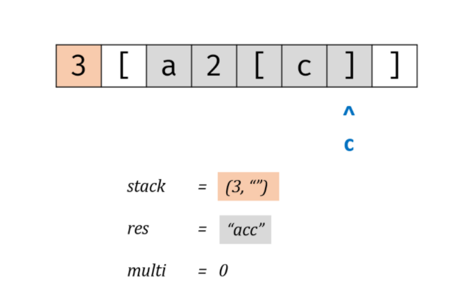

# 力扣

[394. 字符串解码](https://leetcode-cn.com/problems/decode-string/)

中等

```js
给定一个经过编码的字符串，返回它解码后的字符串。
编码规则为: k[encoded_string]，表示其中方括号内部的 encoded_string 正好重复 k 次。注意 k 保证为正整数。
你可以认为输入字符串总是有效的；输入字符串中没有额外的空格，且输入的方括号总是符合格式要求的。
此外，你可以认为原始数据不包含数字，所有的数字只表示重复的次数 k ，例如不会出现像 3a 或 2[4] 的输入。

示例 1：

输入：s = "3[a]2[bc]"
输出："aaabcbc"
示例 2：

输入：s = "3[a2[c]]"
输出："accaccacc"
示例 3：

输入：s = "2[abc]3[cd]ef"
输出："abcabccdcdcdef"
示例 4：

输入：s = "abc3[cd]xyz"
输出："abccdcdcdxyz"
```


## 栈

需要**从内向外**生成与拼接字符串，这与栈的**先入后出**特性对应。 

算法流程：

- 当 c 为数字时，将数字字符转化为数字 multi，用于后续倍数计算；
- 当 c 为字母时，在 res 尾部添加 c；
- 当 c 为 [ 时，将当前 multi 和 res 入栈，并分别置空置 0：
  - 记录此 [ 前的临时结果 res 至栈，用于发现对应 ] 后的拼接操作；
  - 记录此 [ 前的倍数 multi 至栈，用于发现对应 ] 后，获取 multi × [...] 字符串。
  - 进入到新 [ 后，res 和 multi 重新记录。

- 当 c 为 ] 时，stack 出栈，拼接字符串 res = last_res + cur_multi * res，其中:
  - last_res是上个 [ 到当前 [ 的字符串，例如 "3[a2[c]]" 中的 a；
  - cur_multi是当前 [ 到 ] 内字符串的重复倍数，例如 "3[a2[c]]" 中的 2。

图解：

- 每次遍历到 【 就缓存一下 【 之前出现的数字和字符串，缓存说的就是往对应的栈里添加。

- 添加完，将当前缓存变量刷新为初始态：mul = 0；cur = "" ; 方便再次遍历到数字、字母的时候，

也就是 a、2 的时候，用临时变量来做缓存。




当遍历到 】 的时候，将变量缓存（c）和数字栈pop出来的（2）相乘拼接后（cc），再与字母栈pop出来的（a）拼接（acc），得到新的变量 cur 缓存。



此时遍历到 】 时，重复上边过程，3 * acc + ""


复杂度

- 时间复杂度 O(N)，一次遍历 `s`；
- 空间复杂度 O(N)，辅助栈在极端情况下需要线性空间，例如 `2[2[2[a]]]`。

```java
class Solution {
    public String decodeString(String s) {
        StringBuilder cur = new StringBuilder();
        int mul = 0;
        LinkedList<Integer> nll = new LinkedList<>();
        LinkedList<String> sll = new LinkedList<>();
        for(Character c : s.toCharArray()) {
            if(c == '[') {
                nll.push(mul);
                sll.push(cur.toString());
                mul = 0;
                cur = new StringBuilder();
            }
            else if(c == ']') {
                StringBuilder sb = new StringBuilder();
                int cur_multi = nll.pop();
                for(int i = 0; i < cur_multi; i++) sb.append(cur);
                cur = new StringBuilder(sll.pop() + sb);
            }
            else if(c >= '0' && c <= '9') mul = mul * 10 + Integer.parseInt(c + "");
            else cur.append(c);//mul * 10 是为了处理，"100[leetcode]"
        }
        return cur.toString();
    }
}
```

## 递归

总体思路与辅助栈法一致，不同点在于将 [ 和 ] 分别作为递归的开启与终止条件：

- 当 s[i] == ']' 时，返回当前括号内记录的 res 字符串与 ] 的索引 i （更新上层递归指针位置）；
- 当 s[i] == '[' 时，开启新一层递归，记录此 [...] 内字符串 tmp 和递归后的最新索引 i，并执行 res + multi * tmp 拼接字符串。
- 遍历完毕后返回 res。

复杂度分析：

时间复杂度 O(N)，递归会更新索引，因此实际上还是一次遍历 s；
空间复杂度 O(N)，极端情况下递归深度将会达到线性级别。

```java
class Solution {
    public String decodeString(String s) {
        return dfs(s, 0)[0];
    }
    private String[] dfs(String s, int i) {
        StringBuilder res = new StringBuilder();
        int multi = 0;
        while(i < s.length()) {
            if(s.charAt(i) >= '0' && s.charAt(i) <= '9') 
                multi = multi * 10 + Integer.parseInt(String.valueOf(s.charAt(i))); 
            else if(s.charAt(i) == '[') {
                String[] tmp = dfs(s, i + 1);
                i = Integer.parseInt(tmp[0]);
                while(multi > 0) {
                    res.append(tmp[1]);
                    multi--;
                }
            }
            else if(s.charAt(i) == ']') 
                return new String[] { String.valueOf(i), res.toString() };
            else 
                res.append(String.valueOf(s.charAt(i)));
            i++;
        }
        return new String[] { res.toString() };
    } 
}
```

