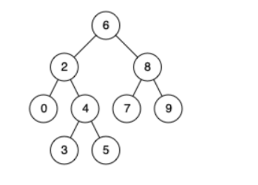

力扣中等

[98. 验证二叉搜索树](https://leetcode-cn.com/problems/validate-binary-search-tree/)


示例 1:

输入：



返回：true


示例 2:

输入:
    5
   / \
  1   4
     / \
    3   6
输出: false
解释: 输入为: [5,1,4,null,null,3,6]。
     根节点的值为 5 ，但是其右子节点值为 4 。


### 思路

中序遍历时，判断**当前节点是否大于中序遍历的前一个节点**，如果大于，说明满足 BST，继续遍历；否则直接返回 false。

````java
class Solution {
    long pre = Long.MIN_VALUE;
    public boolean isValidBST(TreeNode root) {
        if (root == null) return true;
        // 访问左子树	卡他到最后不能真正的返回，假性返回个false。
        if (!isValidBST(root.left)) return false;
        // 访问当前节点：如果当前节点小于等于中序遍历的前一个节点，说明不满足BST，返回 false；
        if (root.val <= pre) return false;
        pre = root.val;
        // 访问右子树
        return isValidBST(root.right);
    }
}
````

