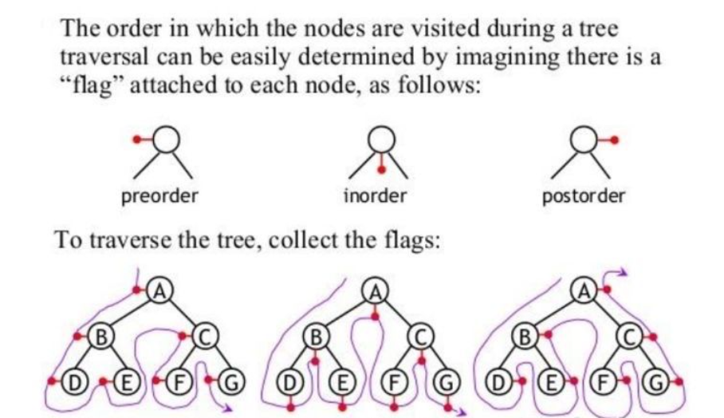

涉及题目：

[144. 二叉树的前序遍历](https://leetcode-cn.com/problems/binary-tree-preorder-traversal/)

[94. 二叉树的中序遍历](https://leetcode-cn.com/problems/binary-tree-inorder-traversal/)

[145. 二叉树的后序遍历](https://leetcode-cn.com/problems/binary-tree-postorder-traversal/)

[102. 二叉树的层序遍历](https://leetcode-cn.com/problems/binary-tree-level-order-traversal/)


题解主要是迭代遍历。


## 迭代





这里主要说下以左右根顺序进行后序遍历代码书写的一些点，也就是代码后序2。

不过能用跟右左这样的顺序进行写的话会和前序遍历基本一样了，比如代码后序1、后序3。

前序、中序代码简单些，在做迭代前序遍历和中序遍历的时候，发现root经过的路径都是左根右，对于前序和中序来说，访问路径基本上跟经过路径是一致的。

但是在后序遍历中，我们先经过根节点，但是我们不会去记录它的值，而是会选择先访问它的右子节点。所以在这种情况下，我们会将根节点留在栈中不弹出，等到需要访问它的时候再出。

那我们什么情况下才能记录根节点的值？

是从右节点回溯到根节点，而不是从左节点回溯到根节点，所以我们需要记录之前访问过的节点，来确定是否记录当前节点。总结起来，什么时候才记录节点的值？这里对后序遍历代码中 if 中情况解释：

- 当前经过节点是叶子节点。

````
从3到2
		1           
       /         
      2          
     /    
    3 
````


- 当前经过节点的右子节点是上一次访问的节点。

````
从3到2
		1           
       /         
      2   
      \   
       3 
````


若不满足上述情况，说明是从左孩子回溯到根节点，需要先访问根节点的右孩子，root = root.right

````java
//先序
class Solution {
    public List<Integer> preorderTraversal(TreeNode root) {
        List<Integer> res = new ArrayList<>();
        Stack<TreeNode> stack = new Stack<>();
        while (root != null || !stack.isEmpty()) {
            while (root != null) {
                res.add(root.val);
                stack.add(root);
                root = root.left;
            }
            root = stack.pop().right;
        }
        return res;
    }
}
//中序
class Solution {
    public List<Integer> inorderTraversal(TreeNode root) {
        List<Integer> inOrderList = new ArrayList<>();  
        Stack<TreeNode> stack = new Stack<>();  
        while(root != null || !stack.empty()) {       
            while(root != null) {  
                stack.push(root); 
                root = root.left;   
            }
            root = stack.pop();
            inOrderList.add(root.val);   
            root = root.right;    
        }
        return inOrderList;
    }  
}
//后序1
//代码的遍历思路是跟右左，然后将结果进行反转，和前序遍历很像。
class Solution {
    public List<Integer> postorderTraversal(TreeNode root) {
        List<Integer> res = new ArrayList<>();
        Stack<TreeNode> stack = new Stack<>();
        while (root != null || !stack.isEmpty()) {
            while (root != null) {
                res.add(root.val);
                stack.add(root);
                root = root.right;
            }
            root = stack.pop().left;
        }
        Collections.reverse(res);
        return res;
    }
}
//后序2
class Solution {
    public List<Integer> postorderTraversal(TreeNode root) {
        List<Integer> postOrderList = new ArrayList<>();    
        Stack<TreeNode> stack = new Stack<>();  
        TreeNode pre = null; //记录之前访问过的结点
        while(root != null || !stack.empty()) {
            while(root != null) {   
                stack.push(root);
                root = root.left;
            }
            root = stack.peek();
            //root.right == null 当前经过节点是叶子节点。
            //root.right == pre	 当前经过节点的右子节点是上一次访问的节点。
            if(root.right == null || root.right == pre) {       
                pre = root;    //记录下上一次访问的结点
                postOrderList.add(stack.pop().val); 
                root = null;   //让root跳过第二个while循环
            }else {
                root = root.right;     
            }
        }
        return postOrderList;    
    }
}
//后序3
//这个代码的遍历顺序是跟右左，并利用add(0,root.val)这个方法反序变为了左右根。不过整体推荐后序1。
//ArrayList中add(int index, E element),写过一篇文章讲解它的坑点，这里不多说了。
class Solution {
    public List<Integer> postorderTraversal(TreeNode root) {
        List<Integer> list=new ArrayList<>();
        Stack<TreeNode> stack=new Stack<>();
        while(root!=null||(!stack.empty())){
            if(root!=null){
             stack.push(root);
             list.add(0,root.val);
             root=root.right;
            }
            else{
                TreeNode tem=stack.pop();
                root=tem.left;
            }
        }
        return list;
    }
}
````


## 递归

```java
//前序
public static void preOrderRecur(TreeNode head) {
    if (head == null) {return;}
    System.out.print(head.value + " ");
    preOrderRecur(head.left);
    preOrderRecur(head.right);
}
//中序
public static void inOrderRecur(TreeNode head) {
    if (head == null) {return;}
    inOrderRecur(head.left);
    System.out.print(head.value + " ");
    inOrderRecur(head.right);
}
//后序
public static void postOrderRecur(TreeNode head) {
    if (head == null) {return;}
    postOrderRecur(head.left);
    postOrderRecur(head.right);
    System.out.print(head.value + " ");
}
```


## Morris 遍历

 Morris遍历使用二叉树节点中大量指向null的指针，由Joseph Morris 于1979年发明，不作展示。


