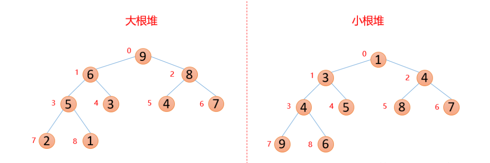
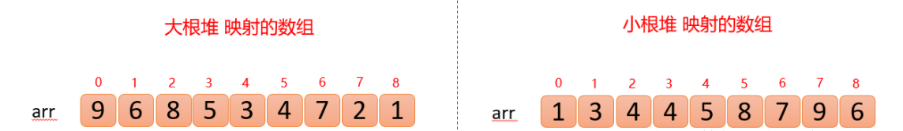

## 堆

**大根堆**

每个结点的值都大于其左孩子和右孩子结点的值，称之为大根堆；

**小根堆**

每个结点的值都小于其左孩子和右孩子结点的值，称之为小根堆。 






堆中某个节点的值总是大于等于或小于等于其子节点的值，并且堆是一颗**完全二叉树**。

堆可以用数组来表示，这是因为堆是完全二叉树。

**位置 k 的两个子节点的位置分别为 2k+1和 2k+2。**

### 上浮和下沉

在堆中，当一个节点比父节点大，那么需要交换这个两个节点。交换后还可能比它新的父节点大，因此需要不断地进行比较和交换操作，把这种操作称为**上浮**。

类似地，当一个节点比子节点小，也需要不断地向下进行比较和交换操作，把这种操作称为**下沉**。一个节点如果有两个子节点，**应当与两个子节点中最大那个节点进行交换**。 

### 插入元素

将新元素放到数组末尾，然后**上浮**到合适的位置。

小顶堆的话，插在尾部，然后下沉到合适位置。 

### 删除最大元素

**从数组顶端删除最大的元素**，并将数组的**最后一个元素放到顶端**，并让这个元素**下沉**到合适的位置。 

小跟堆，删除最小也删除第一个元素。

## 堆排序

1. 将无需序列构建成一个堆，根据升序、降序需求选择大顶堆或小顶堆;
2. 将堆顶元素与末尾元素交换，将最大元素"沉"到数组末端;
3. 重新调整结构，使其满足堆定义，然后继续交换堆顶元素与当前末尾元素，反复执行调整+交换步骤，直到整个序列有序。

### 1、构建堆

将无序数组构造成一个大根堆（升序用大根堆，降序就用小根堆） 

无序数组建立堆最直接的方法是从左到右遍历数组进行上浮操作。

一个更高效的方法是**从右(数组的中点)至左进行下沉操作**，如果一个节点的两个节点都已经是堆有序，那么进行下沉操作可以使得这个节点为根节点的堆有序。

**叶子节点不需要进行下沉操作，可以忽略叶子节点的元素，因此只需要遍历一半的元素即可。** 

### 2、交换

**最大元素和当前堆中数组的最后一个元素交换位置，这样就固定了一个值**，交换之后需要进行**下沉**操作维持堆的有序状态，将剩余的数重新构造成一个大根堆，重复这样的过程。

### 分析

**N个节点的堆**，**堆的高度为 logN**，因此在堆中**插入元素和删除最大元素的复杂度都为 logN。**

**对于堆排序，由于要对 N 个节点进行下沉操作，因此复杂度为 NlogN。**

堆排序是一种**原地排序**，**没有利用额外的空间**。

现代操作系统很少使用堆排序，因为它**无法利用局部性原理进行缓存**，也就是**数组元素很少和相邻的元素进行比较和交换**。

## 代码

````java
public class HeapSort {
    public static void heapSort(int[] arr) {
        //1、构建大顶堆
        int len = arr.length;
        int m = len / 2 - 1;
        //这里可以 for 好一点。
        while (m >= 0)//从右边到做，对前半段数组进行下沉操作,把大的往数组前边换。
            sink(arr, m--, len - 1);//m--就是循环遍历，len - 1是传过去判断是否越界
        //2、固定一个值并将新值重新下沉
        while (len > 1) {
            swap(arr, 0, len - 1);//把大的往数组尾部换。
            sink(arr, 0, --len);
        }
    }
    public static void sink(int[] arr, int i, int len) {
        int l = 2 * i + 1;
        int r = 2 * i + 2;
        int t;//存子节点中值较大的节点索引
        while (l < len) {//注意是 l
            t = arr[l] < arr[r] && r < len ? r : l;
            if (arr[i] > arr[t])//和父节点值比较，取最大值节点索引给t
                t = i;
            if (i == t)//如果父结点索引是最大值的索引，那已经是大根堆了，则退出循环
                break;
            swap(arr, t, i);//当前值和一父两子中最大的交换
            i = t;
            l = 2 * i + 1;
            r = 2 * i + 2;
        }
    }
    public static void swap(int[] arr, int a, int b) {
        int t = arr[a];
        arr[a] = arr[b];
        arr[b] = t;
    }
}
````

### 测试

````java
public static void main(String[] args) {
    int arr[] = {5, 4, 3, 2, 1, 1, 2, 3, 4, 5};
    heapSort(arr);
    for (int i = 0; i < arr.length; i++) 
        System.out.print(arr[i] + "\t");
}
````

结果：

````css
1	1	2	2	3	3	4	4	5	5	
````


## 参考：

https://www.javazhiyin.com/1200.html

堆排序算法（图解详细流程）：https://blog.csdn.net/u010452388/article/details/81283998

其他计数排、桶排、基数排 参看菜鸟：https://www.runoob.com/w3cnote/counting-sort.html