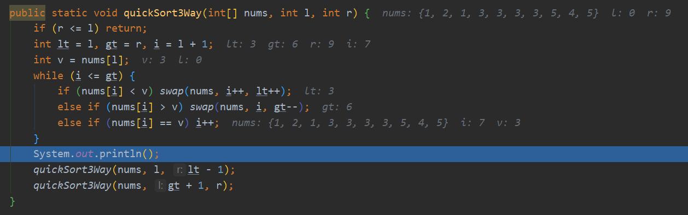

## 快速排序

````java
public class Sort {
	public static void quickSort(int[] arr, int l, int h) {
        if (l > h)  return;
        int i = l, j = h, tag = arr[l];
        while (i < j) {
            while (tag <= arr[j] && i < j)  j--;
            while (tag >= arr[i] && i < j)  i++;
            if (i < j)  swap(arr,i,j);
        }
        swap(arr,i,l);
        quickSort(arr, l, j - 1);
        quickSort(arr, j + 1, h);
    }
    public static void swap(int[] arr,int a,int b){
        int t = arr[a];
        arr[a] = arr[b];
        arr[b] = t;
    }
}
````


## 非递归版本

````java
class Solution {
    public int[] sortArray(int[] nums) {
        int l = 0;
        int r = nums.length - 1;
        Stack<Integer> stack = new Stack<>();
        stack.push(r);//先push r
        stack.push(l);//后push l
        int i = 0;	//是切分后的中间变量下标
        while (!stack.isEmpty()) {
            l = stack.pop();//这里是l、r 的顺序
            r = stack.pop();
            if (l < r) {
                i = quickSort(nums, l, r);
            }
            if (l < i - 1) {
                stack.push(i - 1);	//先push r
                stack.push(l);		//后push l
            }
            if (r > i + 1) {
                stack.push(r);		//先push r
                stack.push(i + 1);	//后push l
            }
        }
        return nums;
    }
    public static int quickSort(int[] arr, int l, int h) {
        int i = l, j = h, tag = arr[l];
        while (i < j) {
            while (tag <= arr[j] && i < j) j--;
            while (tag >= arr[i] && i < j) i++;
            if (i < j) swap(arr, i, j);
        }
        swap(arr, i, l);
        return i;
    }
    public static void swap(int[] arr, int a, int b) {
        int t = arr[a];
        arr[a] = arr[b];
        arr[b] = t;
    }
}
````


## 三向切分排序

初始：int arr[] = {3, 5, 4, 5, 3, 2, 1, 3, 1, 3};

while 循环，结束时，i 和 gt 擦肩而过。

第一轮：



第一轮后，数组被分为三部分，小于标准值v的部分，等于标准值v的部分，大于标准值v的部分。

第一轮后各个参数指向的意思：

lt  指向了最左边的标准值（也就是靠左边的第一个3），lt - 1 代表小于标准值 v 部分的最右下标

gt 指向了最左边的标准值（也就是靠右边的第一个3），gt+1 代表大于标准值 v 部分的最左下标

i 用来遍历、取值比较、交换、跳过和标准值 v 相等的下标。


分别再二分递归，递归的结束条件是 if (l > r) return;

````java
class Solution {
    public static void quickSort3Way(int[] nums, int l, int r) {
        if (l > r) return;
        int lt = l, gt = r, i = l + 1;
        int v = nums[l];
        while (i <= gt) { // i > gt 结束 相遇在标准值和大于标准值的相交的地方。
            if (nums[i] < v) swap(nums, i++, lt++);//i比lt多走的是nums[i] == v的次数
            else if (nums[i] > v) swap(nums, i, gt--);//i不增加，因为刚换来的值大小不定。
            else if (nums[i] == v) i++;
        }
        quickSort3Way(nums, l, lt - 1);
        quickSort3Way(nums, gt + 1, r);
    }

    public static void swap(int[] arr, int a, int b) {
        int t = arr[a];
        arr[a] = arr[b];
        arr[b] = t;
    }
}
````

