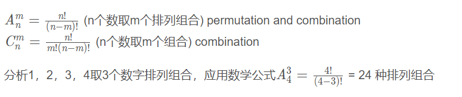

## 题目

1，2，3，4 取3个数组成三位数字，求能排列组合数量，并将它们打印出来。

其他类似题目：

数组中有10个数字，1到9，选3个当做个十百位，有多少种组合。

### 1. 数学公式

如果只求排列组合数量，可以直接使用数学公式，用代码表示：A34

````java
public static long pnc(int n, int m){

	long numerator  = 1;
	for(;n>1;n--)
		numerator = numerator*n;//计算n！
	
	long denominator = 1;
	for(int i=n-m;i>1;i--)
		denominator = denominator*i;//计算(n-k)!
	
	return numerator/denominator;
}
````

 测试： 

````java
public static void main(String args[]){
	System.out.println(pnc(4,3));
}
````

输出：

```
24
```

### 2. 举法

打印的话，使用穷举法，代码： 

````java
public static void pnc(){
	long pnc = 0;
  	for(int i=1;i<=4;i++){
  		for(int j=1;j<=4;j++){
  			for(int k=1;k<=4;k++){
  				if(i!=j && i!=k && j!=k){
  					pnc++;
  					int num = i*100+j*10+k;
  					System.out.print(num + " "); 
  				}
  			}
  		}
  	}
	System.out.println("\n" + "Permutations and Combinations: "+ pnc ); 
}
````

if代码块可以用Stringbuffer写 

```java
if(i!=j && i!=k && j!=k){
	pnc++;
	StringBuffer num = new StringBuffer();
	num.append(i);
	num.append(j);
	num.append(k);
	num.append(" ");
	System.out.print(num);
}
```

 测试： 

```java
public static void main(String args[]){
	pnc();
}
```

 输出： 

```java
123 124 132 134 142 143 213 214 231 234 241 243 312 314 321 324 341 342 412 413 421 423 431 432
Permutations and Combinations: 24
```

## 排列组合总结

3个奖牌，金、银、铜，给8人颁发。先发金再发银再发铜。就是A38


发3个饮料瓶，没顺序，就是C38，就是多了把顺序除掉 3！


### 数学公式：



## 参考

排列组合知识，5分钟彻底了解排列组合：https://zhuanlan.zhihu.com/p/41855459