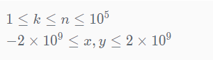

# 力扣

[460. LFU 缓存](https://leetcode-cn.com/problems/lfu-cache/)


力扣困难


请你为 最不经常使用（LFU）缓存算法设计并实现数据结构。

实现 LFUCache 类：

LFUCache(int capacity) - 用数据结构的容量 capacity 初始化对象
int get(int key) - 如果键存在于缓存中，则获取键的值，否则返回 -1。
void put(int key, int value) - 如果键已存在，则变更其值；如果键不存在，请插入键值对。当缓存达到其容量时，则应该在插入新项之前，使最不经常使用的项无效。在此问题中，当存在平局（即两个或更多个键具有相同使用频率）时，应该去除 最久未使用 的键。
注意「项的使用次数」就是自插入该项以来对其调用 get 和 put 函数的次数之和。使用次数会在对应项被移除后置为 0 。

为了确定最不常使用的键，可以为缓存中的每个键维护一个 使用计数器 。使用计数最小的键是最久未使用的键。

当一个键首次插入到缓存中时，它的使用计数器被设置为 1 (由于 put 操作)。对缓存中的键执行 get 或 put 操作，使用计数器的值将会递增。

 

示例：

输入：
["LFUCache", "put", "put", "get", "put", "get", "get", "put", "get", "get", "get"]
[[2], [1, 1], [2, 2], [1], [3, 3], [2], [3], [4, 4], [1], [3], [4]]
输出：
[null, null, null, 1, null, -1, 3, null, -1, 3, 4]

解释：
// cnt(x) = 键 x 的使用计数
// cache=[] 将显示最后一次使用的顺序（最左边的元素是最近的）
LFUCache lFUCache = new LFUCache(2);
lFUCache.put(1, 1);   // cache=[1,_], cnt(1)=1
lFUCache.put(2, 2);   // cache=[2,1], cnt(2)=1, cnt(1)=1
lFUCache.get(1);      // 返回 1
                      // cache=[1,2], cnt(2)=1, cnt(1)=2
lFUCache.put(3, 3);   // 去除键 2 ，因为 cnt(2)=1 ，使用计数最小
                      // cache=[3,1], cnt(3)=1, cnt(1)=2
lFUCache.get(2);      // 返回 -1（未找到）
lFUCache.get(3);      // 返回 3
                      // cache=[3,1], cnt(3)=2, cnt(1)=2
lFUCache.put(4, 4);   // 去除键 1 ，1 和 3 的 cnt 相同，但 1 最久未使用
                      // cache=[4,3], cnt(4)=1, cnt(3)=2
lFUCache.get(1);      // 返回 -1（未找到）
lFUCache.get(3);      // 返回 3
                      // cache=[3,4], cnt(4)=1, cnt(3)=3
lFUCache.get(4);      // 返回 4
                      // cache=[3,4], cnt(4)=2, cnt(3)=3


提示：

0 <= capacity, key, value <= 104
最多调用 105 次 get 和 put 方法


进阶：你可以为这两种操作设计时间复杂度为 O(1) 的实现吗？


题解：

思路整理，格式整理了，可能有误删，正确性不保证。


1、O(1) 解法 —— 双向链表直接使用LinkedHashSet
2、O(1) 解法 —— 自定义双向链表
3、O(1) 解法 —— 存储频次的HashMap改为直接用双向链表（最优实现 13ms 双100%）
4、O(logN) 解法 —— 使用小根堆找到 freq 最小，因为 Java 中的 PriorityQueue 默认就是小根堆, 实现最简单
5、最傻fufuの O(N) —— 只用1条双向链表

**方法 3 相对于其他人很多几百毫秒的 O(1)实现来说，是目前最优的 O(1)  实现哦，只需要 13 毫秒！** 

## 一、O(1) 解法

下面要说的 O(1) 的 3 种 Java 写法其实是 1 种解法，因为具体实现细节中使用的数据结构不同，导致性能有所差异。为方便理解，下面 3 个实现，性能从略挫逐步优化：

方法1、HashMap<Integer, Node> cache 存缓存的内容; min 是最小访问频次; HashMap<Integer, LinkedHashSet<Node>> freqMap **存每个访问频次对应的 Node 的双向链表**（写法 1 为了方便，直接用了 JDK 现有的 LinkedHashSet，**其实现了 1 条双向链表贯穿哈希表中的所有 Entry**，支持以插入的先后顺序对原本无序的 HashSet 进行迭代）

方法2、HashMap<Integer, Node> cache 存缓存的内容; min 是最小访问频次;

 HashMap<Integer, DoublyLinkedList>freqMap 存每个访问频次对应的 Node 的双向链表（写法 2 与写法 1 一样，只不过将 JDK 自带的 LinkedHashSet 双向链表实现改成了自定义的双向链表 DoublyLinkedList，减少了一些哈希相关的耗时）

方法3、HashMap<Integer, Node> cache 存缓存的内容; 将写法 1 写法 2 中的 freqMap 不再用 HashMap 来表示，而是直接用双向链表 DoublyLinkedList firstLinkedList; DoublyLinkedList lastLinkedList，省去了一些哈希相关的耗时，也不需要用 min 来存储最小频次了，lastLinkedList.pre 这条 DoublyLinkedList 即为最小频次对应的 Node 双向链表，lastLinkedList.pre.tail.pre 这个 Node 即为最小频次的双向链表中的所有 Node 中最先访问的 Node，即容量满了后要删除的 Node。

### 方法一

已阅，不好搞。

O(1) 解法，双向链表直接使用 LinkedHashSet

```java
class Node {
    int key;
    int value;
    int freq = 1;

    public Node() {}
    
    public Node(int key, int value) {
        this.key = key;
        this.value = value;
    }
}

class LFUCache {
    
    // 存储缓存的内容
    Map<Integer, Node> cache;  
    // 存储每个频次对应的双向链表。 相同频次的，LinkedHashSet的顺序代表了时间。
    Map<Integer, LinkedHashSet<Node>> freqMap; 
    
    int size;
    int capacity;
    
    int min; // 存储当前最小频次，用于饱满的时候剔除。

    public LFUCache(int capacity) {
        cache = new HashMap<> (capacity);
        freqMap = new HashMap<>();
        this.capacity = capacity;
    }
    
    public int get(int key) {
        Node node = cache.get(key);
        if (node == null) {
            return -1;
        }
        freqInc(node);//维护队列
        return node.value;
    }
    
    public void put(int key, int value) {
        if (capacity == 0) {
            return;
        }
        Node node = cache.get(key);
        if (node != null) {	// 修改
            node.value = value;
            freqInc(node);//维护队列
        } else {
            if (size == capacity) { //删除掉频率最小的
                Node deadNode = removeNode();
                cache.remove(deadNode.key);
                size--;
            }
            Node newNode = new Node(key, value);
            cache.put(key, newNode);
            addNode(newNode); //维护队列
            size++;     
        }
    }

    void freqInc(Node node) {
        // 从原freq对应的链表里移除, 并更新min
        int freq = node.freq;
        LinkedHashSet<Node> set = freqMap.get(freq);
        set.remove(node);
        if (freq == min && set.size() == 0) { 
            min = freq + 1;
        }
        // 加入新freq对应的链表
        node.freq++;
        LinkedHashSet<Node> newSet = freqMap.get(freq + 1);
        if (newSet == null) {
            newSet = new LinkedHashSet<>();
            freqMap.put(freq + 1, newSet);
        }
        newSet.add(node);
    }

    void addNode(Node node) {
        LinkedHashSet<Node> set = freqMap.get(1);
        if (set == null) {
            set = new LinkedHashSet<>();
            freqMap.put(1, set);
        } 
        set.add(node); 
        min = 1;
    }

    Node removeNode() {
        LinkedHashSet<Node> set = freqMap.get(min);
        Node deadNode = set.iterator().next();//???
        set.remove(deadNode);
        return deadNode;
    }
}
```

### 方法二

未阅。

O(1) 解法，自定义双向链表

```java
class LFUCache {
    Map<Integer, Node> cache; // 存储缓存的内容
    Map<Integer, DoublyLinkedList> freqMap; // 存储每个频次对应的双向链表
    int size;
    int capacity;
    int min; // 存储当前最小频次

    public LFUCache(int capacity) {
        cache = new HashMap<> (capacity);
        freqMap = new HashMap<>();
        this.capacity = capacity;
    }
    
    public int get(int key) {
        Node node = cache.get(key);
        if (node == null) {
            return -1;
        }
        freqInc(node);
        return node.value;
    }
    
    public void put(int key, int value) {
        if (capacity == 0) {
            return;
        }
        Node node = cache.get(key);
        if (node != null) {
            node.value = value;
            freqInc(node);
        } else {
            if (size == capacity) {
                DoublyLinkedList minFreqLinkedList = freqMap.get(min);
                cache.remove(minFreqLinkedList.tail.pre.key);
                minFreqLinkedList.removeNode(minFreqLinkedList.tail.pre); // 这里不需要维护min, 因为下面add了newNode后min肯定是1.
                size--;
            }
            Node newNode = new Node(key, value);
            cache.put(key, newNode);
            DoublyLinkedList linkedList = freqMap.get(1);
            if (linkedList == null) {
                linkedList = new DoublyLinkedList();
                freqMap.put(1, linkedList);
            }
            linkedList.addNode(newNode);
            size++;  
            min = 1;   
        }
    }

    void freqInc(Node node) {
        // 从原freq对应的链表里移除, 并更新min
        int freq = node.freq;
        DoublyLinkedList linkedList = freqMap.get(freq);
        linkedList.removeNode(node);
        if (freq == min && linkedList.head.post == linkedList.tail) { 
            min = freq + 1;
        }
        // 加入新freq对应的链表
        node.freq++;
        linkedList = freqMap.get(freq + 1);
        if (linkedList == null) {
            linkedList = new DoublyLinkedList();
            freqMap.put(freq + 1, linkedList);
        }
        linkedList.addNode(node);
    }
}

class Node {
    int key;
    int value;
    int freq = 1;
    Node pre;
    Node post;

    public Node() {}
    
    public Node(int key, int value) {
        this.key = key;
        this.value = value;
    }
}

class DoublyLinkedList {
    Node head;
    Node tail;

    public DoublyLinkedList() {
        head = new Node();
        tail = new Node();
        head.post = tail;
        tail.pre = head;
    }

    void removeNode(Node node) {
        node.pre.post = node.post;
        node.post.pre = node.pre;
    }

    void addNode(Node node) {
        node.post = head.post;
        head.post.pre = node;
        head.post = node;
        node.pre = head;
    }
}
```


### 方法三

未阅。

O(1) 解法，存储频次的HashMap改为直接用双向链表（最优实现 13ms 双100%）

```java
import java.util.HashMap;
import java.util.Map;

class Node {
    int key;
    int value;
    int freq = 1;
    Node pre; // Node所在频次的双向链表的前继Node 
    Node post; // Node所在频次的双向链表的后继Node
    DoublyLinkedList doublyLinkedList;  // Node所在频次的双向链表
    public Node() {}
    public Node(int key, int value) {
        this.key = key;
        this.value = value;
    }
}

class LFUCache {
    
    Map<Integer, Node> cache;  // 存储缓存的内容，Node中除了value值外，还有key、freq、所在doublyLinkedList、所在doublyLinkedList中的postNode、所在doublyLinkedList中的preNode，具体定义在下方。
    DoublyLinkedList firstLinkedList; // firstLinkedList.post 是频次最大的双向链表
    DoublyLinkedList lastLinkedList;  // lastLinkedList.pre 是频次最小的双向链表，满了之后删除 lastLinkedList.pre.tail.pre 这个Node即为频次最小且访问最早的Node
    int size;
    int capacity;
  
    public LFUCache(int capacity) {
        cache = new HashMap<>(capacity);
        firstLinkedList = new DoublyLinkedList();
        lastLinkedList = new DoublyLinkedList();
        firstLinkedList.post = lastLinkedList;
        lastLinkedList.pre = firstLinkedList;
        this.capacity = capacity;
    }
    public int get(int key) {
        Node node = cache.get(key);
        if (node == null) {
            return -1;
        }
        // 该key访问频次+1
        freqInc(node);
        return node.value;
    }
    public void put(int key, int value) {
        if (capacity == 0) {
            return;
        }
        Node node = cache.get(key);
        // 若key存在，则更新value，访问频次+1
        if (node != null) {
            node.value = value;
            freqInc(node);
        } else {
            // 若key不存在
            if (size == capacity) {
                // 如果缓存满了，删除lastLinkedList.pre这个链表（即表示最小频次的链表）中的tail.pre这个Node（即最小频次链表中最先访问的Node），如果该链表中的元素删空了，则删掉该链表。
                cache.remove(lastLinkedList.pre.tail.pre.key);
                lastLinkedList.removeNode(lastLinkedList.pre.tail.pre);
                size--;
                if (lastLinkedList.pre.head.post == lastLinkedList.pre.tail) {
                    removeDoublyLinkedList(lastLinkedList.pre);
                }
            }
            // cache中put新Key-Node对儿，并将新node加入表示freq为1的DoublyLinkedList中，若不存在freq为1的DoublyLinkedList则新建。
            Node newNode = new Node(key, value);
            cache.put(key, newNode);
            if (lastLinkedList.pre.freq != 1) {
                DoublyLinkedList newDoublyLinedList = new DoublyLinkedList(1);
                addDoublyLinkedList(newDoublyLinedList, lastLinkedList.pre);
                newDoublyLinedList.addNode(newNode);
            } else {
                lastLinkedList.pre.addNode(newNode);
            }
            size++;
        }
    }

    /**
     * node的访问频次 + 1
     */
    void freqInc(Node node) {
        // 将node从原freq对应的双向链表里移除, 如果链表空了则删除链表。
        DoublyLinkedList linkedList = node.doublyLinkedList;
        DoublyLinkedList preLinkedList = linkedList.pre;
        linkedList.removeNode(node);
        if (linkedList.head.post == linkedList.tail) {
            removeDoublyLinkedList(linkedList);
        }
        // 将node加入新freq对应的双向链表，若该链表不存在，则先创建该链表。
        node.freq++;
        if (preLinkedList.freq != node.freq) {
            DoublyLinkedList newDoublyLinedList = new DoublyLinkedList(node.freq);
            addDoublyLinkedList(newDoublyLinedList, preLinkedList);
            newDoublyLinedList.addNode(node);
        } else {
            preLinkedList.addNode(node);
        }
    }
    /**
     * 增加代表某1频次的双向链表
     */
    void addDoublyLinkedList(DoublyLinkedList newDoublyLinedList, DoublyLinkedList preLinkedList) {
        newDoublyLinedList.post = preLinkedList.post;
        newDoublyLinedList.post.pre = newDoublyLinedList;
        newDoublyLinedList.pre = preLinkedList;
        preLinkedList.post = newDoublyLinedList;
    }
    /**
     * 删除代表某1频次的双向链表
     */
    void removeDoublyLinkedList(DoublyLinkedList doublyLinkedList) {
        doublyLinkedList.pre.post = doublyLinkedList.post;
        doublyLinkedList.post.pre = doublyLinkedList.pre;
    }
}

class DoublyLinkedList {
    int freq; // 该双向链表表示的频次
    DoublyLinkedList pre;  // 该双向链表的前继链表（pre.freq < this.freq）
    DoublyLinkedList post; // 该双向链表的后继链表 (post.freq > this.freq)
    Node head; // 该双向链表的头节点，新节点从头部加入，表示最近访问
    Node tail; // 该双向链表的尾节点，删除节点从尾部删除，表示最久访问

    public DoublyLinkedList() {
        head = new Node();
        tail = new Node();
        head.post = tail;
        tail.pre = head;
    }

    public DoublyLinkedList(int freq) {
        head = new Node();
        tail = new Node();
        head.post = tail;
        tail.pre = head;
        this.freq = freq;
    }
    void removeNode(Node node) {
        node.pre.post = node.post;
        node.post.pre = node.pre;
    }
    void addNode(Node node) {
        node.post = head.post;
        head.post.pre = node;
        head.post = node;
        node.pre = head;
        node.doublyLinkedList = this;
    }
}
```

## 二、O(logN)解法

已阅：好懂的一种方法。

O(logN) 解法，使用小根堆找到 freq 最小，因为 Java 中的 PriorityQueue **默认就是小根堆**, 实现最简单。

每次将访问频次 freq 最小的且最先访问的上浮到堆顶，下面用全局自增 idx 表示访问的先后，或者可以直接改成 idx = System.nanoTime() 用以比较访问时间的先后。

```java
class LFUCache {

    Map<Integer, Node> cache;//数字key -> 节点
    Queue<Node> queue;		//存节点，维护节点顺序
    int capacity;
    int size;
    int idx = 0;

    public LFUCache(int capacity) {
        cache = new HashMap<>(capacity);
        if (capacity > 0) {
            queue = new PriorityQueue<>(capacity);
        }
        this.capacity = capacity;
    }
    
    public int get(int key) {
        Node node = cache.get(key);
        if (node == null) {
            return -1;
        }
        node.freq++;
        node.idx = idx++;
        queue.remove(node);
        queue.offer(node);
        return node.value;
    }
    
    public void put(int key, int value) {
        if (capacity == 0) {
            return;
        }
        Node node = cache.get(key);
        if (node != null) {	// 修改
            node.value = value;
            node.freq++;
            node.idx = idx++;	// 存的是 Node 对象，这里已经对对象内部修改完毕了。
            queue.remove(node); // 维护队列顺序
            queue.offer(node);
        } else {			// 添加
            if (size == capacity) {	// 空间满，剔除。
                cache.remove(queue.peek().key);
                queue.poll();
                size--;
            } 
            Node newNode = new Node(key, value, idx++);
            cache.put(key, newNode);
            queue.offer(newNode);
            size++;
        }
    }
}

class Node implements Comparable<Node> {
    int key;
    int value;
    int freq;
    int idx;

    public Node() {}

    public Node(int key, int value, int idx) {
        this.key = key;
        this.value = value;
        freq = 1;
        this.idx = idx;
    }

    public int compareTo(Node node) {
		int diff = freq - node.freq;
        return diff != 0? diff: idx - node.idx;
    }
}
```

## 三、O(N) 解法

未阅。

O(N) ，只用1条**双向链表**，比较蠢。
使 freq 小的 Node 在链表的左边，freq 大的 Node 在链表的右边，freq 相等的话最久使用的 Node 在左边、最近使用的 Node 在右边，因此满了之后删除 head.post，该 Node 即 freq 最小且最久访问的。
每次 node 的 freq++ 后，从当前位置向后遍历链表，直到 nextNode.freq > node.freq || nextNode == tail，在 nextNode 之前插入该 node。

```java
class LFUCache {

    HashMap<Integer, Node> cache;
    Node head;
    Node tail;
    int capacity;
    int size;

    public LFUCache(int capacity) {
        cache = new HashMap<Integer, Node>(capacity);
        this.capacity = capacity;
        head = new Node();
        tail = new Node();
        head.post = tail;
        tail.pre = head;
    }
    
    public int get(int key) {
        Node node = cache.get(key);
        if (node == null) {
            return -1;
        }
        node.freq++;
        moveToNewPosition(node);
        return node.value;
    }
    
    public void put(int key, int value) {
        if (capacity == 0) {
            return;
        }
        Node node = cache.get(key);
        if (node != null) {
            node.value = value;
            node.freq++;
            moveToNewPosition(node);
        } else {
            if (size == capacity) {
                cache.remove(head.post.key);
                removeNode(head.post);
                size--;
            }
            Node newNode = new Node(key, value);
            addNode(newNode);
            cache.put(key, newNode);
            size++;
        }
    }

    private void moveToNewPosition(Node node) {
        Node nextNode = node.post;
        removeNode(node);
        while (nextNode.freq <= node.freq && nextNode != tail) {
            nextNode = nextNode.post;
        }
        nextNode.pre.post = node;
        node.pre = nextNode.pre;
        node.post = nextNode;
        nextNode.pre = node;
    }

    private void addNode(Node node) {
        node.post = head.post;
        node.pre = head;
        head.post.pre = node;
        head.post = node;
        moveToNewPosition(node);
    }

    private void removeNode(Node node) {
        node.pre.post = node.post;
        node.post.pre = node.pre;
    }
}

class Node {
    int key;
    int value;
    int freq = 1;
    Node pre;
    Node post;

    public Node() {}
    public Node(int key, int value) {
        this.key = key;
        this.value = value;
    }
}
```


# 参考

https://leetcode-cn.com/problems/lfu-cache/solution/java-13ms-shuang-100-shuang-xiang-lian-biao-duo-ji/


# 牛客


困难

分类：模拟


题目描述

一个缓存结构需要实现如下功能。

- set(key, value)：将记录(key, value)插入该结构
- get(key)：返回key对应的value值

但是缓存结构中最多放K条记录，如果新的第K+1条记录要加入，就需要根据策略删掉一条记录，然后才能把新记录加入。这个策略为：在缓存结构的K条记录中，哪一个key从进入缓存结构的时刻开始，被调用set或者get的次数最少，就删掉这个key的记录；

如果调用次数最少的key有多个，上次调用发生最早的key被删除

这就是LFU缓存替换算法。实现这个结构，K作为参数给出

[要求]

set和get方法的时间复杂度为O(1)

若opt=1，接下来两个整数x, y，表示set(x, y)
若opt=2，接下来一个整数x，表示get(x)，若x未出现过或已被移除，则返回-1


对于每个操作2，输出一个答案

示例1

输入

```
[[1,1,1],[1,2,2],[1,3,2],[1,2,4],[1,3,5],[2,2],[1,4,4],[2,1]],3
```

返回值

```
[4,-1]
```

说明

```
在执行"1 2 4"后，"1 1 1"被删除。因此第二次询问的答案为-1
```

备注:




看力扣吧，牛客题解少。


