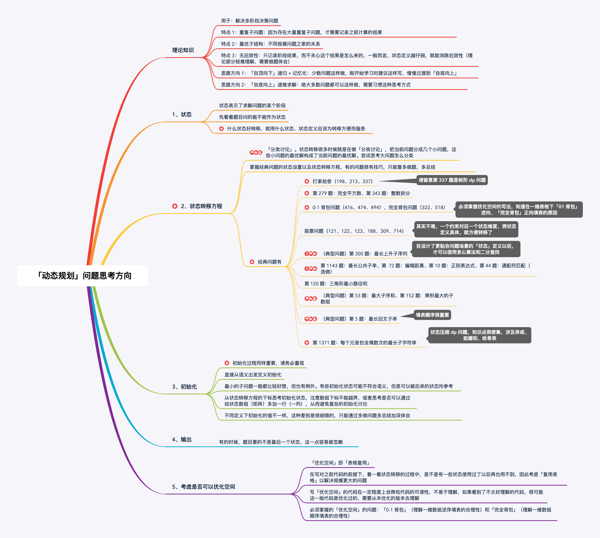

思路图：

动态规划

动态规划的解题方法是「空间换时间」思想的体现，常见的解决问题解题过程很像在「填表」。 

1、定义状态

也就是用数组，或者说临时变量表示实际问题中的什么。状态的定义是为了更好的得出状态转移方程。如果状态定义的不好，状态转移方程也就不容易得出，容易出现一步错，步步错，或者说一步错，步步难的情况。因此要随机应变，应变着重新更改状态的定义。

2、状态定义方程

也是动态规划的核心也是难点，说简单点就是找所定义状态之间的各种递推关系。动态规划问题难度不同思考的东西方向也不同一点。单纯说面试的话，难度低一些，思路从一个小规模问题出发，逐步得到大问题的解，并记录中间过程。再简单一点的动态规划问题甚至就是举例子找规律，找关系式。

难一些的，需要对各种状态空间进行分类，也就是分类讨论

3、状态的初始化： 常见技巧是否需要多设置一行、一列来规避一些边界情况，特殊情况。

4、空间优化：针对重复的计算、不必要的空间、空间重复利用进行思考规避。