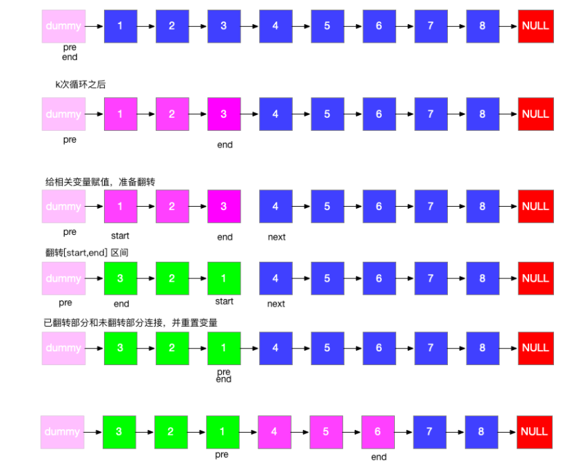

力扣困难


将给出的链表中的节点每 k 个一组翻转，返回翻转后的链表 

如果链表中的节点数不是 k 的倍数，将最后剩下的节点保持原样

你不能更改节点中的值，只能更改节点本身。

要求空间复杂度 O(1) 

例如： 

给定的链表是1→2→3→4→5

对于   k=2, 你应该返回 2→1→4→3→5

对于   k=3, 你应该返回 3→2→1→4→5


示例1

输入

{1,2,3,4,5},2

输出

{2,1,4,3,5}


## 版本一：

版本一过程图，简单易懂。



思路：

如图，关注下代码中，变量的初始化，和间断链表之间的衔接。

每次都初始化为流程图第一行的状态。

注意反转后 start 和 end 位置，以及用的是 pre 变量接受。

变量含义：

dummy 作一个临时节点，用于返回结果。

pre 指向每次要翻转的链表结点的上一个节点。

end 指向每次要翻转的链表的尾节点。

start 代表当前节点。

reverse 函数为链表翻转函数，输入：1->2->3->4 输出：null<-1<-2<-3<-4。

````java
class Solution {
    public ListNode reverseKGroup(ListNode head, int k) {
        if (head == null || head.next == null){return head;}
        ListNode dummy=new ListNode(0);
        dummy.next=head;
        ListNode pre=dummy;
        ListNode end=dummy;
        
        while(end.next!=null){
            for(int i=0;i<k && end != null;i++){
                end=end.next;	    //end为空，end.next会报空指针异常。
            }
            if(end==null){break;}
            ListNode next=end.next; //记录下end.next,方便后面链接链表
            end.next=null;			//断开链表
            ListNode start=pre.next;//记录下要翻转链表的头节点
            pre.next=reverse(start);//翻转链表，返回值是end，用pre链接。
            start.next=next;		//重新链接。
            //翻转结束，回到下一的初始状态。
            pre=start;
            end=start;
        }
        return dummy.next;
    }

    public ListNode reverse(ListNode head) {
        if (head == null || head.next == null){return head;}
        ListNode preNode = null;
        ListNode curNode = head;
        ListNode nextNode = null;
        while (curNode != null){
            nextNode = curNode.next;
            curNode.next=preNode;
            preNode = curNode;
            curNode = nextNode;
        }
        return preNode;
    }
}
````


## 版本二：

````java
public class Solution {
    public static ListNode reverseKGroup(ListNode head, int k) {
		if(head == null || head.next == null || k < 2) return head;
		ListNode dummy = new ListNode(0);
		dummy.next = head;
		ListNode pre = dummy, cur = head, temp;
		int len = 0;
		while (head != null) {
			len ++ ;
			head = head.next;
		}
		for (int i = 0; i < len / k; i ++ ) {
			for (int j = 1; j < k; j ++ ) {
				temp = cur.next;
                
				cur.next = temp.next;
				temp.next = pre.next;
                
				pre.next = temp;
			}
			pre = cur;
			cur = cur.next;
		}
		return dummy.next;
	}
}
````


## 参考

[25. K 个一组翻转链表](https://leetcode-cn.com/problems/reverse-nodes-in-k-group/)

牛客网：https://www.nowcoder.com/questionTerminal/b49c3dc907814e9bbfa8437c251b028e


