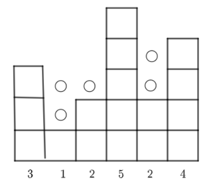
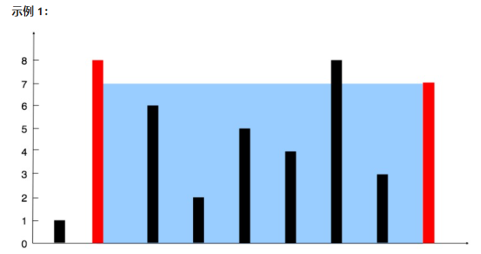
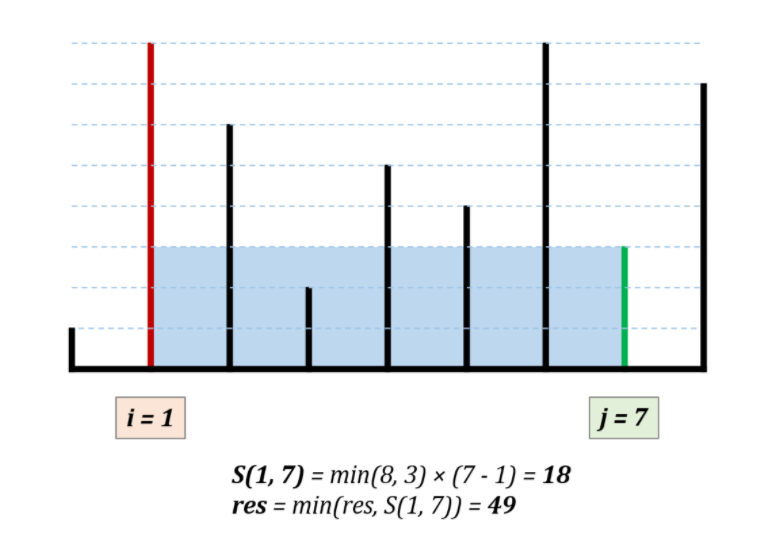

牛客：https://www.nowcoder.com/practice/31c1aed01b394f0b8b7734de0324e00f?tpId=117&&tqId=35269&rp=1&ru=/activity/oj&qru=/ta/job-code-high/question-ranking


牛客力扣题目含义不一样

牛客和力扣这道题一样，力扣困难：[42. 接雨水](https://leetcode-cn.com/problems/trapping-rain-water/)


题目描述：

数组所有的值都是非负的，能装多少水。题意还得看图。


示例1：

## 输入

```
[3,1,2,5,2,4]
```

## 返回值

```
5
```




示例2

## 输入

```
[4,5,1,3,2]
```

## 返回值

```
2
```


​	  |

|	|

|	|		  |

|	|		  |	|

|	|	|	|	|

分类：双指针

````java
import java.util.*;

public class Solution {
    /**
     * max water
     * @param arr int整型一维数组 the array
     * @return long长整型
     */
        public static long maxWater(int[] arr) {
        if (arr == null || arr.length <= 2) {
            return 0;
        }
        int left = 0, right = arr.length - 1;
        long sum = 0;
        // 找出左右边界的最小值作为水位高度
        int mark = Math.min(arr[left], arr[right]);
        while (left < right) {
            // 如果左边较低，则左边界向右遍历，否则右边界向左移动,相等无所谓
            if (arr[left] < arr[right]) {
                left++;
                // 如果当前标尺小于水位，则水量累加
                if (arr[left] < mark) {
                    sum += mark - arr[left];
                } else { // 否则，将此标尺和右边边界高度进行比较，找出剩下数组中的新水位
                    mark = Math.min(arr[left], arr[right]);
                }
            } else {
                right--;
                // 同理，如果当前标尺小于水位，则水量累加
                if (arr[right] < mark) {
                    sum += mark - arr[right];
                } else { // 否则，将此标尺和左边界的高度进行比较，找出剩余数组中的新水位
                    mark = Math.min(arr[right], arr[left]);
                }
            }
        }
        return sum;
    }
}
````


这是一道相似的题目

力扣中等：[11. 盛最多水的容器](https://leetcode-cn.com/problems/container-with-most-water/)


转述：看图

给你 n 个非负整数 a1，a2，...，an，每个数代表坐标中的一个点 (i, ai) 。在坐标内画 n 条垂直线，垂直线 i 的两个端点分别为 (i, ai) 和 (i, 0) 。

**找出其中的两条线，使得它们与 x 轴共同构成的容器可以容纳最多的水。**


**说明：**你不能倾斜容器。 

示例1：

输入：[1,8,6,2,5,4,8,3,7]
输出：49 
解释：图中垂直线代表输入数组 [1,8,6,2,5,4,8,3,7]。在此情况下，容器能够容纳水（表示为蓝色部分）的最大值为 49。




示例 2：

输入：height = [1,1]
输出：1


示例 3：

输入：height = [4,3,2,1,4]
输出：16


示例 4：

输入：height = [1,2,1]
输出：2


提示：

n = height.length
2 <= n <= 3 * 104
0 <= height[i] <= 3 * 104


分类：双指针、动态规划

思路：

消状态这点讲的很好，其实质就是在移动的过程中不断消去不可能成为最大值的状态。！ 


如果是双指针暴力枚举出所有状态，那就是时间复杂度就是 N^2。

指针移动规则可以省去一些不必要的移动。

指针移动规则：每次选定围成水槽两板高度 h[i]，h[j] 中的短板（最小值），向中间收窄 1 格。


设每一状态下水槽面积为 S，(0 <= i < j < n)，由于水槽的实际高度由两板中的短板决定，则可得面积公式 S = min(h[i], h[j]) × (j - i)。


若向内移动短板，水槽的短板 min(h[i], h[j]) 可能变大，因此水槽面积 S 可能增大。
若向内移动长板，水槽的短板 min(h[i], h[j]) 不变或变小，下个水槽的面积一定小于当前水槽面积。


因此只向内移动短板。



复杂度分析：

时间复杂度：O(N)，双指针遍历一次底边宽度 N。

空间复杂度：O(1)，指针使用常数额外空间。

````java
class Solution {
    public int maxArea(int[] height) {
        int i = 0, j = height.length - 1, res = 0;
        while(i < j){
            res = height[i] < height[j] ? 
                Math.max(res, (j - i) * height[i++]): 
                Math.max(res, (j - i) * height[j--]); 
        }
        return res;
    }
}

作者：jyd
链接：https://leetcode-cn.com/problems/container-with-most-water/solution/container-with-most-water-shuang-zhi-zhen-fa-yi-do/
来源：力扣（LeetCode）
著作权归作者所有。商业转载请联系作者获得授权，非商业转载请注明出处。
````


