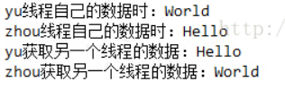

# JUC 类

## Future

Future是一个接口。Future模式可以这样来描述：我有一个任务，提交给了Future，Future替我完成这个任务。期间我自己可以去做任何想做的事情。一段时间之后，我就便可以从Future那儿取出结果。

相当于下了一张订货单，一段时间后可以拿着提订单来提货，这期间可以干别的任何事情。其中Future 接口就是订货单，真正处理订单的是Executor类，它根据Future接口的要求来生产产品。经常配合线程池来一起工作，将任务交给线程池去处理。

FutureTask是一个实现类，它实现了Runnable接口，配合Callable接口创建线程。Callable接口的call()方法作为线程执行体，call可以有返回值，也可以抛出异常。Callable对象不能直接作为Thread的目标，需要用Future可以完成。

````java
public static void main(String[] args)throws Exception{
		FutureTask<Integer> task=new FutureTask<Integer>(
            	new Callable(){public Integer call(){ return 1+2+3+4;}}); 
		new Thread(task).start();
		System.out.println("做自己的事，计算1+2+3+4交给另一个线程完成\n");
		System.out.println("返回获取结果 "+task.get());
		
	}
````

 结果： 

 做自己的事，计算1+2+3+4交给另一个线程完成 

 返回获取结果 10 


## Exchanger

这个类用于交换数据，只能用于两个线程。当一个线程运行到exchange()方法时会阻塞，另一个线程运行到exchange()时，二者交换数据，然后执行后面的程序。

```java
import java.util.concurrent.Exchanger;
public class JUCTest implements Runnable{
	private  Exchanger<String> exchange;
	private  String name;
	private	 String str;
	public JUCTest(Exchanger<String> exchange,String name,String str){
		this.exchange=exchange;
		this.name=name;
		this.str=str;
	}
	@Override  
	public void run(){  //线程同步用了synchronized否则无法保证s的正确性
		try{		
			System.out.println(name+"线程自己的数据时："+str);
			String s=exchange.exchange(str);    //交换数据
			System.out.println(name+"获取另一个线程的数据："+s);
		}
		catch(Exception e){
			e.printStackTrace();
		}
	}
	public static void main(String[] args) throws Exception {
		Exchanger<String> ex=new Exchanger<String>();
		new Thread(new JUCTest(ex,"zhou","Hello")).start();   
		new Thread(new JUCTest(ex,"yu","World")).start();   
	}
}
```

结果：

