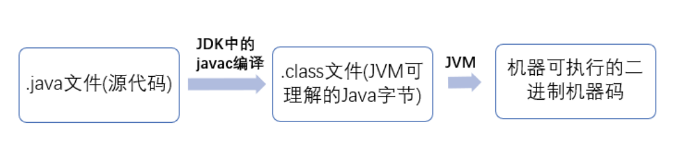

## ⾯向对象和⾯向过程的区别

**⾯向过程**：⽐如单⽚机、嵌⼊式开发、Linux/Unix 等⼀般采⽤⾯向过程开发。

⾯向过程性能⽐⾯向对象⾼。⾯向过程没有⾯向对象易维护、易复⽤、易扩展。

**⾯向对象**：⾯向对象易维护、易复⽤、易扩展。因为⾯向对象有封装、继承、多态性的特性，所以可以设计出低耦合的系统，使系统更加灵活、更加易于维护。但是，⾯向对象性能⽐⾯向过程低。

⾯向过程性能好的原因：

⾯向过程语⾔**⼤多**都是直接编译成**机械码**在电脑上执⾏，并且其它⼀些⾯向过程的脚本语⾔性能也并不⼀定⽐ Java 好。**Java 是半编译语⾔**，最终的执⾏代码并**不是可以直接被 CPU 执⾏的⼆进制机械码**。

## Java 语⾔有哪些特点

1、⾯向对象（封装，继承，多态）

2、平台⽆关性（ Java 虚拟机实现平台⽆关性）；

3、⽀持多线程（C++ 语⾔没有内置的多线程机制，因此必须调⽤操作系统的多线程功能来进⾏多线程程序设计）

4、 ⽀持⽹络编程并且很⽅便（ Java 语⾔诞⽣本身就是为简化⽹络编程设计）

5、⾃动内存管理机制

## JVM、JDK 和 JRE 

Java 虚拟机（JVM）是运⾏ Java 字节码的虚拟机。JVM 可以理解的代码就叫做**字节码**（即扩展名为.class的⽂件）。JVM 有针对不同系统的特定实现（Windows，Linux，macOS），⽬的是使⽤相同的字节码，它们都会给出相同的结果。

Java 程序从源代码到运⾏⼀般有下⾯ 3 步：

.class->机器码这⼀步。在这⼀步 **JVM 类加载器**⾸先加载字节码⽂件，然后通过**解释器逐⾏解释执⾏**，这种⽅式的执⾏速度会相对慢。

**JIT 编译器**完成第⼀次编译后，其会将字节码对应的机器码保存下来，运⾏效率肯定是⾼于 Java 解释器。

**HotSpot** 采⽤了**惰性评估**(Lazy Evaluation)的做法，根据⼆⼋定律，消耗⼤部分系统资源的只有那⼀⼩部分的代码（**热点代码**），⽽这也就是 JIT 所需要编译的部分。

## JDK 和 JRE

JDK 是 **Java Development Kit**，它是功能⻬全的 Java SDK。它**拥有 JRE** 所拥有的⼀切，**还有编译器（javac）****和**⼯具（如 javadoc 和 jdb）**。它能够**创建和编译程序**。

JRE 是 Java **运⾏时环境**。包括 Java 虚拟机（**JVM**），Java **类库**，java 命令和其他的⼀些基础构件。但是，它不能⽤于创建新程序。

一般如果只是为了运⾏⼀下 Java 程序的话，那么你只需要安装 JRE 就可以了。

## Java 和 C++的区别

1、都是**⾯向对象**的语⾔，都⽀持**封装、继承和多态**

2、J**ava 不提供指针**来直接访问内存，**程序内存更加安全**

3、Java 的类是单继承的，**C++ ⽀持多重继承**；虽然 Java 的类不可以多继承，但是接⼝可以多继承。

4、Java 有**⾃动内存管理机制**，不需要程序员⼿动释放⽆⽤内存

5、在 C 语⾔中，字符串或字符数组最后都会有⼀个额外的字符‘\0’来表示结束。但是，**Java 语⾔中没有结束符这⼀概念**。

## 重载和重写

重载

就是同⼀个类中多个同名⽅法根据不同的传参来执⾏不同的逻辑处理。

发⽣在同⼀个类中，⽅法名必须相同，参数类型不同、个数不同、顺序不同，⽅法返回值和访问修饰符可以不同。

重写

发⽣在运⾏期，是⼦类对⽗类的允许访问的⽅法的实现过程进⾏重新编写。

1、返回值类型、⽅法名、参数列表必须相同，抛出的异常范围⼩于等于⽗类，访问修饰符范围⼤于等于⽗类。

2、如果⽗类⽅法访问修饰符为private/final/static则⼦类就不能重写该⽅法，但是被 static 修饰的⽅法能够被再次声明。

3、 构造⽅法⽆法被重写

综上：重写就是⼦类对⽗类⽅法的重新改造，外部样⼦不能改变，内部逻辑可以改变。

## 封装、继承、多态

封装

把⼀个对象的属性私有化，同时提供⼀些可以被外界访问的属性的⽅法。

继承

1、⼦类拥有⽗类对象所有的属性和⽅法（包括私有属性和私有⽅法），但是⽗类中的私有属性和⽅法⼦类是**⽆法访问，只是拥有**。

2、⼦类可以拥有⾃⼰属性和⽅法，即⼦类可以对⽗类进⾏**扩展**。

多态

即⼀个引⽤**变量到底会指向哪个类的实例对象**，该引⽤变量发出的⽅法**调⽤到底是哪个类中实现的⽅法**，必须在由程序运⾏期间才能决定。

实现多态：

1、继承（多个⼦类对同⼀⽅法的重写）

2、接⼝（实现接⼝并覆盖接⼝中同⼀⽅法）。

## 构造函数

Java 程序在执⾏⼦类的构造⽅法之前，**如果没有⽤super()来调⽤⽗类特定的构造⽅法**，则会调⽤⽗类中“没有参数的构造⽅法”。这样是帮助⼦类做初始化⼯作。

因此，如果⽗类中**只定义了有参数的构造⽅法**，⽽在⼦类的构造⽅法中⼜没有⽤super()来调⽤⽗类中特定的构造⽅法，**则编译时将发⽣错误**，因为 Java 程序在⽗类中找不到没有参数的构造⽅法可供执⾏。**解决办法是在⽗类⾥加上⼀个不做事且没有参数的构造⽅法。**

## 接⼝和抽象类的区别

1、接⼝的**⽅法默认是public**，所有⽅法在接⼝中**不能有实现**(Java 8 开始接⼝⽅法可以有默认实现），⽽**抽象类可以有⾮抽象的⽅法**。

2、接⼝中除了**static、final变量**，不能有其他变量，⽽抽象类中则不⼀定。

3、**⼀个类可以实现多个接⼝，但只能实现⼀个抽象类**。**接⼝⾃⼰本身可以通过extends关键字扩展多个接⼝**

4、接⼝⽅法默认修饰符是public，**抽象⽅法可以有public、protected和default这些修饰符**（**抽象⽅法就是为了被重写所以不能使⽤private关键字修饰**！）。

5、从设计层⾯来说，**抽象类是对类的抽象，是⼀种模板设计**，⽽**接⼝是对⾏为的抽象**，是⼀种**⾏为的规范**。

扩展：

1、 **Jdk 9** 在接⼝中引⼊了**私有⽅法和私有静态⽅法。jdk 8** 的时候接⼝可以有**默认⽅法和静态⽅法功能。**

2、在 JDK8 中，接⼝也可以定义**静态⽅法**，可以直接⽤接⼝名调⽤。**实现类和实现是不可以调⽤的。**

如果同时**实现两个接⼝**，接⼝中定义了⼀样的**默认⽅法**，则必须重写，不然会报错。

## 成员变量与局部变量的区别

1、从语法形式上看:成员变量是属于类的，⽽局部变量是在⽅法中定义的变量或是⽅法的参数；成员变量可以被public,private,static等修饰符所修饰，⽽局部变量不能被访问控制修饰符及static所修饰；但是，成员变量和局部变量都能被final所修饰。

2、从变量在内存中的存储⽅式来看:如果成员变量是使⽤static修饰的，那么这个成员变量是属于类的，如果没有使⽤static修饰，这个成员变量是属于实例的。对象存于堆内存，如果局部变量类型为基本数据类型，那么存储在栈内存，如果为引⽤数据类型，那存放的是指向堆内存对象的引⽤或者是指向常量池中的地址。

3、从变量在内存中的⽣存时间上看:成员变量是对象的⼀部分，它随着对象的创建⽽存在，⽽局部变量随着⽅法的调⽤⽽⾃动消失。

4、成员变量如果没有被赋初值:则会⾃动以类型的默认值⽽赋值（⼀种情况例外:被final修饰的成员变量也必须显式地赋值），⽽局部变量则不会⾃动赋值。

## 对象实体与对象引⽤

创建⼀个对象⽤ new 运算符，new 创建对象实例（对象实例在堆内存中）。对象引⽤指向对象实例（**对象引⽤存放在栈内存中**）。⼀个对象引⽤可以指向 0 个或 1 个对象（⼀根绳⼦可以不系⽓球，也可以系⼀个⽓球）;⼀个对象可以有 n 个引⽤指向它（可以⽤ n 条绳⼦系住⼀个⽓球）。

## 哈希碰撞解决方式

**拉链法**

**开放定址法**

当发生地址冲突时，按照某种方法**继续探测哈希表中的其他存储单元，直到找到空位置为止。**
用方程来表达的话是这样子， 

> H i ( key ) = ( H ( key )+ d i ) mod m ( i = 1,2,…… ， k ( k ≤ m – 1)) 

m 是哈希表的长度。

举一个实际的例子，
一个哈希函数是 H (key) = key mod 7 ，
哈希表长度为 7，
关键字序列（ 32 ， 13 ， 49 ， 55 ， 22 ， 38 ， 21 ）
如果以线性探测再散列来生成哈希表的话，

过程是这样的 ：

> 32 ％ 7 = 4 ； 13 ％ 7 = 6 ； 49 ％ 7 = 0 ；
> 55 ％ 7 = 6 发生冲突，下一个存储地址（ 6 ＋ 1 ）％ 7 ＝ 0 ，仍然发生冲突，再下一个存储地址：（ 6 ＋ 2 ）％ 7 ＝ 1 未发生冲突，可以存入。
> 22 ％ 7 ＝ 1 发生冲突，下一个存储地址是：（ 1 ＋ 1 ）％ 7 ＝ 2 未发生冲突；
> 38 ％ 7 ＝ 3 ；
> 21 ％ 7 ＝ 0 发生冲突，按照上面方法继续探测直至空间 5 ，不发生冲突 

所得到的哈希表对应存储位置： 

> 下标： 0 1 2 3 4 5 6
> 49 55 22 38 32 21 13  

参考：

https://segmentfault.com/p/1210000015259218/read