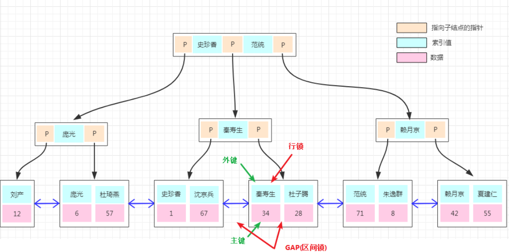

# 事务

脏读:指读到了其他事务未提交的数据

不可重复读: 读到了其他事务已提交的数据

不可重复读与幻读都是读到其他事务已提交的数据，但是它们针对点不同

不可重复读：update
幻读：delete，insert

# 隔离级别

未提交读 （READ UNCOMMITTED） ：不允许同时进行写操作，但允许其他事务读此行数据 

已提交读（READ COMMITTED）：允许其他事务继续访问该行数据，但是未提交的写事务将会禁止其他事务访问该行，会对该写锁一直保持直到到事务提交. 

可重复读（REPEATABLE READS）： InnoDb的默认隔离级别 

可串行化（Serializable ）：最高的隔离级别，它求在选定对象上的读锁和写锁保持直到事务结束后才能释放，所以能防住上诉所有问题，但因为是串行化的，所以效率较低. 

## MVCC

MVCC：多版本并发控制。MySQL、ORACLE、PostgreSQL等都是使用了以乐观锁为理论基础的MVCC（多版本并发控制）来避免不可重复读和幻读。MVCC的实现没有固定的规范，每个数据库都会有不同的实现方式，这里讨论的是InnoDB的MVCC。 

在InnoDB中，会在每行数据后添加两个额外的隐藏的值来实现MVCC，这两个值一个记录这行数据何时被创建，另外一个记录这行数据何时过期（或者被删除）。在实际操作中，存储的并不是时间，而是事务的版本号，每开启一个新事务，事务的版本号就会递增。 在可重读Repeatable reads事务隔离级别下：

- SELECT时，读取创建版本号<=当前事务版本号，删除版本号为空或  >  当前事务版本号。
- INSERT时，保存当前事务版本号为行的创建版本号
- DELETE时，保存当前事务版本号为行的删除版本号
- UPDATE时，插入一条新纪录，保存当前事务版本号为行创建版本号，同时保存当前事务版本号到原来删除的行

## Next-Key锁



B+树的所有数据存储在叶子节点上,当有一个新的叫`秦寿生`的数据进来,一定是排在在这条id=34的数据前面或者后面的,我们如果对前后这个范围进行加锁了,那当然新的`秦寿生`就插不进来了.

那如果有一个新的`范统`要插进行呢? 因为`范统`的前后并没有被锁住,是能成功插入的,这样就极大地提高了数据库的并发能力.


InnoDB的行锁锁定的是索引，而不是记录本身，这一点也需要有清晰的认识。故某索引相同的记录都会被加锁，会造成索引竞争，这就需要我们严格设计业务sql，尽可能的使用主键或唯一索引对记录加锁。索引映射的记录如果存在，加行锁，如果不存在，则会加 next-key lock / gap 锁 / 间隙锁，故InnoDB可以实现事务对某记录的预先占用，如果记录存在，它就是本事务的，如果记录不存在，那它也将是本是无的，只要本是无还在，其他事务就别想占有它。 


### 快照读

我们平时只用使用select就是快照读,这样可以减少加锁所带来的开销.

````
select * from table ....
````

### 当前读

对于会对数据修改的操作(update、insert、delete)都是采用当前读的模式。在执行这几个操作时会读取最新的记录，即使是别的事务提交的数据也可以查询到。假设要update一条记录，但是在另一个事务中已经delete掉这条数据并且commit了，如果update就会产生冲突，所以在update的时候需要知道最新的数据。读取的是最新的数据，需要加锁。以下第一个语句需要加共享锁，其它都需要加排它锁。

````
select * from table where ? lock in share mode; 
select * from table where ? for update; 
insert; 
update; 
delete;
````


为什么说可重复读防不住幻读？

RR 级别作为 mysql 事务默认隔离级别，是事务安全与性能的折中，可能也符合二八定律（20%的事务存在幻读的可能，80%的事务没有幻读的风险），我们在正确认识幻读后，便可以根据场景灵活的防止幻读的发生。 

RR级别幻读例子：

1、a事务先select，b事务insert确实会加一个gap锁，但是如果b事务commit，这个gap锁就会释放（释放后a事务可以随意操作）
2、a事务再select出来的结果在MVCC下还和第一次select一样
3、接着a事务不加条件地update，这个update会作用在所有行上（包括b事务新加的）
4、a事务再次select就会出现b事务中的新行，并且这个新行已经被update修改了

Mysql官方给的幻读解释是：只要在一个事务中，第二次select多出了row就算幻读， 所以这个场景下，算出现幻读了。

# 索引

300w记录的7字段左右表，根据没有索引的列查一条记录，9秒左右。创建完索引，1秒以内。

## 聚簇索引

聚簇索引（Clustered Index）就是按照每张表的主键构造一棵B+树，同时叶子节点中存放的即为整张表的行记录数据。 

举个例子：


《MySQL技术内幕》的作者通过分析工具得到聚簇索引树的大致构造如下：


#### 聚簇索引树

1、聚簇索引的叶子节点称为**数据页**，每个数据页通过一个双向链表来进行链接，而且数据页按照主键的顺序进行排列。

2、如图所示，每个数据页上存放的是完整的行记录，而在非数据页的索引页中，存放的仅仅是键值及指向数据页的偏移量，而不是一个完整的行记录。

#### 创建

1、如果定义了主键，InnoDB会自动使用主键来创建聚簇索引。

2、如果没有定义主键，InnoDB会选择一个唯一的非空索引代替主键。

3、如果没有唯一的非空索引，InnoDB会隐式定义一个主键来作为聚簇索引。


#### 使用

 对于InnoDB表，顺序插入是最快的方式，乱序慢，一般都会定义一个自增的ID列为主键。 

对于InnoDB表，一般定义主键为不可更新，更改耗时，因为将会导致被更新的行移动 。


## 非聚簇索引

辅助索引(Secondary Index)， 也叫非聚簇索引、普通索引。

和聚簇索引相比，叶子节点中并不包含行记录的全部数据。

叶子节点简单记忆为存了当前索引的键值和主键索引。详细说是除了包含键值以外，每个叶子节点的索引行还包含了一个书签（bookmark），该书签用来告诉InnoDB哪里可以找到与索引相对应的行数据。 


##### 区别

聚簇索引和非聚簇索引的区别：叶节点是否存放一整行记录 。

InnoDB 主键使用的是聚簇索引，MyISAM 不管是主键索引，还是二级索引使用的都是非聚簇索引。 


## 覆盖索引

覆盖索引（Covering index），只是特定于具体select语录而言的联合索引。而不再需要回表查询啦，就称该联合索引覆盖了这条select语句。 覆盖索引是联合索引之中的更优表现。也就是InnoDB存储引擎支持覆盖索引，即从辅助索引中就可以得到查询的记录，而不需要查询聚簇索引中的记录。 

使用覆盖索引有啥好处？

1、可以减少大量的IO操作

 如果要查询辅助索引中不含有的字段，得先遍历辅助索引，再遍历聚簇索引，而如果要查询的字段值在辅助索引上就有，就不用再查聚簇索引了，这显然会减少IO操作。 

2、 有助于统计 

````sql
CREATE TABLE `student` (
  `id` bigint(20) NOT NULL,
  `name` varchar(255) NOT NULL,
  `age` varchar(255) NOT NULL,
  `school` varchar(255) NOT NULL,
  PRIMARY KEY (`id`)，
  KEY `idx_name` (`name`)，
  KEY `idx_school_age` (`school`，`age`)
) ENGINE=InnoDB DEFAULT CHARSET=utf8;
````

例1：

执行： select count(*) from student 

优化器会怎么处理？

遍历聚簇索引和辅助索引都可以统计出结果，但辅助索引要远小于聚簇索引，所以优化器会选择辅助索引来统计。

执行explain命令：  key和Extra显示使用了idx_name这个辅助索引。 


例2：

执行： select *  from student where age   >   10 and age < 15 

因为联合索引idx_school_age的字段顺序是先school再age，按照age做条件查询，结果通常不走索引： 

但是，如果保持条件不变，查询所有字段改为查询条目数： 

执行： select count(*) from student where age   >   10 and age < 15 

优化器会选择这个联合索引： 


## 联合索引

联合索引是指对表上的多个列进行索引。

举个例子：

以下为创建联合索引idx_a_b的示例： 


 联合索引的内部结构： 


1、联合索引也是一棵B+树，其键值数量大于等于2。

2、键值都是排序的，通过叶子节点可以逻辑上顺序的读出所有数据。数据（1,1）（1,2）（2,1）（2,4）（3,1）（3,2）是按照（a，b）先比较a再比较b的顺序排列。

实例分析1：

好处一，方便查询。

基于上面的结构，对于以下查询显然是可以使用（a，b）这个联合索引的：

select * from table where a=xxx and b=xxx ; 

select * from table where a=xxx; 

对于下面的sql是不能使用这个联合索引的，因为叶子节点的b值，1,2,1,4,1,2显然不是排序的。 

select * from table where b=xxx 

实例分析2：

好处二：方便排序。

联合索引的第二个好处是对第二个键值已经做了排序。举个例子： 

````sql
create table buy_log(
    userid int not null,
    buy_date DATE
)ENGINE=InnoDB;

insert into buy_log values(1, '2009-01-01');
insert into buy_log values(2, '2009-02-01');

alter table buy_log add key(userid);
alter table buy_log add key(userid, buy_date);
````

当执行 select * from buy_log where user_id = 2； 时，优化器会选择key(userid)； 

但是当执行:select * from buy_log where user_id = 2 order by buy_date desc;  时，优化器会选择key(userid, buy_date)，因为buy_date是在userid排序的基础上做的排序。 

如果把key（userid,buy_date）删除掉，再执行：  select * from buy_log where user_id = 2 order by buy_date desc;  优化器会选择key（userid），但是对查询出来的结果会进行一次filesort，即按照buy_date重新排下序。所以联合索引的好处在于可以避免filesort排序。 


## 索引存储结构

#### b树

（balance tree）和b+树应用在数据库索引，可以认为是m叉的多路平衡查找树，但是从理论上讲，二叉树查找速度和比较次数都是最小的，为什么不用二叉树呢？ 

查询：

减少IO次数，对于树来说，IO次数就是树的高度，而“矮胖”就是b树的特征之一，每一层节点的比较会对应一次磁盘IO，它的每个节点最多包含m个孩子，m称为b树的阶，m的大小取决于磁盘页的大小。 

增加、删除:

范围多路平衡查找树，一次增加、删除未必导致分裂与合并，进行自平衡的次数也少。


一个M阶的b树具有如下几个特征：

1. 定义任意非叶子结点最多只有M个儿子，且M>2；
2. 根结点的儿子数为[2, M]；
3. 除根结点以外的非叶子结点的儿子数为[M/2, M]，向上取整；
4. 非叶子结点的关键字个数=儿子数-1；
5. 所有叶子结点位于同一层；
6. k个关键字把节点拆成k+1段，分别指向k+1个儿子，同时满足查找树的大小关系。


#### b+树

b+树，是b树的一种变体，查询性能更好。m阶的b+树的特征：

1. 有n棵子树的非叶子结点中含有n个关键字（b树是n-1个），这些关键字不保存数据，只用来索引，所有数据都保存在叶子节点（b树是每个关键字都保存数据）。
2. 所有的叶子结点中包含了全部关键字的信息，及指向含这些关键字记录的指针，且叶子结点本身依关键字的大小自小而大顺序链接。
3. 所有的非叶子结点可以看成是索引部分，结点中仅含其子树中的最大（或最小）关键字。
4. 通常在b+树上有两个头指针，一个指向根结点，一个指向关键字最小的叶子结点。
5. 同一个数字会在不同节点中重复出现，根节点的最大元素就是b+树的最大元素。


B树和B+树的区别：

1、B+树中只有叶子节点会带有指向记录的指针（ROWID），一个块中可以容纳更多的索引项，磁盘页能容纳更多节点元素，更“矮胖”，可以降低树的高度；而B树则所有节点都带有，在内部节点出现的索引项不会再出现在叶子节点中。

2、B+树中所有叶子节点都是通过指针连接在一起，而B树没有，对于范围查找来说，b+树只需遍历叶子节点链表即可，b树却需要重复地中序遍历。

3、b+树查询必须查找到叶子节点，b树只要匹配到即可不用管元素位置，因此b+树查找更稳定；


B+树的优点：

1、内部节点可以存更多索引项

2、叶子节点之间通过指针来连接，范围扫描快速。

 

B树的优点：

对于在内部节点的数据，可直接得到，不必根据叶子节点来定位。


# 索引失效

##### 最左前缀法则

如果索引了多列，要遵守最左前缀法则。指的是查询从索引的最左前列开始，并且不跳过索引中的列。

1、违反最左前缀法则

对a、b、c列建立联合索引，where里是b and c 不走、where里是b 不走。

而where里是a、c 的话走只 a 的那一段索引长度。

而where里是=a、>b、=c 的话走只 a和b 的那一段索引长度，c的就不走了。

2、不要在索引列上进行运算操作，索引将失。

比如 where substring(a, 3 , 2 ) ='索引'

3、字符串不加单引号，造成索引失效。没有对字符串类型的值加单引号，MySQL的查询优化器，会自动的进行类型转换，造成索引失效。

4、用or分割开的条件，如果or前的条件中的列有索引，而后面的列中没有索引，那么涉及的索引都不会被用到。

比如：a or b	a有索引，b没有建索引，不加其他sql关键字的话sql整体不走索引。

5、模糊查询，以%开头的Like模糊查询，索引失效。

这里说的都是 查询的 多字段，非覆盖索引查询。

如果仅仅是尾部模糊匹配，索引不会失效（开头%）。如果是头部模糊匹配（%开头），索引失效。

解决：

使用覆盖索引查询，随便模糊都走索引。

6、in 走索引， not in 索引失效。

7、is NULL ， is NOT NULL 有时索引失效，看评估。

8、如果MySQL评估使用索引比全表更慢，则不使用索引。看列值的区别度大不大。


# SQL优化

##### Explain 结果含义

type：显示的是访问类型:

system > const > eq_ref > ref > fulltext > ref_or_null > index_merge > unique_subquery  > index_subquery > range > index > ALL

Extra 含义：

using index：使用覆盖索引的时候就会出现

using where：在查找使用索引的情况下，需要回表去查询所需的数据

using index condition：查找使用了索引，但是需要回表查询数据

using index、using where：查找使用了索引，但是需要的数据都在索引列中能找到，所以不需要回表查询数据


##### 插入

MySQL一条语句如何写？插入1000条？

1、插入语句常用写法1：插入一条的SQL语句

INSERT INTO 

items(name,city,price,number,picture)  

VALUES

('耐克运动鞋','广州',500,1000,'003.jpg');

2、插入语句常用写法2：插入多条的SQL语句，两者都是建立一个连接。

INSERT INTO 

items(name,city,price,number,picture) 

VALUES

('耐克运动鞋','广州',500,1000,'003.jpg'),

('耐克运动鞋2','广州2',500,1000,'002.jpg');

3、其他优化

- 对于InnoDB，按照主键顺序插入，因为InnoDB类型的表是按照主键的顺序保存。

- 关闭唯一性校验

- 手动提交事务

##### 排序

所有不是通过索引直接返回排序结果的排序都叫 FileSort 排序。

通过有序索引顺序扫描直接返回有序数据为 using index，不需要额外排序，操作效率高。这里说的是explain结果中的 Extra 列。

总结：

1、通过加索引，where 条件和Order by 使用相同的索引，并且Order By 的顺序和索引顺序相同（多字段排序也要最左前缀的意思）。

Order by 的字段都是升序，或者都是降序。否则肯定需要额外的操作，这样就会出现FileSort。

2、索引优化不掉的FileSort，可以适当提高 sort_buffer_size 和 max_length_for_sort_data 系统变量，来增大排序区的大小，提高排序的效率。或者视情况提示sql直接FileSort 不再先内存排序再转FileSort 。

##### 优化 group by

不需要排序的 order by null 禁止排序。需要排序的视情况加索引。

##### 优化子查询

多数情况下，子查询是可以被更高效的连接（JOIN）替代，是因为MySQL不需要在内存中创建临时表来完成这个逻辑上需要两个步骤的查询工作。少了步骤，而且explain中的Extra列也会是NULL或者其他更好的情况。

##### 优化OR条件

1、OR之间的每个条件列都必须用到索引，而且不能使用到复合索引；如果没有索引，则应该考虑增加索引。

2、SQL改写：

建议使用 union 替换 or，UNION 要优于 OR 。

UNION 语句的 type 值为 ref，OR 语句的 type 值为 range，可以看到这是一个很明显的差距

UNION 语句的 ref 值为 const，OR 语句的 type 值为 null，const 表示是常量值引用。

##### 优化分页查询

利用索引上完成排序分页操作，最后根据主键关联回原表查询所需要的其他列内容。

SELECT * 

FROM student AS stu ,

​		  (SELECT id FROM student order by id limit 2000000,10)  AS a 

where a.id =stu.id

##### SQL提示

1、IGNORE INDEX

如果用户只是单纯的想让MySQL忽略一个或者多个索引，则可以使用 ignore index

select*fromtb_sellerignoreindex(idx_seller_name)wherename='小米科技';


2、FORCE INDEX

为强制MySQL使用一个特定的索引，可在查询中使用 force index 

SELECT *  FROM student AS stu force index  (idx_a_b)  where ....


3、USE INDEX

在查询语句中表名的后面，添加 use index 来提供希望MySQL去参考的索引列表，就可以让MySQL不再考虑其他可用的索引，适用于索引有多种选择的情况。


# 数据类型：

varchar（100）可以存多少中文字符？

具体还是要看版本的

4.0版本以下：33个。

varchar(100)，指的是100字节，如果存放UTF8汉字时，只能存33个（每个汉字3字节）

5.0版本以上：

varchar(100)，指的是100个字符，无论存放的是数字、字母还是UTF8汉字（每个汉字3字节），都可以存放100个。MySQL的varchar(n)可以存储的中文字符数和英文字符数是一致的，都是n个字符， INSERT的value字符数超过就报错。 [Err] 1406 - Data too long for column’string’ at row x 


##### 数值类型

| 类型         | 大小                                     | 范围（有符号）                                               | 范围（无符号）                                               | 用途            |
| :----------- | :--------------------------------------- | :----------------------------------------------------------- | :----------------------------------------------------------- | :-------------- |
| TINYINT      | 1 byte                                   | (-128，127)                                                  | (0，255)                                                     | 小整数值        |
| SMALLINT     | 2 bytes                                  | (-32 768，32 767)                                            | (0，65 535)                                                  | 大整数值        |
| MEDIUMINT    | 3 bytes                                  | (-8 388 608，8 388 607)                                      | (0，16 777 215)                                              | 大整数值        |
| INT或INTEGER | 4 bytes                                  | (-2 147 483 648，2 147 483 647)                              | (0，4 294 967 295)                                           | 大整数值        |
| BIGINT       | 8 bytes                                  | (-9,223,372,036,854,775,808，9 223 372 036 854 775 807)      | (0，18 446 744 073 709 551 615)                              | 极大整数值      |
| FLOAT        | 4 bytes                                  | (-3.402 823 466 E+38，-1.175 494 351 E-38)，0，(1.175 494 351 E-38，3.402 823 466 351 E+38) | 0，(1.175 494 351 E-38，3.402 823 466 E+38)                  | 单精度 浮点数值 |
| DOUBLE       | 8 bytes                                  | (-1.797 693 134 862 315 7 E+308，-2.225 073 858 507 201 4 E-308)，0，(2.225 073 858 507 201 4 E-308，1.797 693 134 862 315 7 E+308) | 0，(2.225 073 858 507 201 4 E-308，1.797 693 134 862 315 7 E+308) | 双精度 浮点数值 |
| DECIMAL      | 对DECIMAL(M,D) ，如果M>D，为M+2否则为D+2 | 依赖于M和D的值                                               | 依赖于M和D的值                                               | 小数值          |


##### 日期/时间类型

每个时间类型有一个有效值范围和一个"零"值，当指定不合法的MySQL不能表示的值时使用"零"值。

TIMESTAMP类型有专有的自动更新特性，将在后面描述。

| 类型      | 大小 ( bytes) | 范围                                                         | 格式                | 用途                     |
| :-------- | :------------ | :----------------------------------------------------------- | :------------------ | :----------------------- |
| DATE      | 3             | 1000-01-01/9999-12-31                                        | YYYY-MM-DD          | 日期值                   |
| TIME      | 3             | '-838:59:59'/'838:59:59'                                     | HH:MM:SS            | 时间值或持续时间         |
| YEAR      | 1             | 1901/2155                                                    | YYYY                | 年份值                   |
| DATETIME  | 8             | 1000-01-01 00:00:00/9999-12-31 23:59:59                      | YYYY-MM-DD HH:MM:SS | 混合日期和时间值         |
| TIMESTAMP | 4             | 1970-01-01 00:00:00/2038结束时间是第 **2147483647** 秒，北京时间 **2038-1-19 11:14:07**，格林尼治时间 2038年1月19日 凌晨 03:14:07 | YYYYMMDD HHMMSS     | 混合日期和时间值，时间戳 |

##### 字符串、字符类型

| 类型       | 大小                  | 用途                            |
| :--------- | :-------------------- | :------------------------------ |
| CHAR       | 0-255 bytes           | 定长字符串                      |
| VARCHAR    | 0-65535 bytes         | 变长字符串                      |
| TINYBLOB   | 0-255 bytes           | 不超过 255 个字符的二进制字符串 |
| TINYTEXT   | 0-255 bytes           | 短文本字符串                    |
| BLOB       | 0-65 535 bytes        | 二进制形式的长文本数据          |
| TEXT       | 0-65 535 bytes        | 长文本数据                      |
| MEDIUMBLOB | 0-16 777 215 bytes    | 二进制形式的中等长度文本数据    |
| MEDIUMTEXT | 0-16 777 215 bytes    | 中等长度文本数据                |
| LONGBLOB   | 0-4 294 967 295 bytes | 二进制形式的极大文本数据        |
| LONGTEXT   | 0-4 294 967 295 bytes | 极大文本数据                    |

**注意**：

5版本以后char(n) 和 varchar(n) 中括号中 n 代表字符的个数，并不代表字节个数，比如 CHAR(30) 就可以存储 30 个字符。

CHAR 和 VARCHAR 类型类似，但它们保存和检索的方式不同。它们的最大长度和是否尾部空格被保留等方面也不同。在存储或检索过程中不进行大小写转换。

BINARY 和 VARBINARY 类似于 CHAR 和 VARCHAR，不同的是它们包含二进制字符串而不要非二进制字符串。也就是说，它们包含字节字符串而不是字符字符串。这说明它们没有字符集，并且排序和比较基于列值字节的数值值。

BLOB 是一个二进制大对象，可以容纳可变数量的数据。

有 4 种 BLOB 类型：TINYBLOB、BLOB、MEDIUMBLOB 和 LONGBLOB。它们区别在于可容纳存储范围不同。

有 4 种 TEXT 类型：TINYTEXT、TEXT、MEDIUMTEXT 和 LONGTEXT。

对应的这 4 种 BLOB 类型，可存储的最大长度不同，可根据实际情况选择。


# 日志

重做日志（redo log） 、 回滚日志（undo log） 、 二进制日志（binlog） 

参考：

https://www.cnblogs.com/wy123/p/8365234.html


## 参考：

[《MySQL技术内幕 InnoDB存储引擎》学习笔记](https://blog.csdn.net/u012006689/article/details/73195837)

https://www.runoob.com/mysql/mysql-data-types.html

https://www.cnblogs.com/CoderAyu/p/11525408.html

https://blog.csdn.net/login_sonata/article/details/75268075