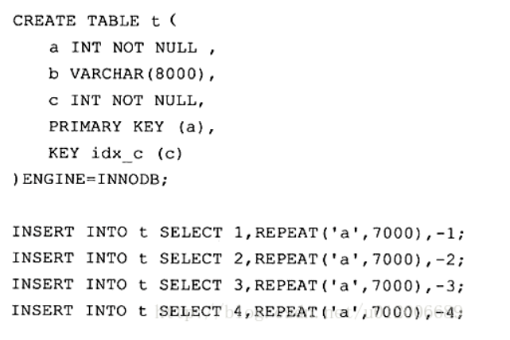
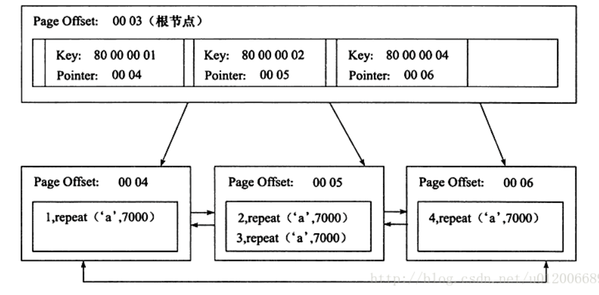
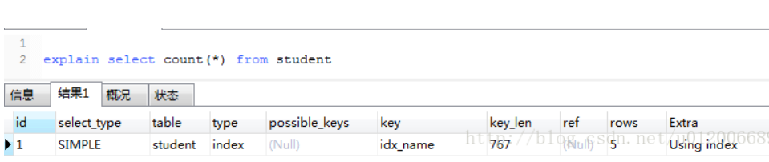
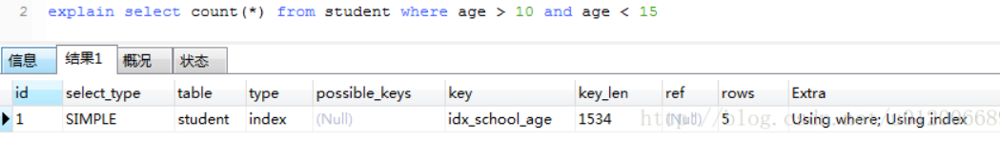
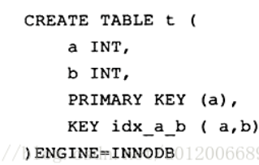
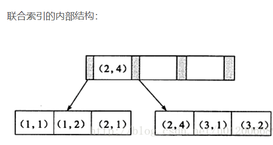

聚集索引、辅助索引、覆盖索引、联合索引

## 聚集索引

聚集索引（Clustered Index）就是按照每张表的主键构造一棵B+树，同时叶子节点中存放的即为整张表的行记录数据。 

举个例子：



《MySQL技术内幕》的作者通过分析工具得到聚集索引树的大致构造如下：




#### 聚集索引树

1、聚集索引的叶子节点称为**数据页**，每个数据页通过一个双向链表来进行链接，而且数据页按照主键的顺序进行排列。

2、如图所示，每个数据页上存放的是完整的行记录，而在非数据页的索引页中，存放的仅仅是键值及指向数据页的偏移量，而不是一个完整的行记录。

#### 创建

1、如果定义了主键，InnoDB会自动使用主键来创建聚集索引。

2、如果没有定义主键，InnoDB会选择一个唯一的非空索引代替主键。

3、如果没有唯一的非空索引，InnoDB会隐式定义一个主键来作为聚集索引。

## 辅助索引

辅助索引(Secondary Index)， 也叫非聚集索引、普通索引。

和聚集索引相比，叶子节点中并不包含行记录的全部数据。

叶子节点简单记忆为存了当前索引的键值和主键索引。详细说是除了包含键值以外，每个叶子节点的索引行还包含了一个书签（bookmark），该书签用来告诉InnoDB哪里可以找到与索引相对应的行数据。 


## 覆盖索引

覆盖索引（Covering index），只是特定于具体select语录而言的联合索引。而不再需要回表查询啦，就称该联合索引覆盖了这条select语句。 覆盖索引是联合索引之中的更优表现。也就是InnoDB存储引擎支持覆盖索引，即从辅助索引中就可以得到查询的记录，而不需要查询聚集索引中的记录。 

使用覆盖索引有啥好处？

1、可以减少大量的IO操作

 如果要查询辅助索引中不含有的字段，得先遍历辅助索引，再遍历聚集索引，而如果要查询的字段值在辅助索引上就有，就不用再查聚集索引了，这显然会减少IO操作。 

2、 有助于统计 

````sql
CREATE TABLE `student` (
  `id` bigint(20) NOT NULL,
  `name` varchar(255) NOT NULL,
  `age` varchar(255) NOT NULL,
  `school` varchar(255) NOT NULL,
  PRIMARY KEY (`id`),
  KEY `idx_name` (`name`),
  KEY `idx_school_age` (`school`,`age`)
) ENGINE=InnoDB DEFAULT CHARSET=utf8;
````

例1：

执行： select count(*) from student 

优化器会怎么处理？

遍历聚集索引和辅助索引都可以统计出结果，但辅助索引要远小于聚集索引，所以优化器会选择辅助索引来统计。

执行explain命令：  key和Extra显示使用了idx_name这个辅助索引。 




例2：

执行： select *  from student where age > 10 and age < 15 

因为联合索引idx_school_age的字段顺序是先school再age，按照age做条件查询，结果通常不走索引： 

但是，如果保持条件不变，查询所有字段改为查询条目数： 

执行： select count(*) from student where age > 10 and age < 15 

优化器会选择这个联合索引： 



## 联合索引

联合索引是指对表上的多个列进行索引。

举个例子：

以下为创建联合索引idx_a_b的示例： 




 联合索引的内部结构： 



1、联合索引也是一棵B+树，其键值数量大于等于2。

2、键值都是排序的，通过叶子节点可以逻辑上顺序的读出所有数据。数据（1,1）（1,2）（2,1）（2,4）（3,1）（3,2）是按照（a，b）先比较a再比较b的顺序排列。

实例分析1：

好处一，方便查询。

基于上面的结构，对于以下查询显然是可以使用（a，b）这个联合索引的：

select * from table where a=xxx and b=xxx ; 

select * from table where a=xxx; 

对于下面的sql是不能使用这个联合索引的，因为叶子节点的b值，1,2,1,4,1,2显然不是排序的。 

select * from table where b=xxx 

实例分析2：

好处二：方便排序。

联合索引的第二个好处是对第二个键值已经做了排序。举个例子： 

````sql
create table buy_log(
    userid int not null,
    buy_date DATE
)ENGINE=InnoDB;

insert into buy_log values(1, '2009-01-01');
insert into buy_log values(2, '2009-02-01');

alter table buy_log add key(userid);
alter table buy_log add key(userid, buy_date);
````

当执行 select * from buy_log where user_id = 2； 时，优化器会选择key(userid)； 

但是当执行:select * from buy_log where user_id = 2 order by buy_date desc;  时，优化器会选择key(userid, buy_date)，因为buy_date是在userid排序的基础上做的排序。 

如果把key（userid,buy_date）删除掉，再执行：  select * from buy_log where user_id = 2 order by buy_date desc;  优化器会选择key（userid），但是对查询出来的结果会进行一次filesort，即按照buy_date重新排下序。所以联合索引的好处在于可以避免filesort排序。 


参考：

[《MySQL技术内幕 InnoDB存储引擎》学习笔记](https://blog.csdn.net/u012006689/article/details/73195837)


## 日志

重做日志（redo log） 、 回滚日志（undo log） 、 二进制日志（binlog） 

参考：

https://www.cnblogs.com/wy123/p/8365234.html