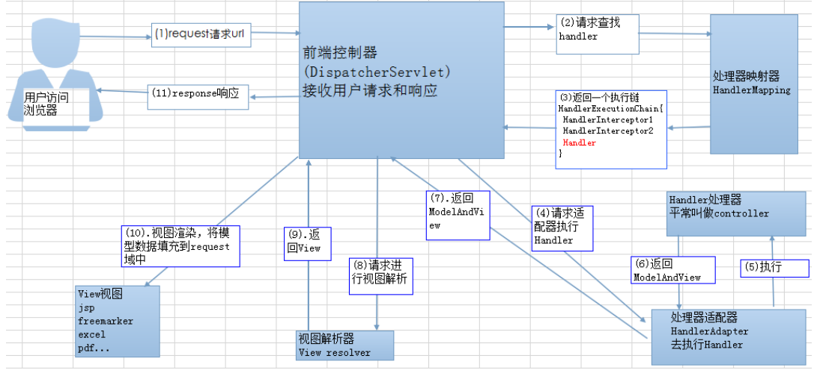

## Spring 中的单例 bean 的线程安全问题了解吗？

当多个线程操作同⼀个对象的时候，对这个对象的⾮静态成员变量的写操作会存在线程安全问题。

常⻅的有两种解决办法：

1、在Bean对象中尽量避免定义可变的成员变量（不太现实）。

2、在类中定义⼀个ThreadLocal成员变量，将需要的可变成员变量保存在 ThreadLocal 中（推荐的⼀种⽅式）。

## Spring 中的 bean ⽣命周期?

Bean 容器找到配置⽂件中 Spring Bean 的定义。

Bean 容器利⽤ Java Reflection API 创建⼀个Bean的实例。

如果涉及到⼀些属性值利⽤set()⽅法设置⼀些属性值。

如果 Bean 实现了BeanNameAware接⼝，调⽤setBeanName()⽅法，传⼊**Bean的名字**。

如果 Bean 实现了BeanClassLoaderAware接⼝，调⽤setBeanClassLoader()⽅法，传⼊**ClassLoader对象的实例**。

与上⾯的类似，如果实现了其他***.Aware接⼝**，就调⽤相应的⽅法。

如果有和加载这个 Bean 的 Spring 容器相关的BeanPostProcessor对象，执⾏**初始化前处理方法postProcessBeforeInitialization()⽅法**

如果Bean实现了InitializingBean接⼝，执⾏afterPropertiesSet()⽅法。

如果 **Bean 在配置⽂件中的定义包含 init-method** 属性，执⾏指定的⽅法。

如果有和加载这个 Bean的 Spring 容器相关的BeanPostProcessor对象，执**⾏初始化后处理postProcessAfterInitialization**()⽅法

当要**销毁 Bean** 的时候，如果 Bean 实现了**DisposableBean**接⼝，执⾏**destroy**()⽅法。

当要销毁 Bean 的时候，如果 Bean 在配置⽂件中的定义包含 **destroy-method** 属性，执⾏指定的⽅法。

图示：

参考：

https://www.cnblogs.com/zrtqsk/p/3735273.html

## SpringMVC ⼯作流程

图的⼀个**笔误**的⼩问题：

Spring MVC 的⼊⼝函数也就是前端控制器DispatcherServlet的作⽤是**接收请求，响应结果**。

1、客户端（浏览器）发送请求，直接请求到**DispatcherServlet**。

2、DispatcherServlet根据请求信息调⽤**HandlerMapping处理器映射器**，解析请求对应的**Handler**。

3、解析到对应的**Handler**（也就是我们平常说的**Controller控制器**）后，开始由**HandlerAdapter适配器**处理。

4、**HandlerAdapter会根据Handler来调⽤真正的处理器去处理请求**，并处理相应的业务逻辑。

5、 处理器处理完业务后，会返回⼀个**ModelAndView**对象给视图解析器，Model是返回的数据对象，View是个逻辑上的View。

6、 **ViewResolver视图解析器**会根据逻辑View查找实际的**View视图**。

7、 **DispaterServlet**把返回的Model传给View（**视图渲染**）。

8、 把View返回给请求者（浏览器）

##  Spring 框架中⽤到了哪些设计模式？

1、**⼯⼚**设计模式 : Spring使⽤⼯⼚模式通过**BeanFactory**、**ApplicationContext****创建 bean 对象**。

2、**代理**设计模式 : Spring **AOP** 功能的实现。

3、**单例**设计模式 : Spring 中的 **Bean** 默认都是单例的。

4、**包装器**设计模式 : 我们的项⽬需要连接多个数据库，⽽且不同的客户在每次访问中根据需要会去访问不同的数据库。这种模式让我们可以根据客户的需求能够动态切换不同的数据源。 、

Spring 中用到的包装器模式在类名上含有 **Wrapper或者Decorator**。这些类基本上都是动态地给一个对象添加一些**额外的职责** 

5、**观察者**模式: Spring 事件驱动模型就是观察者模式很经典的⼀个应⽤。

 事件机制的实现需要三个部分,事件源,事件,事件监听器 

 ApplicationEvent 抽象类 **[事件]** 

 ApplicationListener 接口 **[事件监听器]** 

 ApplicationContext 接口 **[事件源]** 

- **ContextStartedEvent**：ApplicationContext **启动后**触发的事件;
- **ContextStoppedEvent**：ApplicationContext **停止后**触发的事件;
- **ContextRefreshedEvent**：ApplicationContext **初始化或刷新**完成后触发的事件;
- **ContextClosedEvent**：ApplicationContext **关闭后**触发的事件。

6、**适配器**模式 :Spring **AOP 的增强**或**通知(Advice)**使⽤到了**适配器模式**，比如 `AdvisorAdapter`  ，**spring MVC** 中也是⽤到了适配器模式**适配Controller**。

Spring预定义的**通知**要通过对应的**适配器**，适配成 **MethodInterceptor** 接口(方法拦截器)类型的对象（如：`MethodBeforeAdviceInterceptor` 负责适配 `MethodBeforeAdvice`）。 

7、**模板方法**模板方法： jdbcTemplate、hibernateTemplate 

参考：

https://blog.csdn.net/caoxiaohong1005/article/details/80039656

## Spring 事务中的隔离级别

TransactionDefinition 接⼝中定义了五个表示隔离级别的常量：

1、TransactionDefinition.ISOLATION_**DEFAULT**: 使⽤后端数据库默认的隔离级别，Mysql默认采⽤的 REPEATABLE_READ隔离级别 Oracle 默认采⽤的 READ_COMMITTED隔离级别

2、TransactionDefinition.ISOLATION_READ_UNCOMMITTED:最低的隔离级别，允许读取尚未提交的数据变更，可能会导致脏读、幻读或不可重复读

3、TransactionDefinition.ISOLATION_READ_COMMITTED: 允许读取并发事务已经提交的数据，可以阻⽌脏读，但是幻读或不可重复读仍有可能发⽣

4、TransactionDefinition.ISOLATION_REPEATABLE_READ: 对同⼀字段的多次读取结果都是⼀致的，除⾮数据是被本身事务⾃⼰所修改，可以阻⽌脏读和不可重复读，但幻读仍有可能发⽣。

5、TransactionDefinition.ISOLATION_SERIALIZABLE: 最⾼的隔离级别，完全服从ACID的隔离级别。所有的事务依次逐个执⾏，这样事务之间就完全不可能产⽣⼲扰，也就是说，该级别可以防⽌脏读、不可重复读以及幻读。但是这将严重影响程序的性能。通常情况下也不会⽤到该级别。

## Spring 事务中哪⼏种事务传播⾏为?

**⽀持当前事务**的情况：

1、TransactionDefinition.PROPAGATION_REQUIRED：如果当前**存在**事务，则**加⼊**该事务；如果当前**没有**事务，则**创建**⼀个新的事务。

2、TransactionDefinition.PROPAGATION_SUPPORTS：如果当前存在事务，则加⼊该事务；如果当前**没有**事务，则**以⾮事务的⽅式继续运⾏**。

3、TransactionDefinition.PROPAGATION_MANDATORY：如果当前存在事务，则加⼊该事务；如果当前没有事务，则**抛出异常**。（mandatory：强制性）

**不⽀持当前事务**的情况：

4、TransactionDefinition.PROPAGATION_REQUIRES_NEW：**创建**⼀个新的事务，如果当前**存在**事务，则把当前事务**挂起**。

5、TransactionDefinition.PROPAGATION_NOT_SUPPORTED：**以⾮事务⽅式运⾏**，如果当前**存在**事务，则把当前事务**挂起**。

6、TransactionDefinition.PROPAGATION_NEVER：以**⾮事务⽅式运⾏**，如果当前**存在**事务，则**抛出异常**。

其他情况：

7、TransactionDefinition.PROPAGATION_NESTED：如果当前**存在**事务，则**创建**⼀个事务作为当前事务的**嵌套**事务来运⾏；如果当前**没有**事务，则**创建**该取值等价于TransactionDefinition.PROPAGATION_REQUIRED。

## @Transactional注解

@Transactional注解中如果不配置rollbackFor属性,那么事物只会在遇到**RuntimeException**的时候才会回滚,加上**rollbackFor=Exception.class,**可以让事物在遇到⾮运⾏时异常时也回滚。

参考：

https://www.ibm.com/developerworks/cn/java/j-master-spring-transactional-use/index.html

## Spring解决循环依赖

对于“prototype”作用域bean, Spring 容器无法完成依赖注入，因为Spring 容器不进行缓 存“prototype”作用域的bean ，因此无法提前暴露一个创建中的bean 。 

对于单例：

 一个完整的对象包含两部分 ：当前对象实例化和对象属性的实例化。 

 Spring中，对象的实例化是通过反射实现的， 而对象的属性则是在对象实例化之后通过一定的方式设置的。 

spring对循环依赖的处理有三种情况：

①构造器的循环依赖：这种依赖spring是处理不了的，直 接抛出BeanCurrentlylnCreationException异常。

②单例模式下的**setter循环依赖**：通过“三级缓存”处理循环依赖。 

③非单例循环依赖：无法处理。

spring单例对象的初始化大略分为三步：

1、createBeanInstance：**实例化**，其实也就是调用对象的构造方法实例化对象

2、populateBean：**填充属性**，这一步主要是多bean的依赖属性进行填充

3、initializeBean：调用spring xml中的init 方法。

三级缓存的作用分别是：

**singletonFactories** ： 进入实例化阶段的单例对象工厂的cache （三级缓存）

**earlySingletonObjects** ：完成实例化但是尚未初始化的，提前暴光的单例对象的Cache （二级缓存）

**singletonObjects**：完成初始化的单例对象的cache（一级缓存）

分析一下“A的某个field或者setter依赖了B的实例对象，同时B的某个field或者setter依赖了A的实例对象”这种循环依赖的情况。A首先完成了初始化的第一步，并且将自己提前曝光到singletonFactories中，此时进行初始化的第二步，发现自己依赖对象B，此时就尝试去get(B)，发现B还没有被create，所以走create流程，B在初始化第一步的时候发现自己依赖了对象A，于是尝试get(A)，尝试一级缓存singletonObjects(肯定没有，因为A还没初始化完全)，尝试二级缓存earlySingletonObjects（也没有），尝试三级缓存singletonFactories，**由于A通过ObjectFactory将自己提前曝光了，所以B能够通过ObjectFactory.getObject拿到A对象(虽然A还没有初始化完全**，但是总比没有好呀)，B拿到A对象后顺利完成了初始化阶段1、2、3，完全初始化之后将自己放入到一级缓存singletonObjects中。此时返回A中，A此时能拿到B的对象顺利完成自己的初始化阶段2、3，最终A也完成了初始化，进去了一级缓存singletonObjects中，而且更加幸运的是，由于B拿到了A的对象引用，所以B现在hold住的A对象完成了初始化。

参考：

https://zhuanlan.zhihu.com/p/84267654

https://juejin.cn/post/6844903806757502984

## spring的IOC底层实现原理 

（1）xml配置文件

（2）dom4j解析xml文件

（3）工厂设计模式

（4）反射

IOC（控制反转）,是思想，将原来在程序中手动创建对象UserService对象的控制权，交由Spring框架管理。

 **IOC容器实际上就是个Map（key，value）,Map 中存放的是各种对象。** 

简单的说，就是创建UserService对象的控制权被反转到Spring框架啦

DI(依赖注入),就是在Spring创建这个对象的过程中，将这个对象所依赖的属性注入进去。 

