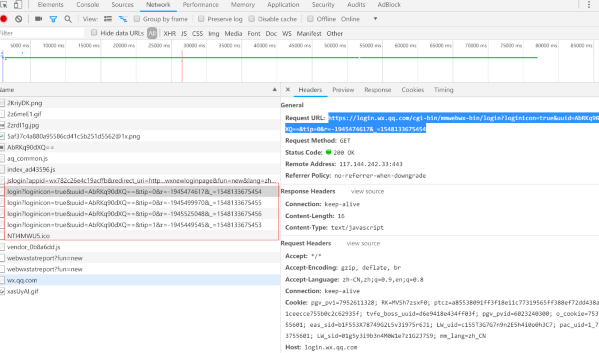

传统的登录方式需要用户在浏览器中输入账号密码，完成输入之后点击登录按钮将这些数据发送到服务器上，服务器对这些数据进行验证并返回特定的状态码和 Cookie 等信息给浏览器。

扫二维码登录方式不需要用户输入账号密码，这些信息保存在手机 APP 中，并由 APP 发送到服务器上。但是这种方式有几个问题需要解决：

1、服务器不能主动发送信息给浏览器，那么要怎么将服务器验证结果的状态码让浏览器获得？

浏览器不断与服务器建立长连接，不断发送带有 uuid 参数的 ajax 请求，询问是否已扫描。

这个请求是阻塞的，请求服务端每次阻塞25s。 也不是一直发，也是隔一段时间地发送。

2、要怎么保证浏览器的登录信息和某个账户关联？

服务器存储 uuid 和手机认证信息关联。

使用二维码识别软件可以得到这个二维码包含的文本信息，这是一个 URL 地址，包含了一个参数 `I=AbRKq90dXQ==`。 

扫完二维码，再打开 Chrome 的开发者工具观察网络请求，注意到浏览器在不断地发送`https://login.wx.qq.com/cgi-bin/mmwebwx-bin/login?loginicon=true&uuid=AbRKq90dXQ==&tip=0&r=-1945474617&_=1548133675454` 这个请求，并且其中的 uuid 参数值和二维码中的 I 参数一样。 

# 原理

登录二维码包含了服务器的 URL 地址，也包含了 uuid 参数。

当用户使用手机 APP 扫描二维码登录之后，发送手机端的用户名、密码、uuid 等信息给服务器，服务器验证之后就将 uuid 和该账户关联并保存到 Session 中。

这个过程的结果浏览器不知道，所以浏览器需要不断地向服务器发送 AJAX 请求，该请求包含了 uuid 参数，当查询到服务器已经存在 uuid 和账户的关联信息之后，就可以知道是某个账户扫描了该二维码登录，并跳转到确认页面。

点击确认，服务器返回 200 成功状态码、Cookie 和账户信息等来自手机端的数据，浏览器接收到这些数据之后就可以完成登录操作。应该注意到，为了使的浏览器能不断发送 AJAX 请求，建立的 HTTP 连接需要是长连接。

- [微信二维码登录的原理](https://www.biaodianfu.com/weixin-qrcode.html)