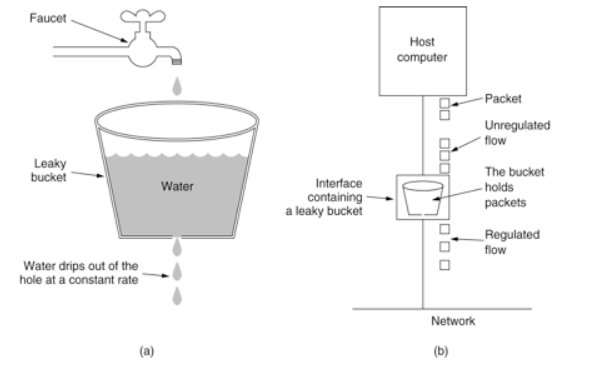
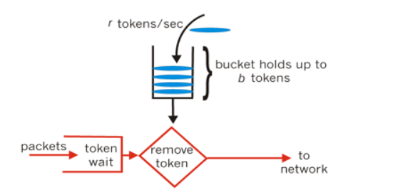

## 限流算法

#### 漏桶算法

桶里有水，桶底有漏洞，水以一定速率漏出来。 漏桶算法不能很好应对突发的大量的请求，无论来多少请求都只是以一定速度进行处理。



#### 令牌桶算法

令牌桶算法以一个恒定的速度往桶里放入令牌，如果有请求需要被处理，则需要先从桶里获取一个令牌，当桶里没有令牌可取时，则拒绝服务。因此可以较好处理突发的大量请求。



**令牌桶算法的基本过程如下：**

假如用户配置的平均发送速率为r，则每隔1/r秒一个令牌被加入到桶中；

假设桶最多可以存发b个令牌。如果令牌到达时令牌桶已经满了，那么这个令牌会被丢弃；

当一个n个字节的数据包到达时，就从令牌桶中删除n个令牌，并且数据包被发送到网络；

如果令牌桶中少于n个令牌，则不会删除令牌，并且认为这个数据包在流量限制之外；

算法允许最长b个字节的突发，但从长期运行结果看，数据包的速率被限制成常量r。

对于在流量限制外的数据包可以以不同的方式处理：

- 被丢弃；
- 队列等待令牌足够
- 它们可以继续发送，并被做特殊标记，网络过载的时候将这些特殊标记的包丢弃。

#### 两种算法的区别

区别在于能否友好处理突发的大量请求。

漏桶算法更能起到保护作用。

## 限流工具类

Google开源工具包Guava提供的限流工具类RateLimiter，该类基于令牌桶算法的实现。

接口描述请参考：RateLimiter接口描述

具体使用请参考：RateLimiter使用实践

**主要源码**：

```java
public double acquire() {
        return acquire(1);
    }

 public double acquire(int permits) {
        checkPermits(permits);  //检查参数是否合法（是否大于0）
        long microsToWait;
        synchronized (mutex) { //应对并发情况需要同步
            microsToWait = reserveNextTicket(permits, readSafeMicros()); //获得需要等待的时间 
        }
        ticker.sleepMicrosUninterruptibly(microsToWait); //等待，当未达到限制时，microsToWait为0
        return 1.0 * microsToWait / TimeUnit.SECONDS.toMicros(1L);
    }

private long reserveNextTicket(double requiredPermits, long nowMicros) {
        resync(nowMicros); //补充令牌
        long microsToNextFreeTicket = nextFreeTicketMicros - nowMicros;
        double storedPermitsToSpend = Math.min(requiredPermits, this.storedPermits); //获取这次请求消耗的令牌数目
        double freshPermits = requiredPermits - storedPermitsToSpend;

        long waitMicros = storedPermitsToWaitTime(this.storedPermits, storedPermitsToSpend)
                + (long) (freshPermits * stableIntervalMicros); 

        this.nextFreeTicketMicros = nextFreeTicketMicros + waitMicros;
        this.storedPermits -= storedPermitsToSpend; // 减去消耗的令牌
        return microsToNextFreeTicket;
    }

private void resync(long nowMicros) {
        // if nextFreeTicket is in the past, resync to now
        if (nowMicros > nextFreeTicketMicros) {
            storedPermits = Math.min(maxPermits,
                    storedPermits + (nowMicros - nextFreeTicketMicros) / stableIntervalMicros);
            nextFreeTicketMicros = nowMicros;
        }
    }
```

## 中间件限流

这里指的是mq消息队列消费端的限流，Rabbit mq 通过控制消费端可一次性处理的消息速度来保证消费端不会因为消息膨胀而瘫痪。