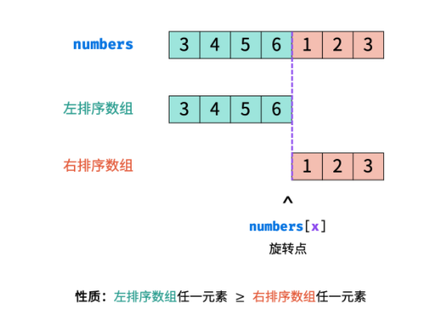

力扣简单

在力扣第154题，一样的题，难度是困难，153是不包含重复数，难度中等。


二分查找的变式。

[二分查找模板总结]()


把一个数组最开始的若干个元素搬到数组的末尾，我们称之为数组的旋转。输入一个非递减排序的数组的一个旋转，输出旋转数组的最小元素。  

NOTE：给出的所有元素都大于0，若数组大小为0，请返回0。 

示例 1：

输入：[3,4,5,1,2]
输出：1

示例 2：

输入：[2,2,2,0,1]
输出：0


思路分析：

排序数组的查找问题首先考虑使用 **二分法** 解决，其可将 **遍历法** 的 **线性级别** 时间复杂度降低至 **对数级别** 。 

本质就是找数组最小值，不过寻找旋转数组的最小元素即寻找 **右排序数组** 的首个元素 nums[x] ，称 x 为 **旋转点** 。 所以用二分对非重复数字的数组部分查找进行二分优化， 重复数字用线性查找法找最小值。



二分情况分析：

nums[m] 代表中点数，nums[i] 代表数组左边数，本题二分法不用 nums[m]和 nums[i] 作比较 ，是因为得不出旋转点在那边。这里 x 代表旋转点索引。

例子：

对于以下两示例，当 i = 0, j = 4, m = 2  时，有 nums[m] > nums[i] ，而结果不同。
[1, 2, 3, 4 ,5] 旋转点 x = 0 ： m 在右排序数组。
[3, 4, 5, 1 ,2] 旋转点 x = 3 ： m 在左排序数组。

因此，采用 nums[m] 代表中点数，nums[j] 代表数组右边数来比较。

首先 i , j 双指针分别指向 nums 数组左右两端 ，当 i = j 时跳出二分循环，并返回旋转点的值 nums[i] 。

当 nums[m] > nums[j]，旋转点 x 一定在 [m + 1, j]  闭区间内，因此执行 i = m + 1 ；
当 nums[m] < nums[j]，旋转点 x 一定在 [i, m] 闭区间内，因此执行 j = m ；
当 nums[m] = nums[j]，无法判断 m 在哪个排序数组中，解决方案： 可以执行 j = j - 1 缩小判断范围。

执行 j = j - 1 原因分析如下：

例子：

两个旋转点值为 0 的数组，则当 i = 0，j=4 时 m = 2，两示例结果不同。
示例一 \[1, 0, 1, 1, 1] ：旋转点 x = 1 ，因此 m = 2 在 右排序数组 中。
示例二 \[1, 1, 1, 0, 1] ：旋转点 x = 3 ，因此 m = 2 在 左排序数组 中。

因此不能执行半数缩小，执行 i+1 越过旋转点。


时间复杂度O(logN) ： 在特例情况下（例如 [1, 1, 1, 1]），会退化到 O(N)。 
空间复杂度 O(1) ：i , j , m 变量使用常数大小的额外空间。


初步分析的代码如下：

````java
class Solution {
    public int minArray(int[] numbers) {
        int i = 0, j = numbers.length - 1;
        while (i < j) {
            int m = (i + j) / 2;
            if (numbers[m] > numbers[j]) i = m + 1;
            else if (numbers[m] < numbers[j]) j = m;
            else if (numbers[m] == numbers[j]) j--;
        }
        return numbers[i];
    }
}
````

但是当出现 nums[m] = nums[j] 时，一定有区间 [i, m] 内所有元素相等 或 区间 [m, j] 内所有元素相等（或两者皆满足），可以举例子说明的。对于寻找此类数组的最小值问题，可直接放弃二分查找，而使用**线性查找替代**。

````java
class Solution {
    public int minArray(int[] numbers) {
        int i = 0, j = numbers.length - 1;
        while (i < j) {
            int m = (i + j) / 2;
            if (numbers[m] > numbers[j]) i = m + 1;
            else if (numbers[m] < numbers[j]) j = m;
            else if (numbers[m] == numbers[j]){
                int x = i;
                for(int k = i + 1; k < j; k++) {
                    if(numbers[k] < numbers[x]) x = k;
                }
                return numbers[x];
            }
        }
        return numbers[i];
    }
}
````

