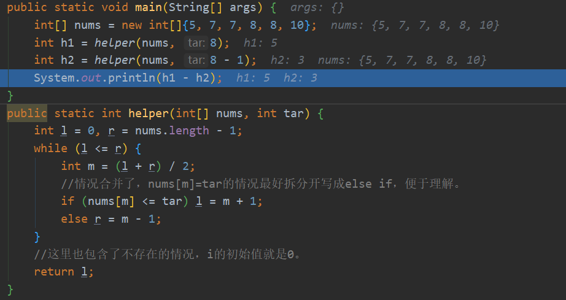
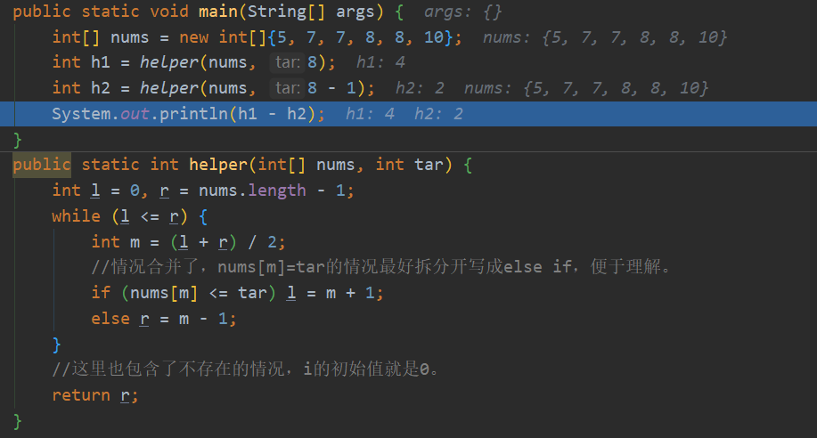
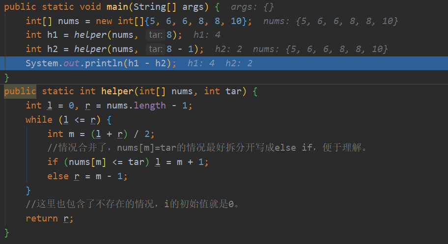
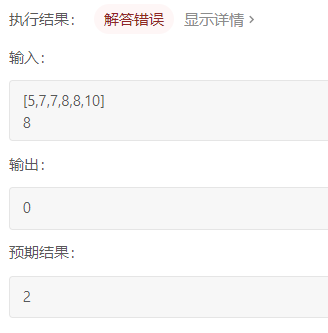

力扣简单

二分查找。


示例 1:

输入: nums = [5,7,7,8,8,10], target = 8
输出: 2


示例 2:

输入: nums = [5,7,7,8,8,10], target = 6
输出: 0

限制：0 <= 数组长度 <= 50000


## 题解

思路：用两次二分， **分别查找最右边界 right 和最左边界left ，最终返回 right - left - 1 即可。** 

思路转化：由于数组 nums 中元素都为整数，因此可以**分别二分查找 target和 target - 1 的最右边界**，将两结果相减并返回即可。


尝试考虑下两个值都不存在的情况，两值都小于数组所有（两个r小于了0，两个l等于了0，差为0），两值都大于数组所有（l最终都大于了数组长度，差为0）。


时间复杂度  ：O(log N)，二分法为对数级别复杂度。

空间复杂度 ：O(1) ，几个变量使用常数大小的额外空间。

````java
class Solution {
    public int search(int[] nums, int target) {
        return helper(nums, target) - helper(nums, target - 1);
    }
    int helper(int[] nums, int tar) {
        int l = 0, r = nums.length - 1;
        while(l <= r) {
            int m = (l + r) / 2;
            //情况合并了，nums[m]=tar的情况最好拆分开写成else if，便于理解。
            if(nums[m] <= tar) l = m + 1;
            else r = m - 1;
        }
        //这里也包含了不存在的情况，i的初始值就是0。返回r也对
        return l;
    }
}
````


##### 测试1

nums = [5,7,7,8,8,10], target = 8 返回 l		一个指着8，一个指着10



````java
public class Main {
    public static void main(String[] args) {
        int[] nums = new int[]{5, 7, 7, 8, 8, 10};
        int h1 = helper(nums, 8);
        int h2 = helper(nums, 8 - 1);
        System.out.println(h1 - h2);
    }
    public static int helper(int[] nums, int tar) {
        int l = 0, r = nums.length - 1;
        while (l <= r) {
            int m = (l + r) / 2;
            //情况合并了，nums[m]=tar的情况最好拆分开写成else if，便于理解。
            if (nums[m] <= tar) l = m + 1;
            else r = m - 1;
        }
        //这里也包含了不存在的情况，i的初始值就是0。
        return l;
    }
}
````

##### 测试2

nums = [5,7,7,8,8,10], target = 8 返回 r		一个指着最右的7，一个指着最右的8



##### 测试3

改动数组

nums = [5,6,6,8,8,10], target = 8 返回 r	 一个指着最右的6，一个指着最右的8



````java
public class Main {
    public static void main(String[] args) {
        int[] nums = new int[]{5, 7, 7, 8, 8, 10};
        int h1 = helper(nums, 8);
        int h2 = helper(nums, 8 - 1);
        System.out.println(h1 - h2);
    }
    public static int helper(int[] nums, int tar) {
        int l = 0, r = nums.length - 1;
        while (l <= r) {
            int m = (l + r) / 2;
            //情况合并了，nums[m]=tar的情况最好拆分开写成else if，便于理解。
            if (nums[m] <= tar) l = m + 1;
            else r = m - 1;
        }
        //这里也包含了不存在的情况，i的初始值就是0。
        return r;
    }
}
````

##### 测试4：

加上 r 越界或者找不到的情况



````java
public class Main {
    public static void main(String[] args) {
        int[] nums = new int[]{5, 6, 6, 8, 8, 10};
        int h1 = helper(nums, 8);
        int h2 = helper(nums, 8 - 1);
        System.out.println(h1 - h2);
    }
    public static int helper(int[] nums, int tar) {
        int l = 0, r = nums.length - 1;
        while (l <= r) {
            int m = (l + r) / 2;
            //情况合并了，nums[m]=tar的情况最好拆分开写成else if，便于理解。
            if (nums[m] <= tar) l = m + 1;
            else r = m - 1;
        }
        //这里也包含了不存在的情况，i的初始值就是0。
        if (r < 0 || nums[r] != r)
            return -1;
        return r;
    }
}
````

