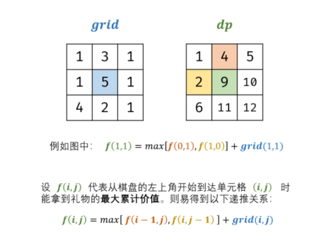

力扣中等


在一个 m*n 的棋盘的每一格都放有一个礼物，每个礼物都有一定的价值（价值大于 0）。

你可以从棋盘的左上角开始拿格子里的礼物，并**每次向右或者向下移动一格、直到到达棋盘的右下角。**

给定一个棋盘及其上面的礼物的价值，请计算你最多能拿到多少价值的礼物？


示例 :

输入: 
[
  [1，3，1]，
  [1，5，1]，
  [4，2，1]
]
输出: 12
解释: 路径 1→3→5→2→1 可以拿到最多价值的礼物


限制：

0 < grid.length <= 200

0 < grid[0].length <= 200	矩阵长宽最大200


思路：

应该用动态规划求解，而不是深度优先搜索，深度优先搜索过于复杂，不是最优解。 


初始状态： dp[0] [0] = grid [0] [0] ，即最开始左上角元素。

返回值： grid[m - 1] [n - 1]  即返回 dp 矩阵右下角元素 


递推关系方程： f (i，j) = max[ f (i，j−1)，f (i−1，j) ] + grid(i*，*j) 

直接从示例中的9来思考，9那个位置，来自于2，4 这两位置中较大的加上本身 5。
最大价值=上次两种可能中的最大那一种加上本身。


1. i=0&&j=0，为起始元素
2. i=0&&j!=0，为矩阵第一行元素，只可从左边到达； 
3. i!=0&&j=0， 为矩阵第一列元素，只可从上边到达； 
4. i!=0&&j!=0， 可从左边或上边到达； 




时间复杂度 O(MN) ： 

M,N 分别为矩阵行高、列宽；动态规划需遍历整个grid 矩阵，使用 O(MN) 时间。

空间复杂度 O(1)) ：

可以原地修改使用常数大小的额外空间。如果不可以原地修改，实际上 dp 过程中只是用到上一层的结果。

可以只用 int[] dp = new int[grid[0].length]  存储就可以。因此，O(N) ，N是列宽。

````java
class Solution {
    public int maxValue(int[][] grid) {
        int m = grid.length, n = grid[0].length;
        for(int i = 0; i < m; i++) {
            for(int j = 0; j < n; j++) {
                if(i == 0 && j == 0) continue;
                if(i == 0) grid[i][j] += grid[i][j - 1] ;
                else if(j == 0) grid[i][j] += grid[i - 1][j];
                else grid[i][j] += Math.max(grid[i][j - 1], grid[i - 1][j]);
            }
        }
        return grid[m - 1][n - 1];
    }
}
````

