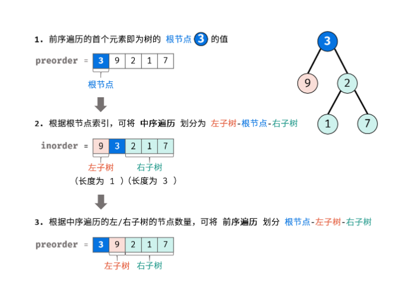

力扣中等


例如，给出

前序遍历 preorder = [3,9,20,15,7]
中序遍历 inorder = [9,3,15,20,7]
返回如下的二叉树：

​	3

   / \
  9  20
    /  \
   15   7


限制：

0 <= 节点个数 <= 5000

 


Pojo - 树

````java
Definition for a binary tree node.
public class TreeNode {
    int val;
    TreeNode left;
    TreeNode right;
    TreeNode(int x) { val = x; }
}
````


前序遍历性质： 节点按照 `[ 根节点 | 左子树 | 右子树 ]` 排序。
中序遍历性质： 节点按照 `[ 左子树 | 根节点 | 右子树 ]` 排序。 

所以

前序遍历的首元素 为树的根节点 node 的值。
在中序遍历中搜索根节点 node 的索引 ，可将 中序遍历 划分为    [ 左子树 | 根节点 | 右子树 ] 。
根据中序遍历中的左 / 右子树的节点数量，可将 前序遍历 划分为 [ 根节点 | 左子树 | 右子树 ] 。


思路如图：



通过先序遍历并回溯构建二叉树。


递推工作中参数的表示：

先序数组中根节点索引：表示图中第一步中左 \ 右范围子树的根节点在 preorder中的索引

中序遍历左边界：表示图中第二步中左 \ 右子树范围的左边界

中序遍历右边界：表示图中第二步中左 \ 右子树范围的右边界

|        | 先序数组中根节点索引 | 中序遍历左边界 | 中序遍历右边界 |
| ------ | -------------------- | -------------- | -------------- |
| 左子树 | root + 1             | left           | i - 1          |
| 右子树 | root + i - left + 1  | i + 1          | right          |


时间复杂度 O(N) ： 

其中 N 为树的节点数量。初始化 HashMap 需遍历 inorder ，占用 O(N) 。

递归共建立 N 个节点，每层递归中的节点建立、搜索操作占用 O(1) ，因此使用 O(N) 时间。

空间复杂度 O(N) ：

HashMap 使用 O(N) 额外空间。最差情况下，树退化为链表，递归深度达到 N ，占用 O(N) 额外空间；

最好情况下，树为满二叉树，递归深度为 NlogN ，占用 O(logN) 额外空间。常用表示方式：preorder 先序、inorder 中序、postorder 后序


注意：本文方法只适用于 “无重复节点值” 的二叉树。 

```java
class Solution {
    int[] preorder;
    HashMap<Integer, Integer> dic = new HashMap<>();
    public TreeNode buildTree(int[] preorder, int[] inorder) {
        //下边要递归，都升级为全局。
        this.preorder = preorder;
        //为了提升效率，本文使用哈希表 dic 存储中序遍历的值与索引的映射，查找时间复杂度为 O(1)
        for(int i = 0; i < inorder.length; i++)
            dic.put(inorder[i], i);
        return recur(0, 0, inorder.length - 1);
    }
     // @param pre_root_idx  先序遍历的索引 root
     // @param in_left_idx   中序遍历的索引 left
     // @param in_right_idx  中序遍历的索引 right
    TreeNode recur(int root, int left, int right) {
        if(left > right) return null;                          // 递归终止
        TreeNode node = new TreeNode(preorder[root]);          // 建立根节点
        //查找根节点在中序遍历 inorder 中的索引 i 
        int i = dic.get(preorder[root]);                       // 划分根节点、左子树、右子树
        node.left = recur(root + 1, left, i - 1);              // 开启左子树递归
        node.right = recur(root + i - left + 1, i + 1, right); // 开启右子树递归
        return node;                                           // 回溯返回根节点
    }
}
```
