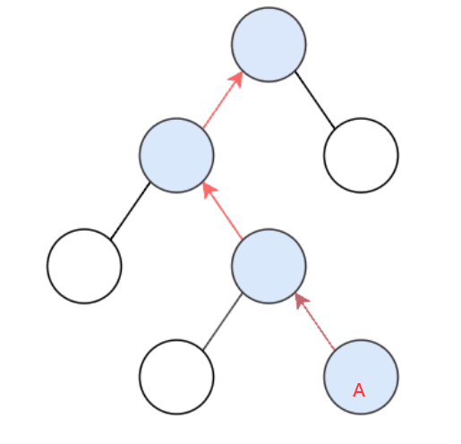

牛客中等

力扣未收录，来自书。


给定一个二叉树和其中的一个结点，请找出**中序遍历**顺序的下一个结点并且返回。

注意：树中的结点不仅包含左右子结点，同时包含指向父结点的指针。


思路：

就是中序遍历（左根右），因为是下一个节点，所以不考虑左，找上一个节点的话，考虑的是左。

因此，两种情况：

一、如果一个节点的右子树不为空，那么该节点的下一个节点是右子树的最左节点；
二、否则，用指向父节点的指针，向上找第一个左链接指向的树包含该节点的祖先节点。

图解第二种情况：




```java
public class TreeLinkNode { 
    int val;
    TreeLinkNode left = null;
    TreeLinkNode right = null;
    TreeLinkNode next = null;//指向父节点
 
    TreeLinkNode(int val) {
        this.val = val;
    }
}
```
```java
public TreeLinkNode GetNext(TreeLinkNode pNode) {
    if (pNode.right != null) {
        TreeLinkNode node = pNode.right;
        while (node.left != null)
            node = node.left;
        return node;
    } else {
        while (pNode.next != null) {
            TreeLinkNode parent = pNode.next;
            if (parent.left == pNode)//终止条件
                return parent;
            pNode = pNode.next;
        }
    }
    return null;
}
```

