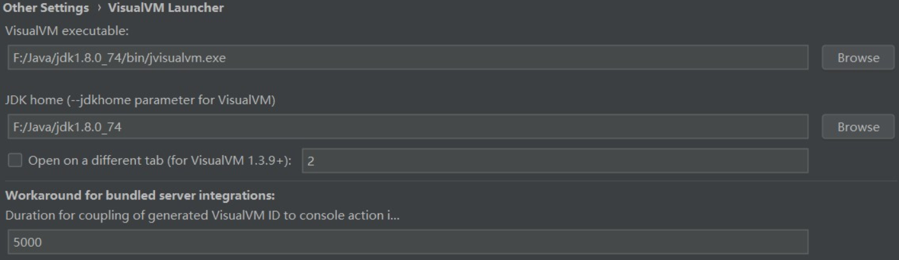
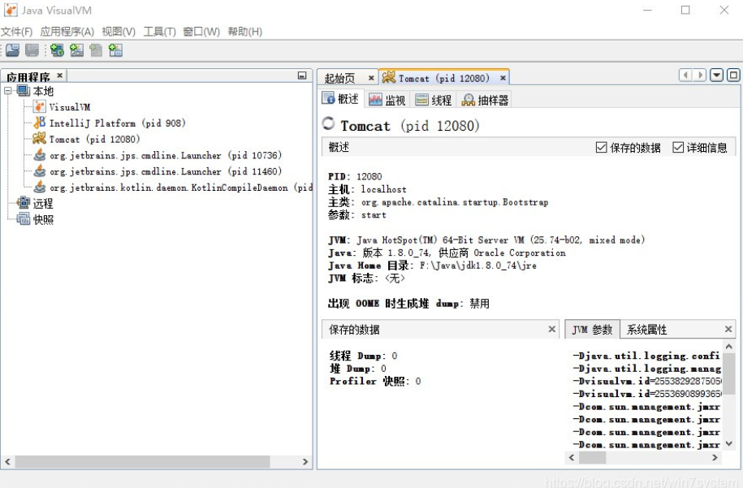

# 解决 Idea 卡顿

本人开发环境目前是 Wins 16G 内存，且是后端开发者，结合网络上的方法和自己亲身体验，总结出如下几条：

### 1、 卸载、关闭不需要用的插件

作为一个 Java 后端开发，前期不打算专注于前端知识，所以可以适当关闭前端插件，比如，对于一些默认安装的什么安卓的 Google 的 app，前端的 JS 框架 等插件可以卸载掉，项目中根本不用不到的一些框架 Struts，Hibernate，Ant 等可以关闭、卸载。

打开 settings -> plugins-> 可以点击插件介绍，再根据自己的需求关闭/卸载掉自己不常用的插件，重启 Idea 即可。

### 2、减少内存

在设置项目的时候尽量不要将没有关系的项目放置在一个工程中，这样能够减少内存的使用。比如比较大的 maven 项目或者分布式项目都喜欢分成很多模块。但是，实际上自己只负责一个模块，可以根据自己的项目依赖只导入自己相关的 module。

可以点击右键，load/unloan modules，只导入自己需要的模块。

### 3、修改配置文件   

**重点推荐**：关闭之后接着进入电脑中 intellij idea 的安装目录中去，找到其中的 bin 文件夹，在 bin 文件夹中有两个文件，分别叫做：idea.exe.vmoptions 与 idea64.exe.vmoptions，这是笔者的个人配置，我的电脑是 Windows 10 内存是 16G，所以分配了 4G 内存堆，可以根据自己电脑的实际内存设置。

> -server 
> -Xms4096m
> -Xmx4096m
> -XX:NewRatio=3 
> -Xss16m 
> -XX:+UseConcMarkSweepGC 
> -XX:+CMSParallelRemarkEnabled 
> -XX:ConcGCThreads=4 
> -XX:ReservedCodeCacheSize=2048m
> -XX:+AlwaysPreTouch 
> -XX:+TieredCompilation 
> -XX:+UseCompressedOops 
> -XX:SoftRefLRUPolicyMSPerMB=50 
> -Dsun.io.useCanonCaches=false 
> -Djava.net.preferIPv4Stack=true 
> -Djsse.enableSNIExtension=false 
> -ea

### 4、适当关闭检查

**重点推荐**：适当关闭 idea 的 Inspections 的检查或者开发时完全关闭 Inspections 的检查，等开发完后在开启检查。阿里巴巴编码规约检查很消耗时间的，个人感觉这个最有效。

可以全部关闭，idea 右下角有一个 人头标志，可以点击，调准 idea 检查级别


# Java 开发 Idea 插件

##### MyBatisCodeHelperPro

功能特别多，有免费功能，也有收费的网址：https://github.com/gejun123456/MyBatisCodeHelper-Pro

````
提供Mapper接口与配置文件中对应SQL的导航.
编辑XML文件时自动补全.
根据Mapper接口, 使用快捷键生成xml文件及SQL标签.
ResultMap中的property支持自动补全，支持级联(属性A.属性B.属性C).
快捷键生成@Param注解.
XML中编辑SQL时, 括号自动补全.
XML中编辑SQL时, 支持参数自动补全(基于@Param注解识别参数).
自动检查Mapper XML文件中ID冲突.
自动检查Mapper XML文件中错误的属性值.
支持Find Usage.
支持重构从命名.
支持别名.
自动生成ResultMap属性.
快捷键: Option + Enter(Mac) | Alt + Enter(Windows).
````


##### VisualVM Launcher

用于在本地开发进行压力测试，性能测试之类的监控器，其他场景一般不推荐使用此模式启动，还会启动另外一个Visual VM 窗口，这个窗口是 JDK bin目录下的 Java Visual VM。



安装启动成功后， Java Visual VM 的窗口：




#####  **RestfulToolkit** 

````
根据 URL 直接跳转到对应的方法定义 ( Ctrl \ or Ctrl Alt N );
提供了一个 Services tree 的显示窗口;
一个简单的 http 请求工具;
在请求方法上添加了有用功能: 复制生成 URL;,复制方法参数...
其他功能: java 类上添加 Convert to JSON 功能，格式化 json 数据 ( Windows: Ctrl + Enter; Mac: Command + Enter )
````


# 参考

Java 开发 Idea 插件推荐：https://juejin.cn/post/6844903620501045255

值得推荐的 Idea 十几大优秀插件：https://blog.csdn.net/win7system/article/details/83508313

idea美化插件：https://learnku.com/articles/49975

