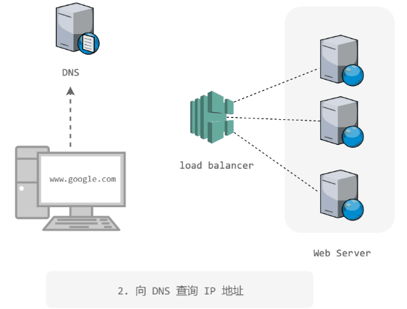

其实这种问题可以从四个方面去回答：1. 操作系统；2. 网络协议；3. 网站架构；4. 浏览器。对于后端研发岗位来说，网站架构方面的知识比较重要。 

# 概述

Web 网站通常使用 B/S 架构，浏览器（Browser）使用 HTTP 协议向服务器（Server）请求指定的 URL 资源。

在浏览器中输入一个 URL 并发送 HTTP 请求时，需要先使用 DNS 协议获取 URL 域名对应的 IP 地址，获取到 IP 地址之后就可以开始建立 HTTP 连接。

HTTP 连接是基于 TCP 连接之上的，HTTP 属于应用层，TCP 属于传输层。因此建立 HTTP 连接之前需要先建立 TCP 连接，那么就涉及到 TCP 的三次握手四次挥手等过程。

TCP 连接建立之后就可以开始建立 HTTP 连接，这个过程可能涉及到长短连接、HTTP 缓存、Cookie、HTTPs 等内容。

在海量用户的高并发请求下，网站架构需要满足低响应时间和高吞吐量等性能要求。除了性能要求之外，网站架构还需要满足扩展性、可用性、安全性等要求。为了满足这些要求，网站普遍使用缓存和集群等技术。

缓存是将图片、视频、js 等静态资源存储在用户比较容易获取到的位置，从而减轻服务器的压力并降低响应时间。

集群是将多台服务器组成一个整体，并使用负载均衡器将请求转发到集群中的某个服务器上，避免单一服务器的负载压力过大导致性能降低。

细节需要知识：DNS、TCP 连接、Http 连接、缓存、集群、spring mvc、前端解析

如图展示：

# 参考资料

[访问一个网址的详细过程](https://github.com/skyline75489/what-happens-when-zh_CN/blob/master/README.rst)